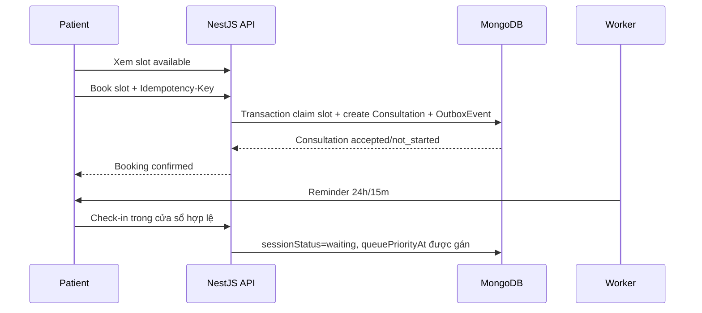
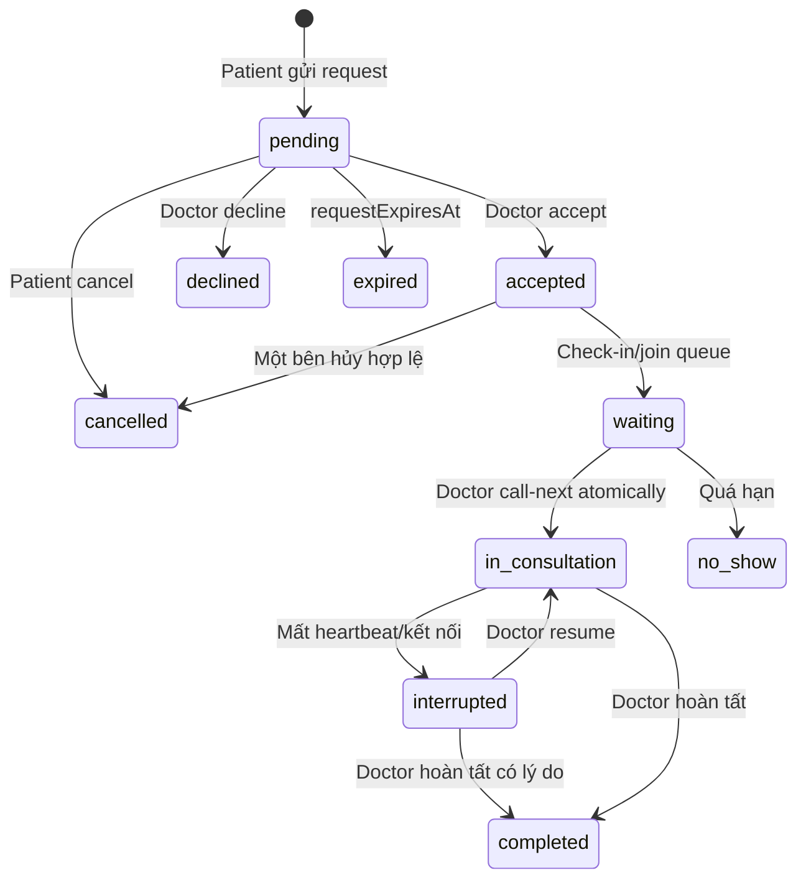
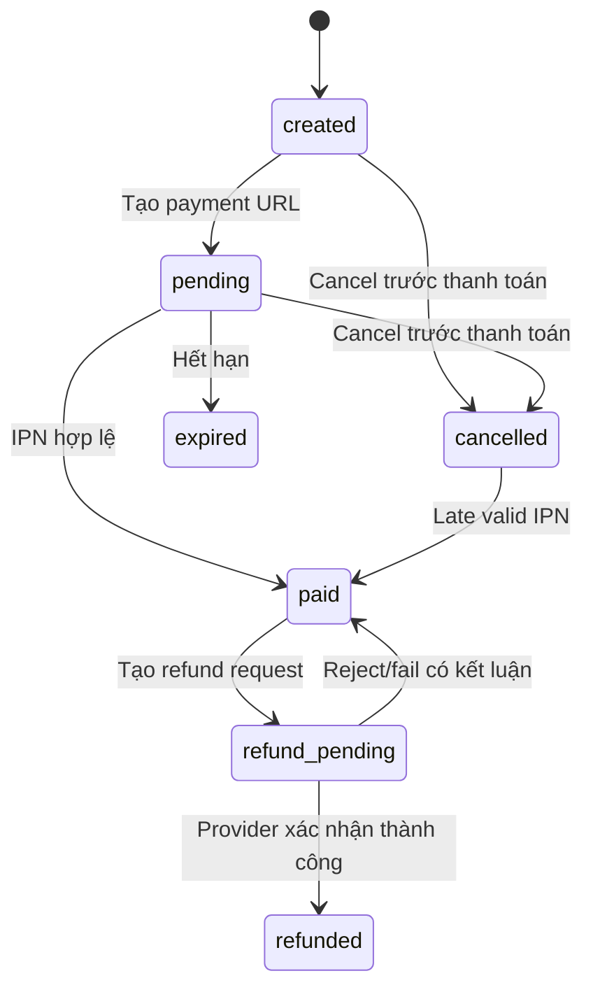
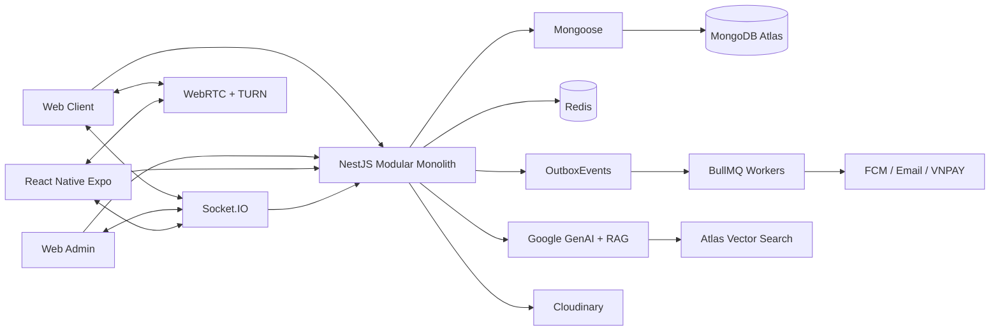

# Healthcare Application — Tổng quan sản phẩm DA2

## 1. Mục đích tài liệu

Tài liệu mô tả phạm vi sản phẩm, nghiệp vụ, kiến trúc và trạng thái chuyển đổi của Healthcare Application từ DA1 sang DA2. Nguồn chuẩn đi kèm:

- Nghiệp vụ: `docs/BUSINESS_RULES.md`.
- Dữ liệu hiện tại: `docs/db-template-v7.dbml`; bản thiết kế Chronic Care đang chờ duyệt: `docs/db-template-v8.dbml`.
- Kế hoạch thực thi: `plan/refactor-plan.md`.
- Kế hoạch sản phẩm Chronic Care: `plan/chronic-care-plan.md`.
- Hợp đồng tích hợp frontend: `docs/fe-integration.md`.

DA2 được triển khai trong giai đoạn 09/2026–12/2026, deadline mục tiêu 31/12/2026. Những chức năng được mô tả là **mục tiêu của phiên bản DA2**, không mặc định đã tồn tại trong code DA1.

## 2. Định vị sản phẩm

Healthcare Application được định vị thành **HealthAI Chronic Care — nền tảng theo dõi và hỗ trợ chăm sóc bệnh mạn từ xa**, không phải hệ thống khám bệnh, chẩn đoán hoặc thay thế cơ sở y tế. MVP bắt buộc có hai Care Program dùng chung Program engine: tăng huyết áp và tiểu đường.

Sản phẩm hỗ trợ:

- Bệnh nhân theo dõi chỉ số sức khỏe và nhận cảnh báo tham khảo.
- Bệnh nhân tham gia Care Program, nhận lịch đo và xem mức độ hoàn thành theo dõi.
- Ở phạm vi P1, bệnh nhân có thể mời một người thân đồng hành để nhận lời nhắc chung khi bệnh nhân bỏ lỡ hoạt động theo dõi, trên cơ sở đồng ý và quyền chia sẻ do bệnh nhân kiểm soát.
- Rule engine version hóa phân tầng `normal|attention|urgent` với lý do giải thích được; kết quả không phải chẩn đoán.
- Bác sĩ theo dõi Priority Inbox và báo cáo 7/30 ngày thay vì đọc toàn bộ dữ liệu thô.
- Bệnh nhân chủ động đặt lịch theo slot bác sĩ đã mở.
- Ở mức P1, bệnh nhân tìm cơ sở y tế theo chương trình theo dõi/chuyên khoa và vị trí; danh mục nội bộ đã kiểm duyệt là nguồn chính, dịch vụ bản đồ chỉ bổ sung khi thiếu kết quả.
- Bệnh nhân gửi yêu cầu tư vấn nhanh theo cơ chế on-demand.
- Bác sĩ tiếp nhận yêu cầu, quản lý lịch, hàng đợi và tư vấn qua chat/audio/video.
- AI cung cấp thông tin, tóm tắt và truy xuất tri thức RAG; không tự đưa ra chẩn đoán.
- Gói hội viên và quota kiểm soát quyền lợi AI.
- Ba tier `Free`, `Plus`, `Care` lần lượt phục vụ theo dõi cơ bản, tự theo dõi nâng cao và chương trình có Doctor/Clinic đồng hành.
- Mọi enrollment đều bắt buộc Doctor assignment để xác định ownership; chỉ tier Care mặc định có quyền lợi Doctor review theo cadence đã snapshot.
- Thanh toán, cancel payment order và full refund có quản trị viên duyệt.
- Quản trị người dùng, hồ sơ bác sĩ, tri thức AI, billing và báo cáo vi phạm.

Khi có dấu hiệu khẩn cấp, hệ thống phải hướng người dùng tới cơ sở y tế hoặc dịch vụ cấp cứu phù hợp, không tiếp tục mô phỏng chẩn đoán.

## 3. Vai trò và kênh sử dụng

| Vai trò | Web Client | Mobile | Web Admin |
|---|---|---|---|
| Patient | Theo dõi sức khỏe, tìm bác sĩ, đặt lịch, on-demand, queue, chat/call, AI, billing | Critical patient flows, FCM và secure token storage | Không |
| Doctor | Care Program, Priority Inbox, dashboard, slot, request, queue, chat/call, hồ sơ và review | Critical doctor flows, FCM và call foreground | Không |
| Admin | Không dùng client cho nghiệp vụ quản trị | Ngoài MVP | Dashboard, users, doctor verification, AI knowledge, plans, payments/refunds, moderation |

Frontend sẽ được tách thành repository riêng gồm:

```text
healthcare-frontend/
├── apps/web-client
├── apps/web-admin
├── apps/mobile
└── packages/
    ├── ui
    ├── api-client
    └── realtime-contracts
```

Backend trở thành repository NestJS độc lập. REST types phía frontend được sinh từ OpenAPI; frontend không import trực tiếp Mongoose schemas hoặc domain source của backend.

## 4. Chức năng theo vai trò

### 4.1 Patient

- Đăng ký local hoặc OAuth, xác thực email, đăng nhập và quản lý phiên.
- Quản lý hồ sơ, avatar và thông tin liên hệ.
- Xem danh sách bác sĩ active + approved và hồ sơ chuyên môn.
- Xem AvailabilitySlots và đặt lịch chủ động.
- Gửi on-demand request cho bác sĩ khi không chọn slot.
- Hủy consultation theo policy; check-in và theo dõi vị trí hàng đợi.
- Chat, gửi tệp/hình ảnh và tham gia audio/video call khi consultation cho phép.
- Nhập, sửa, xóa và xem biểu đồ HealthMetrics.
- Tham gia Care Program, xem nhiệm vụ đo, mức độ hoàn thành và báo cáo 7/30 ngày.
- Mời, xác nhận, sửa hoặc thu hồi quyền của một người thân đồng hành; chọn nhận lời nhắc bỏ lỡ nhiệm vụ mà không cần chia sẻ chỉ số sức khỏe chi tiết.
- Nhận Care Alert có lý do rõ ràng và chuyển sang đặt lịch/on-demand consultation khi cần.
- Tìm cơ sở y tế theo chuyên khoa, địa điểm và khoảng cách; xem lý do gợi ý, nguồn dữ liệu và liên kết chỉ đường. Kết quả không phải khuyến nghị về chất lượng chuyên môn.
- Hỏi AI, xem citation/lịch sử và phần trăm quota token còn lại.
- Xem Plans, tạo PaymentOrder, theo dõi kết quả thanh toán và Subscription.
- Cancel order chưa thanh toán; gửi full-refund request cho order đã paid.
- Review bác sĩ sau consultation completed và gửi ViolationReport.
- Nhận notification trong app và FCM trên mobile.

### 4.2 Doctor

- Đăng ký, cập nhật DoctorProfile và tải tài liệu xác minh.
- Chỉ doctor `active + approved` được mở slot, nhận request hoặc bắt đầu tư vấn.
- Tạo, block và quản lý AvailabilitySlots.
- Accept/decline on-demand request.
- Theo dõi patient đã check-in, gọi người tiếp theo bằng thao tác atomic và xử lý no-show.
- Chat/call trong consultation được authorize.
- Xem health context của patient trong phạm vi consultation.
- Enroll Patient vào Care Program đã duyệt; xem Priority Inbox và xử lý Care Alert được phân công.
- Xem báo cáo xu hướng xác định và AI summary trước consultation; AI không quyết định severity.
- Ghi consultation note, hoàn tất phiên và xem review.
- Nhận notification về request, queue, lịch, message và verification.

### 4.3 Admin

- Xem dashboard tổng hợp từ endpoint chuyên dụng, không tải toàn bộ collection về trình duyệt để tự đếm.
- Tìm kiếm, lọc, khóa/mở khóa tài khoản và xem audit liên quan.
- Approve/reject hồ sơ bác sĩ kèm lý do.
- Quản lý Plans và trạng thái hiển thị.
- Xem PaymentOrders, PaymentTransactions và trạng thái đối soát.
- Review/approve/reject PaymentRefunds; provider call do worker thực hiện.
- Quản lý tài liệu RAG và blacklist keywords.
- Admin và Doctor tạo/chỉnh draft Care Program theo permission; Admin quản lý lifecycle, nguồn, version và publish/retire rule/ngưỡng.
- Xử lý ViolationReports theo workflow bốn trạng thái.
- Tạo và theo dõi NotificationCampaigns nếu còn trong release cut-line.

## 5. Nghiệp vụ cốt lõi

### 5.1 Identity và OAuth

1. Một tài khoản nằm trong `Users`; doctor/admin profile chỉ là dữ liệu theo vai trò.
2. Tài khoản OAuth được ánh xạ qua `OAuthAccounts`; tài khoản OAuth-only có thể không có `passwordHash`.
3. OTP hash, attempts và TTL nằm trong Redis, không nằm trong Users.
4. Refresh token chỉ lưu hash trong `AuthSessions`, có rotation theo `familyId` và phát hiện replay.
5. Password change, logout-all hoặc account ban phải revoke session liên quan.
6. OAuth dùng state, callback allowlist và PKCE khi phù hợp.

### 5.2 Scheduled consultation



- Patient chỉ được chọn slot do doctor tạo sẵn; không gửi `scheduledAt` tùy ý.
- Claim slot là atomic, một slot chỉ tạo tối đa một consultation.
- Cancel đúng policy mở lại slot nếu slot vẫn còn hợp lệ.
- Scheduled instant booking có `requestStatus=accepted` ngay sau transaction.

### 5.3 On-demand consultation



- Một patient chỉ có tối đa một on-demand request pending tới cùng doctor.
- Doctor chỉ có tối đa một consultation `in_consultation`.
- `scheduledEndAt` là mốc dự kiến, không tự động hoàn tất phiên. Doctor kết thúc; worker chỉ được chuyển phiên mất heartbeat sang `interrupted`.
- `requestStatus` mô tả vòng đời yêu cầu; `sessionStatus` mô tả vòng đời phiên thực tế.
- Không dùng `active` cho nhiều nghĩa và không dùng `rejected` để biểu diễn cancel.

### 5.4 Hàng đợi

Hàng đợi là truy vấn nghiệp vụ từ `Consultations`, không phải BullMQ queue. Một item nằm trong queue khi:

```text
requestStatus = accepted
sessionStatus = waiting
queueJoinedAt != null
queuePriorityAt != null
```

Scheduled và on-demand dùng chung hàng đợi theo Doctor. Ưu tiên lần lượt: scheduled quá giờ, scheduled đã đến cửa sổ phục vụ, rồi on-demand accepted theo thời điểm vào hàng đợi. On-demand chỉ được gọi trong khoảng trống nếu thời lượng dự kiến cộng buffer không đè lên scheduled kế tiếp. `queuePriorityAt` là khóa sắp xếp ổn định; `call-next` dùng conditional update/transaction để hai request đồng thời không claim cùng một consultation.

### 5.5 Chat, call và review

- Message gắn với `consultationId`; server kiểm tra participant trước read/send/join room.
- `clientMessageId` chống tạo message trùng khi client retry.
- Socket.IO phục vụ chat, notification, queue update và WebRTC signaling.
- WebRTC media đi peer-to-peer/TURN; database chỉ lưu metadata bắt đầu/kết thúc và consent.
- `callEndedAt` ghi cuộc gọi đã dừng; `completedAt` chỉ được ghi khi Doctor xác nhận hoàn tất consultation/note. Quá thời lượng chỉ tạo cảnh báo/overtime, không tự complete.
- Patient chỉ review consultation của mình sau khi completed; một consultation có tối đa một review.
- Rating summary của doctor được cập nhật trong transaction và có job đối soát.

### 5.6 Chronic Care, Health tracking và AI

- HealthMetrics lưu theo UTC; timezone dùng cho hiển thị.
- Care Program xác định loại metric, tần suất đo, timezone, thời hạn và rule set áp dụng.
- Monitoring task được hoàn thành bởi HealthMetric hợp lệ; adherence chỉ phản ánh mức độ hoàn thành theo dõi, không phải tuân thủ điều trị.
- Alert threshold/rule chỉ là cảnh báo tham khảo. Rule engine là deterministic, version hóa và trả về reason codes; AI không được tạo hoặc thay đổi severity.
- Care Alert `urgent` phải hiển thị hành động an toàn từ template đã duyệt và không chờ LLM.
- Người thân đồng hành là tính năng P1, không phải vai trò y tế mới: người thân đăng ký tài khoản Patient bình thường, đăng nhập bằng cơ chế sẵn có rồi xác nhận liên kết do Patient mời. Người thân chỉ nhận nhắc nhở chung sau khi Patient bỏ lỡ nhiệm vụ quá khoảng thời gian cấu hình; mặc định không xem HealthMetrics, nội dung AI, consultation hoặc Care Alert.
- Patient luôn được nhắc trước. Thông báo cho contact không chứa chỉ số, chẩn đoán hay lý do cảnh báo; mọi consent, thay đổi quyền, gửi thông báo và thu hồi quyền phải audit. `urgent` không biến contact thành kênh cấp cứu; chỉ thông báo contact nếu Patient bật lựa chọn riêng.
- Tìm cơ sở y tế P1 nhận đầu vào là Program/bệnh được chọn rõ ràng hoặc chuyên khoa được duyệt cùng khu vực/vị trí do Patient chọn. Hệ thống dùng `DiseaseSpecialties` do Admin duyệt, lọc `MedicalFacilities` đã xác minh, rồi sắp xếp xác định theo mức khớp chuyên khoa và khoảng cách. Khi dữ liệu nội bộ chưa đủ, backend gọi API bản đồ; Admin phải chọn kết quả, tạo bản nháp và kiểm tra nguồn chính thức trước khi đánh dấu đã xác minh.
- AI chỉ chuẩn hóa truy vấn tự nhiên thành specialty/khu vực và giải thích reason code; AI không suy luận diagnosis, không xếp hạng chất lượng cơ sở và không thay thế safety flow. External map result phải có source label, chỉ được dùng làm fallback và không tự thành dữ liệu verified.
- Doctor Priority Inbox chỉ chứa Patient thuộc enrollment được phân công và có pagination/stable sort.
- Báo cáo 7/30 ngày tính số liệu bằng backend; LLM chỉ diễn đạt từ payload chuẩn hóa và phải có fallback.
- Chuỗi AI summary là `normalize metrics → deterministic aggregate → rule evaluation → SummaryInput snapshot → structured LLM output → grounding/safety guard → summary hoặc fallback`. Mọi con số và nhận xét phải truy về snapshot/source reference; Patient và Doctor dùng presentation policy khác nhau trên cùng facts.
- Redis reserve/commit/release quota token theo ngày; `AiUsageDaily` là dữ liệu bền vững, tách token chat khỏi token sinh summary. Request cap vẫn được giữ để chống spam.
- Không dùng cron xóa toàn bộ quota key; key theo ngày có TTL.
- RAG dùng `AiDocuments`, `AiDocumentChunks` và Atlas Vector Search.
- Admin/Doctor được cấp quyền duyệt ở cấp `AiDocuments`; trạng thái trên chunk là bản sao phục vụ Atlas filter. Chunk lỗi có thể bị loại riêng nhưng không yêu cầu duyệt từng chunk.
- AI response phải có safety policy/disclaimer và không chẩn đoán.

### 5.7 Billing, cancel và refund

- Free giữ HealthMetrics, biểu đồ cơ bản, safety alert, một Care Program cơ bản, in-app notification và quota AI cơ bản.
- Plus bổ sung nhiều Care Program, báo cáo 7/30/90 ngày, weekly AI summary, smart reminder, medication reminder, export và quota AI cao hơn.
- Care bao gồm Plus cùng Doctor-assigned Program, review định kỳ, Priority Inbox, follow-up, tái khám và ưu đãi giá consultation theo Plan snapshot.
- `consultationLimitPerCycle` mặc định: Free `1`, Plus `3`, Care `6`; hệ thống đếm trực tiếp `consultationsUsed` và số còn lại.
- Scheduled/on-demand dùng chung consultation limit và reservation ledger idempotent. Quota AI là entitlement khác, dùng tổng input/output token và request cap, không dùng chung với consultation.
- Subscription không được thay đổi severity/ưu tiên lâm sàng; safety alert và quyền truy cập dữ liệu cơ bản không bị khóa khi hết hạn.
- Plan được version hóa `draft → published → retired`. Admin sửa chính sách kinh doanh trong database và hard ceiling hệ thống; Subscription giữ snapshot nên quyền lợi đã mua không đổi âm thầm.



- Return URL chỉ hiển thị trạng thái; IPN hợp lệ mới ghi nhận paid và tạo outbox event yêu cầu cấp quyền lợi.
- Duplicate IPN không tạo hai subscriptions.
- Mỗi paid order tạo một Subscription grant có `sourceOrderId` unique.
- Worker cấp grant idempotent và reconciliation phục hồi trường hợp paid-without-grant. DA2 dùng state machine + Mongo transaction + transactional outbox, chưa dùng Saga framework.
- Cancel order chỉ dành cho `created|pending`; không gọi refund provider.
- Late valid IPN của order cancelled/expired vẫn phải ghi nhận, không bỏ qua tiền đã thu.
- Full refund MVP: patient request, admin approve/reject, worker gọi VNPAY, timeout chuyển `manual_review` để đối soát.
- Refund không xét theo một phần trăm sử dụng chung. Mỗi phiên bản Plan có `refundPolicy` riêng; policy được snapshot vào order và đánh giá theo từng quyền lợi trả phí như AI token, consultation đã tính lượt, Doctor review, báo cáo và nhiệm vụ Care trả phí.
- Khi tạo yêu cầu, hệ thống chụp mức sử dụng và tạm dừng hành động trả phí mới nhưng vẫn giữ dữ liệu, quyền Free và cảnh báo an toàn. Backend kiểm tra lại mức sử dụng ngay trước khi Admin duyệt để tránh race condition.
- Lỗi thu trùng/đã thu nhưng chưa cấp hoặc cấp sai quyền đi vào `review_required`. Admin có thể duyệt ngoại lệ với lý do và audit, nhưng không thể vượt số tiền đã thu hoặc tạo nhiều refund cho cùng order.
- Chỉ khi provider xác nhận refund thành công mới chuyển order `refunded` và cancel đúng subscription grant.
- Partial refund, chargeback, auto-approve và auto-refund do hủy consultation nằm ngoài DA2.

### 5.8 Notification, Outbox và worker

```text
MongoDB transaction
  -> business entity
  -> Notification
  -> OutboxEvent
  -> dispatcher
  -> BullMQ
  -> Socket.IO / FCM / Email / external job
```

- Outbox đảm bảo side effect không mất sau commit.
- BullMQ phục vụ reminder, expiration, no-show, notification retry, RAG ingestion và payment/refund reconciliation.
- Consumer phải idempotent vì delivery là at-least-once.

## 6. Kiến trúc hệ thống đích



Backend sử dụng Modular Monolith, chia theo capability:

| Module | Dữ liệu sở hữu |
|---|---|
| authentication | Users, OAuthAccounts, AuthSessions, UserDevices |
| practitioner-management | DoctorProfile embedded trong Users và verification policy |
| consultations | AvailabilitySlots, Consultations, ConsultationMessages, Reviews |
| health-tracking | HealthMetrics |
| chronic-care | CarePrograms, CareRules, PatientCarePrograms, CareTasks, HealthEvaluations, CareAlerts, CareReports, CareSummaries, FamilyLinks, FamilyPermissions, FamilyReminders |
| care-directory | MedicalFacilities, DiseaseSpecialties |
| ai-advisory | AiConversations, AiMessages, AiUsageDaily, AiDocuments, AiDocumentChunks, BlacklistKeywords |
| billing | Plans, PaymentOrders, PaymentTransactions, Subscriptions, SubscriptionAddOns, ConsultationUsages, PaymentRefunds |
| notifications | NotificationCampaigns, Notifications, OutboxEvents |
| moderation | ViolationReports |
| platform-audit | AuditLogs dùng chung, phân biệt bằng `domain` |

Mongoose là ODM chính. Mỗi collection có một canonical model thuộc module sở hữu; module khác truy cập qua application facade/query port, không inject model trực tiếp.

## 7. Dữ liệu

DB v7 hiện gồm 27 collections và vẫn là mốc dữ liệu đã chốt. Bản nháp `docs/db-template-v8.dbml` gồm 42 collections, bổ sung Chronic Care, báo cáo xác định/AI summary, quyền lợi gói dịch vụ/lượt tư vấn, người thân đồng hành, tìm cơ sở y tế và một `AuditLogs` dùng chung. V8 chỉ là thiết kế để review; chưa được xem là đã triển khai cho tới khi có migration, verifier và kiểm thử tương ứng.

Nguyên tắc:

- MongoDB là source of truth cho dữ liệu nghiệp vụ; Redis chỉ giữ cache, presence, quota, OTP và queue jobs.
- Dùng versioned migration files; không dùng `autoIndex`, `syncIndexes()` hoặc script rời làm deployment migration.
- Partial/sparse/TTL index, time-series options, validators và Atlas Search definition được tạo/verify qua migration.
- Timestamp lưu UTC; tiền VND lưu integer; secret/token/OTP plaintext không nằm trong database.
- Frontend chỉ nhận API DTO, không nhận raw Mongoose Document hoặc field nội bộ như hash, lock và gateway payload.

## 8. API và realtime contract

- REST prefix: `/api/v1`.
- OpenAPI là nguồn contract chuẩn giữa backend và frontend repository.
- Lỗi chuẩn: `code`, `message`, `details`, `correlationId`.
- Pagination chuẩn: `items`, `page`, `limit`, `total`, `hasNext`.
- Command có nguy cơ retry như booking, message, create order, cancel và refund dùng `Idempotency-Key` hoặc conditional transition.
- Socket event có version, ví dụ `consultation.v1.updated`, `message.v1.created`, `queue.v1.changed`, `notification.v1.created`.
- Frontend integration chi tiết theo từng page nằm trong `docs/fe-integration.md`.

## 9. Công nghệ

| Nhóm | Công nghệ | Vai trò |
|---|---|---|
| Backend | Node.js, TypeScript, NestJS | API, authorization, use case và worker bootstrap |
| Persistence | MongoDB Atlas, Mongoose, MongoDB driver | Business data, migration và feature MongoDB đặc thù |
| Cache/jobs | Redis, BullMQ | OTP, quota, presence, delayed/retry jobs; worker dùng trực tiếp BullMQ |
| Realtime | Socket.IO, Redis Adapter, WebRTC, TURN | Chat, notification, queue và call signaling/media |
| AI | Google GenAI SDK, Atlas Vector Search | AI advisory, summary và RAG |
| Files/push/email | Cloudinary, FCM, Nodemailer | Attachment, push notification và email |
| Payment | VNPAY Sandbox | Payment, query/reconciliation và full-refund P1 |
| Frontend | React, Vite, TanStack Query, Zustand, Tailwind/Shadcn | Web Client và Web Admin |
| Mobile | React Native, Expo | Patient/doctor critical flows |
| Quality | Jest, Supertest, k6, GitHub Actions | Unit, integration, E2E, load test và CI/CD |

## 10. Hiện trạng và chuyển đổi

| Hiện trạng DA1/code hiện tại | Đích DA2 |
|---|---|
| Session API cũ đã bị xóa ở RF-10B | `/consultations` với requestStatus và sessionStatus tách biệt |
| Patient gửi thời gian tùy ý | Scheduled booking chỉ từ AvailabilitySlot |
| Chưa có check-in/queue atomic | `queuePriorityAt`, call-next và no-show policy |
| Chat compatibility theo `sessionId` đã bị xóa | Message/room theo `consultationId`, event canonical |
| User/Doctor/Admin models còn trùng | Một Users model với embedded role profiles |
| AI models/endpoints trùng | Một AI Conversation/Message model và capability services |
| Presence trong process | Redis TTL/heartbeat và Socket.IO Redis Adapter |
| Notification side effect trực tiếp | Notification + transactional outbox + worker |
| Chưa có billing implementation | Plans, payment/IPN, cancel, Subscription grant và refund P1 |
| Health Metrics mới dừng ở ghi nhận/cảnh báo đơn lẻ | Care Program, monitoring adherence, rule evaluation, Care Alert và Doctor Priority Inbox |
| Frontend/backend cùng monorepo | Backend repo riêng; frontend monorepo riêng; OpenAPI contract |

Các API/page hiện tại và API/page đích được phân biệt rõ trong `docs/fe-integration.md`. Frontend repo mới chỉ dùng contract canonical; backend không còn Session compatibility endpoint/event.

## 11. Phạm vi theo deadline

### P0 phải hoàn thành

- Build/test/CI xanh.
- Identity, OAuth/session security và doctor verification.
- AvailabilitySlot, scheduled/on-demand Consultation, check-in, queue và chat.
- Notification/outbox/worker.
- AI quota/RAG cốt lõi.
- Chronic Care cho tăng huyết áp và tiểu đường: Doctor-assigned enrollment/consent, monitoring tasks, rule engine, Care Alert, Priority Inbox, báo cáo 7/30 ngày và AI summary có fallback.
- Liên kết Care Alert với scheduled/on-demand consultation và follow-up.
- P1 (chỉ bật nếu P0 ổn định): Người thân đồng hành với số liên kết theo `familyLinkLimit`, lời mời/xác nhận/thu hồi consent, nhắc bỏ lỡ nhiệm vụ và audit; không cần FamilyGroup trong DA2.
- P1 (chỉ bật nếu P0 ổn định): Tìm cơ sở y tế với danh mục quản trị, ánh xạ Program/specialty, tìm kiếm theo khoảng cách, giải thích kết quả và liên kết chỉ đường; dịch vụ bản đồ bên ngoài chỉ là fallback.
- VNPAY Sandbox payment/subscription và cancel unpaid order.
- Web critical journeys và test race/idempotency.

### P1 có feature flag/cut-line

- Full refund có admin duyệt.
- Mobile patient/doctor critical flow, FCM.
- WebRTC foreground call.
- AI hỗ trợ moderation.
- Medication adherence sau khi hai chương trình P0 đạt gate.

### Ngoài phạm vi DA2

- Partial refund, chargeback và auto-refund.
- Admin mobile đầy đủ và CallKeep production-grade.
- AI chẩn đoán hoặc tự quyết định chế tài.
- AI tạo severity, kê/đổi thuốc hoặc thay thế phản ứng cấp cứu.
- IoT/Bluetooth medical device, caregiver sharing và tích hợp nhà thuốc/bảo hiểm.
- Microservices, Kafka, Kubernetes và scale claim chưa được đo.

Nếu muốn giữ full refund trong release, payment cơ bản phải ổn trước 22/11 và refund phải đạt gate trước 29/11; nếu không, tắt `VNPAY_REFUND_ENABLED` và ưu tiên P0.

## 12. Tiêu chí hoàn thành

- Business rule, API contract và migration không mâu thuẫn DB version đã được duyệt; trước khi v8 được duyệt/triển khai, v7 vẫn là current-state canonical.
- Backend, Web Client và Web Admin build/typecheck/test xanh.
- Critical E2E cho auth, Care Program, monitoring, alert, Doctor Inbox, AI fallback, booking/queue/chat và feature P1 được bật.
- Race/idempotency tests pass cho slot, call-next, IPN và refund.
- Database rỗng được tạo lại từ migration files và `database:verify` pass.
- Không log dữ liệu nhạy cảm; room/file/API đều authorize phía server.
- Demo không cần sửa tay database.
- README, OpenAPI, realtime events và `fe-integration.md` khớp release thực tế.
