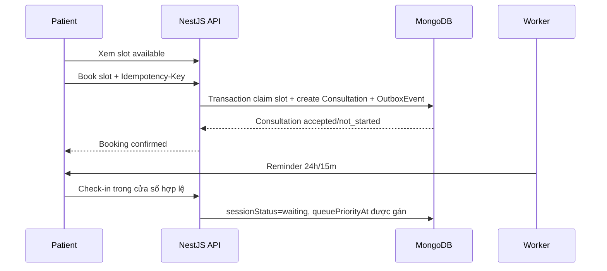
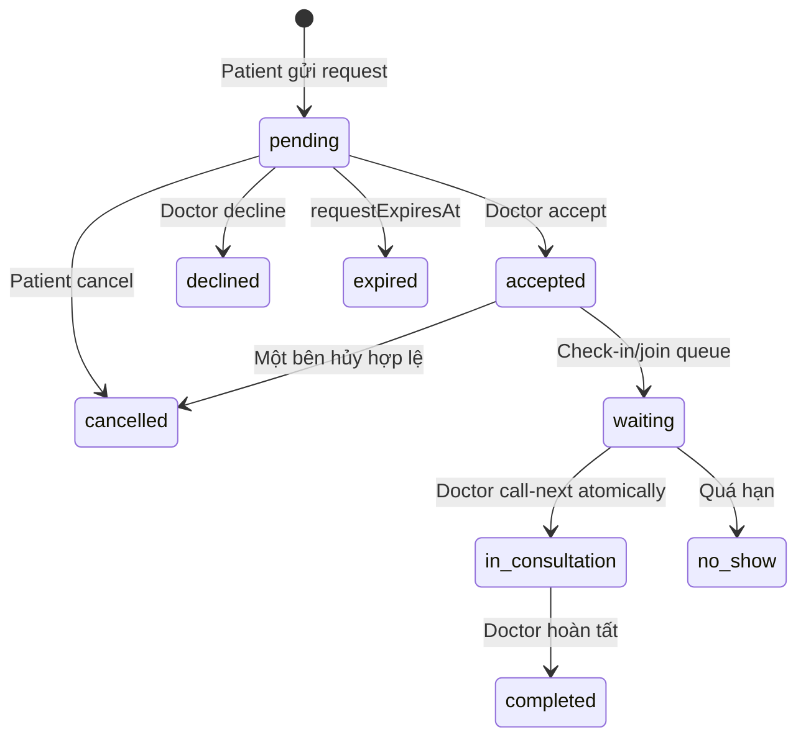
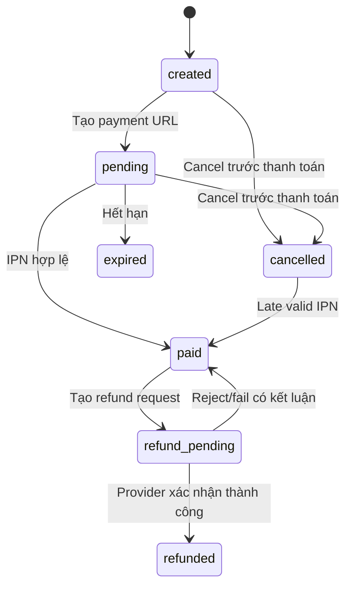
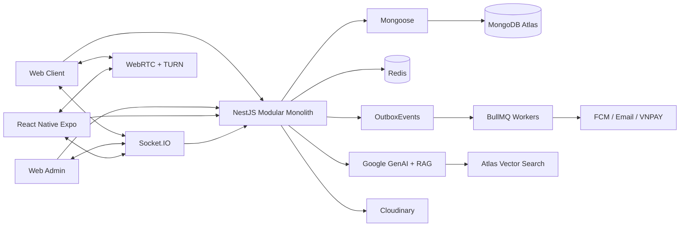

# Healthcare Application — Tổng quan sản phẩm DA2

## 1. Mục đích tài liệu

Tài liệu mô tả phạm vi sản phẩm, nghiệp vụ, kiến trúc và trạng thái chuyển đổi của Healthcare Application từ DA1 sang DA2. Nguồn chuẩn đi kèm:

- Nghiệp vụ: `docs/BUSINESS_RULES.md`.
- Dữ liệu: `docs/db-template-v7.dbml`.
- Kế hoạch thực thi: `plan/refactor-plan.md`.
- Hợp đồng tích hợp frontend: `docs/fe-integration.md`.

DA2 được triển khai trong giai đoạn 09/2026–12/2026, deadline mục tiêu 31/12/2026. Những chức năng được mô tả là **mục tiêu của phiên bản DA2**, không mặc định đã tồn tại trong code DA1.

## 2. Định vị sản phẩm

Healthcare Application là nền tảng **theo dõi sức khỏe và tư vấn từ xa**, không phải hệ thống khám bệnh, chẩn đoán hoặc thay thế cơ sở y tế.

Sản phẩm hỗ trợ:

- Bệnh nhân theo dõi chỉ số sức khỏe và nhận cảnh báo tham khảo.
- Bệnh nhân chủ động đặt lịch theo slot bác sĩ đã mở.
- Bệnh nhân gửi yêu cầu tư vấn nhanh theo cơ chế on-demand.
- Bác sĩ tiếp nhận yêu cầu, quản lý lịch, hàng đợi và tư vấn qua chat/audio/video.
- AI cung cấp thông tin, tóm tắt và truy xuất tri thức RAG; không tự đưa ra chẩn đoán.
- Gói hội viên và quota kiểm soát quyền lợi AI.
- Thanh toán, cancel payment order và full refund có quản trị viên duyệt.
- Quản trị người dùng, hồ sơ bác sĩ, tri thức AI, billing và báo cáo vi phạm.

Khi có dấu hiệu khẩn cấp, hệ thống phải hướng người dùng tới cơ sở y tế hoặc dịch vụ cấp cứu phù hợp, không tiếp tục mô phỏng chẩn đoán.

## 3. Vai trò và kênh sử dụng

| Vai trò | Web Client | Mobile | Web Admin |
|---|---|---|---|
| Patient | Theo dõi sức khỏe, tìm bác sĩ, đặt lịch, on-demand, queue, chat/call, AI, billing | Critical patient flows, FCM và secure token storage | Không |
| Doctor | Dashboard, slot, request, queue, chat/call, hồ sơ và review | Critical doctor flows, FCM và call foreground | Không |
| Admin | Không dùng client cho nghiệp vụ quản trị | Ngoài MVP | Dashboard, users, doctor verification, AI knowledge, plans, payments/refunds, moderation |

Frontend sẽ được tách thành repository riêng gồm:

```text
healthcare-frontend/
├── apps/web-client
├── apps/web-admin
├── apps/mobile
└── packages/
    ├── ui
    ├── api-client
    └── realtime-contracts
```

Backend trở thành repository NestJS độc lập. REST types phía frontend được sinh từ OpenAPI; frontend không import trực tiếp Mongoose schemas hoặc domain source của backend.

## 4. Chức năng theo vai trò

### 4.1 Patient

- Đăng ký local hoặc OAuth, xác thực email, đăng nhập và quản lý phiên.
- Quản lý hồ sơ, avatar và thông tin liên hệ.
- Xem danh sách bác sĩ active + approved và hồ sơ chuyên môn.
- Xem AvailabilitySlots và đặt lịch chủ động.
- Gửi on-demand request cho bác sĩ khi không chọn slot.
- Hủy consultation theo policy; check-in và theo dõi vị trí hàng đợi.
- Chat, gửi tệp/hình ảnh và tham gia audio/video call khi consultation cho phép.
- Nhập, sửa, xóa và xem biểu đồ HealthMetrics.
- Hỏi AI, xem citation/lịch sử và quota còn lại.
- Xem Plans, tạo PaymentOrder, theo dõi kết quả thanh toán và Subscription.
- Cancel order chưa thanh toán; gửi full-refund request cho order đã paid.
- Review bác sĩ sau consultation completed và gửi ViolationReport.
- Nhận notification trong app và FCM trên mobile.

### 4.2 Doctor

- Đăng ký, cập nhật DoctorProfile và tải tài liệu xác minh.
- Chỉ doctor `active + approved` được mở slot, nhận request hoặc bắt đầu tư vấn.
- Tạo, block và quản lý AvailabilitySlots.
- Accept/decline on-demand request.
- Theo dõi patient đã check-in, gọi người tiếp theo bằng thao tác atomic và xử lý no-show.
- Chat/call trong consultation được authorize.
- Xem health context của patient trong phạm vi consultation.
- Ghi consultation note, hoàn tất phiên và xem review.
- Nhận notification về request, queue, lịch, message và verification.

### 4.3 Admin

- Xem dashboard tổng hợp từ endpoint chuyên dụng, không tải toàn bộ collection về trình duyệt để tự đếm.
- Tìm kiếm, lọc, khóa/mở khóa tài khoản và xem audit liên quan.
- Approve/reject hồ sơ bác sĩ kèm lý do.
- Quản lý Plans và trạng thái hiển thị.
- Xem PaymentOrders, PaymentTransactions và trạng thái đối soát.
- Review/approve/reject PaymentRefunds; provider call do worker thực hiện.
- Quản lý tài liệu RAG và blacklist keywords.
- Xử lý ViolationReports theo workflow bốn trạng thái.
- Tạo và theo dõi NotificationCampaigns nếu còn trong release cut-line.

## 5. Nghiệp vụ cốt lõi

### 5.1 Identity và OAuth

1. Một tài khoản nằm trong `Users`; doctor/admin profile chỉ là dữ liệu theo vai trò.
2. Tài khoản OAuth được ánh xạ qua `OAuthAccounts`; tài khoản OAuth-only có thể không có `passwordHash`.
3. OTP hash, attempts và TTL nằm trong Redis, không nằm trong Users.
4. Refresh token chỉ lưu hash trong `AuthSessions`, có rotation theo `familyId` và phát hiện replay.
5. Password change, logout-all hoặc account ban phải revoke session liên quan.
6. OAuth dùng state, callback allowlist và PKCE khi phù hợp.

### 5.2 Scheduled consultation



- Patient chỉ được chọn slot do doctor tạo sẵn; không gửi `scheduledAt` tùy ý.
- Claim slot là atomic, một slot chỉ tạo tối đa một consultation.
- Cancel đúng policy mở lại slot nếu slot vẫn còn hợp lệ.
- Scheduled instant booking có `requestStatus=accepted` ngay sau transaction.

### 5.3 On-demand consultation



- Một patient chỉ có tối đa một on-demand request pending tới cùng doctor.
- Doctor chỉ có tối đa một consultation `in_consultation`.
- `requestStatus` mô tả vòng đời yêu cầu; `sessionStatus` mô tả vòng đời phiên thực tế.
- Không dùng `active` cho nhiều nghĩa và không dùng `rejected` để biểu diễn cancel.

### 5.4 Hàng đợi

Hàng đợi là truy vấn nghiệp vụ từ `Consultations`, không phải BullMQ queue. Một item nằm trong queue khi:

```text
requestStatus = accepted
sessionStatus = waiting
queueJoinedAt != null
queuePriorityAt != null
```

`queuePriorityAt` là khóa sắp xếp ổn định. `call-next` dùng conditional update/transaction để hai request đồng thời không claim cùng một consultation.

### 5.5 Chat, call và review

- Message gắn với `consultationId`; server kiểm tra participant trước read/send/join room.
- `clientMessageId` chống tạo message trùng khi client retry.
- Socket.IO phục vụ chat, notification, queue update và WebRTC signaling.
- WebRTC media đi peer-to-peer/TURN; database chỉ lưu metadata bắt đầu/kết thúc và consent.
- Patient chỉ review consultation của mình sau khi completed; một consultation có tối đa một review.
- Rating summary của doctor được cập nhật trong transaction và có job đối soát.

### 5.6 Health tracking và AI

- HealthMetrics lưu theo UTC; timezone dùng cho hiển thị.
- Alert threshold chỉ là cảnh báo tham khảo.
- Redis reserve/commit/release quota theo ngày; `AiUsageDaily` là dữ liệu bền vững để thống kê và đối soát.
- Không dùng cron xóa toàn bộ quota key; key theo ngày có TTL.
- RAG dùng `AiDocuments`, `AiDocumentChunks` và Atlas Vector Search.
- AI response phải có safety policy/disclaimer và không chẩn đoán.

### 5.7 Billing, cancel và refund



- Return URL chỉ hiển thị trạng thái; IPN hợp lệ mới ghi nhận paid và cấp quyền lợi.
- Duplicate IPN không tạo hai subscriptions.
- Mỗi paid order tạo một Subscription grant có `sourceOrderId` unique.
- Cancel order chỉ dành cho `created|pending`; không gọi refund provider.
- Late valid IPN của order cancelled/expired vẫn phải ghi nhận, không bỏ qua tiền đã thu.
- Full refund MVP: patient request, admin approve/reject, worker gọi VNPAY, timeout chuyển `manual_review` để đối soát.
- Chỉ khi provider xác nhận refund thành công mới chuyển order `refunded` và cancel đúng subscription grant.
- Partial refund, chargeback, auto-approve và auto-refund do hủy consultation nằm ngoài DA2.

### 5.8 Notification, Outbox và worker

```text
MongoDB transaction
  -> business entity
  -> Notification
  -> OutboxEvent
  -> dispatcher
  -> BullMQ
  -> Socket.IO / FCM / Email / external job
```

- Outbox đảm bảo side effect không mất sau commit.
- BullMQ phục vụ reminder, expiration, no-show, notification retry, RAG ingestion và payment/refund reconciliation.
- Consumer phải idempotent vì delivery là at-least-once.

## 6. Kiến trúc hệ thống đích



Backend sử dụng Modular Monolith, chia theo capability:

| Module | Dữ liệu sở hữu |
|---|---|
| identity-access | Users, OAuthAccounts, AuthSessions, AuthEvents, UserDevices |
| practitioner-management | DoctorProfile embedded trong Users và verification policy |
| consultations | AvailabilitySlots, Consultations, ConsultationMessages, Reviews |
| health-tracking | HealthMetrics |
| ai-advisory | AiConversations, AiMessages, AiUsageDaily, AiDocuments, AiDocumentChunks, BlacklistKeywords |
| billing | Plans, PaymentOrders, PaymentTransactions, Subscriptions, PaymentRefunds |
| notifications | NotificationCampaigns, Notifications, OutboxEvents |
| moderation | ViolationReports |

Mongoose là ODM chính. Mỗi collection có một canonical model thuộc module sở hữu; module khác truy cập qua application facade/query port, không inject model trực tiếp.

## 7. Dữ liệu

DB v7 gồm 27 collections được mô tả tại `docs/db-template-v7.dbml`, bao gồm 25 collection nghiệp vụ và hai collection hạ tầng migration `_schema_migrations`, `_migration_lock`.

Nguyên tắc:

- MongoDB là source of truth cho dữ liệu nghiệp vụ; Redis chỉ giữ cache, presence, quota, OTP và queue jobs.
- Dùng versioned migration files; không dùng `autoIndex`, `syncIndexes()` hoặc script rời làm deployment migration.
- Partial/sparse/TTL index, time-series options, validators và Atlas Search definition được tạo/verify qua migration.
- Timestamp lưu UTC; tiền VND lưu integer; secret/token/OTP plaintext không nằm trong database.
- Frontend chỉ nhận API DTO, không nhận raw Mongoose Document hoặc field nội bộ như hash, lock và gateway payload.

## 8. API và realtime contract

- REST prefix: `/api/v1`.
- OpenAPI là nguồn contract chuẩn giữa backend và frontend repository.
- Lỗi chuẩn: `code`, `message`, `details`, `correlationId`.
- Pagination chuẩn: `items`, `page`, `limit`, `total`, `hasNext`.
- Command có nguy cơ retry như booking, message, create order, cancel và refund dùng `Idempotency-Key` hoặc conditional transition.
- Socket event có version, ví dụ `consultation.v1.updated`, `message.v1.created`, `queue.v1.changed`, `notification.v1.created`.
- Frontend integration chi tiết theo từng page nằm trong `docs/fe-integration.md`.

## 9. Công nghệ

| Nhóm | Công nghệ | Vai trò |
|---|---|---|
| Backend | Node.js, TypeScript, NestJS | API, authorization, use case và worker bootstrap |
| Persistence | MongoDB Atlas, Mongoose, MongoDB driver | Business data, migration và feature MongoDB đặc thù |
| Cache/jobs | Redis, BullMQ, `@nestjs/bullmq` | OTP, quota, presence, delayed/retry jobs |
| Realtime | Socket.IO, Redis Adapter, WebRTC, TURN | Chat, notification, queue và call signaling/media |
| AI | Google GenAI SDK, Atlas Vector Search | AI advisory, summary và RAG |
| Files/push/email | Cloudinary, FCM, Nodemailer | Attachment, push notification và email |
| Payment | VNPAY Sandbox | Payment, query/reconciliation và full-refund P1 |
| Frontend | React, Vite, TanStack Query, Zustand, Tailwind/Shadcn | Web Client và Web Admin |
| Mobile | React Native, Expo | Patient/doctor critical flows |
| Quality | Jest, Supertest, k6, GitHub Actions | Unit, integration, E2E, load test và CI/CD |

## 10. Hiện trạng và chuyển đổi

| Hiện trạng DA1/code hiện tại | Đích DA2 |
|---|---|
| `/sessions` với status `pending|active|completed|rejected` | `/consultations` với requestStatus và sessionStatus tách biệt |
| Patient gửi thời gian tùy ý | Scheduled booking chỉ từ AvailabilitySlot |
| Chưa có check-in/queue atomic | `queuePriorityAt`, call-next và no-show policy |
| Chat dùng `sessionId` và event legacy | Message/room theo `consultationId`, event versioned |
| User/Doctor/Admin models còn trùng | Một Users model với embedded role profiles |
| AI models/endpoints trùng | Một AI Conversation/Message model và capability services |
| Presence trong process | Redis TTL/heartbeat và Socket.IO Redis Adapter |
| Notification side effect trực tiếp | Notification + transactional outbox + worker |
| Chưa có billing implementation | Plans, payment/IPN, cancel, Subscription grant và refund P1 |
| Frontend/backend cùng monorepo | Backend repo riêng; frontend monorepo riêng; OpenAPI contract |

Các API/page hiện tại và API/page đích được phân biệt rõ trong `docs/fe-integration.md`; không xóa compatibility endpoint trước khi frontend target flow đã pass E2E.

## 11. Phạm vi theo deadline

### P0 phải hoàn thành

- Build/test/CI xanh.
- Identity, OAuth/session security và doctor verification.
- AvailabilitySlot, scheduled/on-demand Consultation, check-in, queue và chat.
- Notification/outbox/worker.
- AI quota/RAG cốt lõi.
- VNPAY payment cơ bản và cancel unpaid order.
- Web critical journeys và test race/idempotency.

### P1 có feature flag/cut-line

- Full refund có admin duyệt.
- Mobile patient/doctor critical flow, FCM.
- WebRTC foreground call.
- AI hỗ trợ moderation.

### Ngoài phạm vi DA2

- Partial refund, chargeback và auto-refund.
- Admin mobile đầy đủ và CallKeep production-grade.
- AI chẩn đoán hoặc tự quyết định chế tài.
- Microservices, Kafka, Kubernetes và scale claim chưa được đo.

Nếu muốn giữ full refund trong release, payment cơ bản phải ổn trước 22/11 và refund phải đạt gate trước 29/11; nếu không, tắt `VNPAY_REFUND_ENABLED` và ưu tiên P0.

## 12. Tiêu chí hoàn thành

- Business rule và API contract không mâu thuẫn DB v7.
- Backend, Web Client và Web Admin build/typecheck/test xanh.
- Critical E2E cho auth, booking, queue, chat, payment và feature P1 được bật.
- Race/idempotency tests pass cho slot, call-next, IPN và refund.
- Database rỗng được tạo lại từ migration files và `db:verify` pass.
- Không log dữ liệu nhạy cảm; room/file/API đều authorize phía server.
- Demo không cần sửa tay database.
- README, OpenAPI, realtime events và `fe-integration.md` khớp release thực tế.
