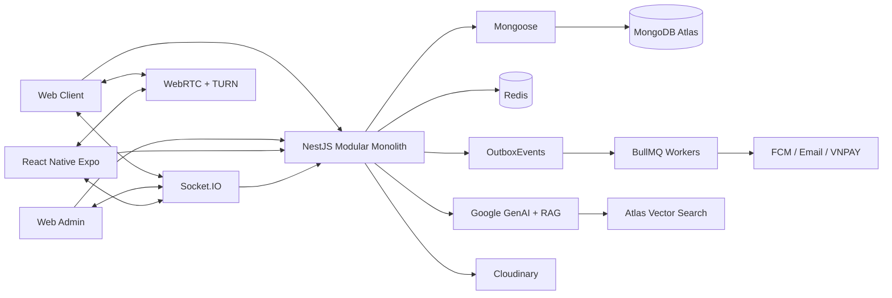

# HealthAI product specification

> Canonical product, role and safety specification. For Chronic Care command behavior, use [chronic-care-spec.md](chronic-care-spec.md); for delivery order, use [roadmap.md](../plan/roadmap.md).

## Business rules

# Healthcare Business Rules

## Mục đích và phạm vi

Tài liệu này mô tả các quy tắc nghiệp vụ có thể điều chỉnh trong quá trình phát triển. Hệ thống phục vụ theo dõi và hỗ trợ chăm sóc bệnh mạn từ xa kết hợp tư vấn trực tuyến; AI chỉ hỗ trợ thông tin, tóm tắt hoặc truy xuất tài liệu, không đưa ra chẩn đoán.

## Khái niệm chính

- AvailabilitySlot là khoảng thời gian bác sĩ mở cho bệnh nhân đặt lịch.
- Consultation là một yêu cầu hoặc một lịch tư vấn giữa bệnh nhân và bác sĩ.
- On-demand là bệnh nhân gửi yêu cầu tư vấn nhanh; bác sĩ quyết định chấp nhận hoặc từ chối.
- Scheduled là bệnh nhân chủ động chọn slot bác sĩ đã mở.
- Request status thể hiện kết quả xử lý yêu cầu hoặc quyền truy cập tư vấn.
- Session status thể hiện trạng thái thực tế của phiên tư vấn.
- Care Program là chương trình theo dõi có thời hạn, loại chỉ số, lịch đo và bộ rule có version.
- Care Enrollment là quan hệ Patient tham gia Care Program và Doctor được phân công theo dõi.
- Monitoring Task là nhiệm vụ đo chỉ số theo lịch; completion/adherence chỉ phản ánh hoạt động theo dõi.
- Care Evaluation là kết quả deterministic của rule engine; Care Alert là item cần Patient/Doctor chú ý và xử lý.

## Care Program và enrollment

1. MVP cam kết cả Care Program tăng huyết áp và tiểu đường; hai chương trình phải dùng chung domain model/rule engine.
2. Chỉ Patient active mới được enroll. Chỉ Admin có `program-management permission` được tạo/chỉnh draft Program Template; chỉ Doctor `active + approved` được khởi tạo enrollment cho Patient.
3. Patient phải xác nhận consent và mục đích sử dụng dữ liệu trước khi enrollment chuyển `active`; consent lưu version và timestamp.
4. Enrollment có trạng thái `pending`, `active`, `paused`, `completed`, `cancelled`. Chỉ enrollment `active` sinh Monitoring Task và Care Evaluation mới.
5. Mỗi enrollment phải tham chiếu đúng một Care Program version và bắt buộc có một Doctor `active + approved` phụ trách trước khi chuyển active.
6. Cập nhật template/rule set không được âm thầm đổi lịch sử. Enrollment đang chạy chỉ chuyển version theo thao tác có audit và effective time rõ ràng.
7. Patient có thể yêu cầu dừng chương trình; dữ liệu lịch sử được giữ theo chính sách retention/audit, không xóa cứng cùng enrollment.
8. Care Program không tạo quan hệ cấp cứu 24/7 và giao diện phải nêu rõ thời gian/phạm vi phản hồi của Doctor.
9. Program version đã publish là bất biến; chỉnh sửa tạo draft/version mới. Chỉ version published/active mới được dùng cho enrollment mới.
10. Baseline, eligibility, consent, task templates, reminder, rule set, review policy, content journey và completion criteria phải được snapshot hoặc tham chiếu version ổn định khi enrollment kích hoạt. Trong DA2, `taskTemplates` được nhúng trong từng phiên bản `CarePrograms`; nhiệm vụ đã sinh được lưu riêng trong `CareTasks`.
11. Doctor chỉ được tùy chỉnh các field được Program Template allowlist. Thay đổi patient-specific threshold hoặc review cadence phải có quyền, lý do và audit.
12. Admin quản lý lifecycle/version/publish/retire của Program Template và tạo/sửa/retire Rule draft qua `rule-management permission`; mọi Doctor `active + approved` có thể activate Rule mà không cần permission/approval riêng. Activate tự retire Rule active cũ của cùng Program version trong một thao tác audit.
13. Rule activation bắt buộc qua server validation cho declarative schema, operator allowlist, Program version và audit. Nguồn/căn cứ, simulation/test evidence là metadata tùy chọn trong DA2, không phải activation gate; AI vẫn không được tự phát hành Rule khi không có Admin/Doctor actor.
14. Doctor assignment bắt buộc ở mọi tier để xác định ownership và authorization; không mặc định tạo nghĩa vụ review định kỳ, SLA hoặc chat 24/7. Các quyền đó chỉ có khi Plan/Enrollment snapshot ghi rõ.
15. `pending -> active` chỉ xảy ra tự động khi đồng thời có Doctor `active + approved`, Program `published`, Care Rule `active`, entitlement hợp lệ, Patient đã chấp nhận đúng consent version và hoàn thành toàn bộ baseline bắt buộc. Thiếu một điều kiện thì enrollment vẫn `pending` và không sinh task/evaluation.
16. Assigned Doctor được chuyển `active -> paused` và `paused -> active` với lý do. Patient có thể gửi yêu cầu pause; Doctor phải xử lý yêu cầu trước khi resume. Resume phải kiểm tra lại Doctor, Program/Rule, consent và entitlement.
17. Assigned Doctor hoặc worker completion được duyệt có thể chuyển `active|paused -> completed` khi đạt completion criteria; phải lưu actor/reason. Patient rút consent làm enrollment chưa kết thúc chuyển `cancelled` ngay; chỉ Assigned Doctor được cancel với lý do.
18. `completed` và `cancelled` là trạng thái cuối, không reopen. Nếu Patient tiếp tục chương trình, Doctor tạo enrollment mới để giữ nguyên lịch sử và snapshot cũ.

## Monitoring Task và mức độ hoàn thành

1. Monitoring Task được sinh từ schedule, timezone và version của Care Program; worker tạo task phải idempotent.
2. Task type P0 gồm `metric`, `check_in`, `education`, `appointment`, `doctor_review`; `medication` và `journal` chỉ bật khi feature tương ứng hoàn tất.
3. Mỗi task template phải có type, schedule, time window, completion rule, reminder policy, required/optional và version. LLM không được tự đánh dấu task hoàn thành.
4. Với task `metric`, HealthMetrics là source of truth; task chỉ tham chiếu metric dùng để hoàn thành, không nhân bản raw health value.
5. Một HealthMetric chỉ hoàn thành task `metric` khi đúng Patient, metric type và cửa sổ thời gian cho phép. Task type khác dùng response/progress/Consultation/DoctorReview canonical tương ứng.
6. Task có trạng thái `scheduled`, `due`, `completed`, `missed`, `cancelled`; task của enrollment paused/cancelled không tiếp tục nhắc.
7. Monitoring adherence bằng số task Patient-required đã completed chia số task Patient-required đến hạn hợp lệ; `doctor_review` không tính vào adherence của Patient.
8. Adherence chỉ phản ánh hoạt động theo dõi, không được mô tả là tuân thủ điều trị hoặc uống thuốc trừ khi medication module được định nghĩa riêng.
9. Sửa/xóa dữ liệu nguồn phải tạo bản ghi HealthMetric thay thế hoặc chuyển bản ghi cũ sang `voided`, ghi `AuditLogs` với `domain = health`, sau đó kích hoạt đánh giá lại và tạo phiên bản task/report/summary liên quan; không ghi đè âm thầm giá trị đã đo.
10. Mọi thời gian lưu UTC; việc xác định ngày và cửa sổ task dùng timezone snapshot của enrollment.
11. Worker chỉ materialize task trong rolling window cấu hình; không tạo toàn bộ task dài hạn ngay khi enroll nếu gây write amplification.
12. Quiet hours, giới hạn tần suất và trạng thái hoàn thành phải được kiểm tra trước khi gửi reminder để tránh notification fatigue.
13. Worker chuyển `scheduled -> due` tại `windowStart`; nguồn hoàn thành hợp lệ chuyển `scheduled|due -> completed`; quá `windowEnd` chuyển `due -> missed`. Enrollment bị pause/cancel hoặc task không còn áp dụng có thể chuyển `scheduled|due -> cancelled` với reason.
14. `completed`, `missed`, `cancelled` là trạng thái cuối trong DA2. Dữ liệu nhập sau hạn vẫn được lưu, hiển thị trong biểu đồ và có thể tạo evaluation mới nhưng không đổi task `missed` thành completed và không hồi tố adherence của cửa sổ cũ.
15. HealthMetric correction dùng append-only replacement/void. Nếu có metric thay thế hợp lệ, task đã completed có thể đổi `completionSourceId` trong transaction và ghi audit; không đảo ngược trạng thái task. Evaluation/report/summary bị ảnh hưởng phải được tạo version thay thế, không ghi đè lịch sử.

## Người thân đồng hành và nhắc nhở hỗ trợ (P1)

1. Người thân đồng hành phải đăng ký tài khoản có role `Patient` bình thường và dùng cơ chế đăng nhập sẵn có; hệ thống không tạo role `family`. Việc là người thân không cấp quyền y tế hoặc quyền xem dữ liệu của Patient khác.
2. Một Patient có thể mời nhiều người thân nhưng số liên kết `active` không được vượt `familyLinkLimit` trong Plan/Subscription snapshot. Patient chỉ được mời tài khoản active khác chính mình; người thân phải đăng nhập và xác nhận liên kết trước khi nhận notification.
3. Consent phải tách bạch tối thiểu hai quyền: `missed_task_reminder` và `weekly_progress`. Các quyền xem HealthMetrics chi tiết, Care Alert, AI conversation, consultation, hồ sơ hoặc dữ liệu y tế nhạy cảm đều mặc định `false` và ngoài P1.
4. Patient luôn nhận reminder trước. Contact chỉ nhận reminder khi task Patient-required đã `missed`, enrollment còn `active`, contact đã consent và qua một grace period cấu hình. Notification chỉ nói Patient có một hoạt động theo dõi chưa hoàn thành; không chứa metric, severity, diagnosis, Doctor name, AI content hay lý do alert.
5. `urgent` không tự gửi cho contact và không biến contact thành emergency contact. Patient chỉ có thể bật một consent riêng cho notification `urgent` sau khi đọc cảnh báo; nội dung gửi vẫn không nêu chi tiết y khoa và phải theo safety policy đã duyệt.
6. `pending -> active` chỉ khi đúng người được mời accept trước `invitationExpiresAt`; người được mời có thể chuyển `pending -> declined`, worker chuyển invitation quá hạn sang `expired`, Patient có thể hủy invitation thành `revoked`.
7. Patient được chuyển `active -> paused` và `paused -> active`. Patient hoặc người thân có thể chuyển `active|paused -> revoked`; revoke có hiệu lực ngay cho notification/query mới nhưng không đăng xuất hay vô hiệu hóa tài khoản Patient độc lập của người thân.
8. Khi mời lại cùng cặp Patient–người thân ở trạng thái `revoked|declined|expired`, hệ thống tái sử dụng `FamilyLinks`, tăng `invitationVersion`, reset dữ liệu vòng mời hiện tại và chuyển về `pending`. Mọi FamilyPermission cũ vẫn revoked; khi accept phải tạo permission/consent version mới. Lịch sử các lần mời nằm trong `AuditLogs`.
9. Invitation, acceptance/decline/expiry, consent version, pause/resume, thay đổi scope, reminder event, delivery result, revoke và actor phải được ghi trong `AuditLogs` với `domain = care` và các bản ghi `FamilyReminders` liên quan. Người thân không được xem danh sách Doctor hoặc lịch sử alert chỉ vì được liên kết.
10. Reminder cho contact tuân thủ quiet hours, frequency cap và deduplication độc lập với notification của Patient. Không gửi reminder nếu task đã hoàn thành, bị hủy hoặc enrollment không còn active.
11. `FamilyLinks` đã biểu diễn quan hệ nhiều-nhiều giữa các tài khoản nên DA2 không tạo `FamilyGroups`. Chỉ thêm group khi có nghiệp vụ thật sự như hộ gia đình dùng chung, vai trò trưởng nhóm hoặc hội thoại nhóm.

## Care rule, evaluation và alert

1. Rule set có lifecycle `draft`, `active`, `retired`; chỉ version active áp dụng cho dữ liệu mới. Mọi Doctor `active + approved` có thể activate sau server validation; không có bước human approval riêng. Activate tự retire version active cũ của cùng Program version.
2. Rule engine phải deterministic và trả về `normal`, `attention` hoặc `urgent` cùng `reasonCodes`, `ruleSetVersion` và input references.
3. Rule có thể dùng giá trị hiện tại, số lần lặp, xu hướng ngắn hạn hoặc dữ liệu bị thiếu; không được trả về chẩn đoán/tên bệnh mới.
4. Ngưỡng và nội dung hành động không hard-code rải rác trong service. Mọi thay đổi phải có actor, lý do, version và audit log.
5. AI/LLM không được tạo, nâng/hạ severity hoặc ghi đè kết quả Care Evaluation.
6. Evaluation `urgent` dùng safety template đã duyệt để hướng Patient liên hệ cơ sở y tế/cấp cứu phù hợp; không chờ AI và không cam kết Doctor phản hồi tức thời.
7. Care Alert phải có deduplication key theo enrollment, rule và evaluation window để retry không tạo cảnh báo trùng.
8. Alert có trạng thái `open`, `acknowledged`, `resolved`, `dismissed`; acknowledge không đồng nghĩa đã giải quyết hoặc đã liên hệ Patient.
9. Chỉ Doctor được phân công, Patient sở hữu dữ liệu và Admin có quyền audit mới xem alert theo phạm vi tương ứng.
10. Resolve/dismiss phải lưu actor, timestamp và lý do; alert quan trọng không được hard-delete.
11. Assigned Doctor có thể chuyển `open -> acknowledged -> resolved` hoặc `open -> resolved`. Khi resolve trực tiếp từ `open`, backend phải ghi acknowledge và resolve cùng actor/time trong một transaction để không mất dấu đã tiếp nhận.
12. Assigned Doctor được chuyển `open|acknowledged -> dismissed` chỉ với reason code được phép như `duplicate`, `invalid_metric`, `rule_false_positive`. Admin có quyền audit nhưng không thay Doctor đưa ra clinical disposition.
13. `resolved` và `dismissed` là trạng thái cuối, không reopen. Evaluation trong cùng deduplication window phải dùng lại alert `open|acknowledged`; evaluation ở window mới hoặc sau khi alert cũ kết thúc tạo alert mới.

## Tìm cơ sở y tế theo nhu cầu theo dõi (P1)

1. `MedicalFacilities` là danh mục cơ sở y tế do Admin quản lý. Mỗi bản ghi có `status = verified` phải có tối thiểu tên, loại cơ sở, địa chỉ, tọa độ, tỉnh/thành, kênh liên hệ, danh sách chuyên khoa/dịch vụ, nguồn xác minh, `verifiedAt` hoặc `updatedAt` và nhật ký trong `AuditLogs` với `domain = facility`.
2. `DiseaseSpecialties` ánh xạ bệnh/Care Program sang một hoặc nhiều chuyên khoa. Chỉ Admin có quyền tạo, duyệt, sửa hoặc ngừng dùng ánh xạ; mọi thay đổi phải có phiên bản/nhật ký và không được coi là chẩn đoán hoặc hướng dẫn lâm sàng.
3. Tìm kiếm cần condition/Program đã chọn rõ ràng hoặc specialty đã duyệt, cùng khu vực hoặc vị trí do Patient chủ động cung cấp. Vị trí chính xác là dữ liệu nhạy cảm: chỉ dùng cho truy vấn hiện tại khi Patient cho phép, không lưu lịch sử mặc định.
4. Kết quả nội bộ chỉ lấy `MedicalFacilities` đã xác minh, lọc chuyên khoa/khu vực rồi sắp xếp xác định theo mức khớp chuyên khoa và khoảng cách. Không dùng AI score, đánh giá sao, doanh thu hay phí quảng cáo để thay đổi thứ tự phù hợp y khoa.
5. Mỗi kết quả phải hiển thị source, ngày cập nhật, specialty khớp và reason code dễ hiểu. Hệ thống không tuyên bố “tốt nhất”, “phù hợp điều trị nhất” hoặc bảo đảm khả năng tiếp nhận/đặt lịch nếu không có xác nhận chính thức của cơ sở.
6. Dịch vụ bản đồ bên ngoài chỉ được gọi khi danh mục nội bộ thiếu kết quả hoặc Patient chủ động mở rộng tìm kiếm. Kết quả phải gắn nhãn nguồn bên ngoài và tuân thủ điều khoản ghi nguồn/lưu dữ liệu của nhà cung cấp. Khi cần bổ sung danh mục, Admin chọn một kết quả bản đồ để tạo `MedicalFacilities.status = draft`, kiểm tra nguồn chính thức rồi mới chuyển sang `verified`; kết quả API không bao giờ tự được xác minh.
7. AI chỉ được chuẩn hóa văn bản tự nhiên thành bộ lọc condition/specialty/location trong allowlist và giải thích kết quả dựa trên dữ liệu đã trả về. AI không suy luận bệnh, xếp hạng chất lượng cơ sở, chẩn đoán hoặc xử lý tình huống `urgent`.
8. Trong luồng `urgent`, safety template luôn hiển thị trước. Tìm cơ sở y tế/chỉ đường là tác vụ bổ trợ và không được trì hoãn hướng dẫn liên hệ cấp cứu/cơ sở y tế phù hợp.
9. Liên kết đặt lịch chỉ xuất hiện khi cơ sở có tích hợp chính thức hoặc đường dẫn đã được Admin xác thực. Không mô phỏng còn chỗ, giá hoặc xác nhận lịch từ dữ liệu bản đồ.

## Doctor Priority Inbox và follow-up

1. Priority Inbox là projection/query từ Care Alerts và enrollments, không phải nguồn dữ liệu lâm sàng mới.
2. Thứ tự mặc định: severity, detectedAt và `_id` tie-breaker; AI score không tham gia quyết định thứ tự P0.
3. Mọi list phải pagination, projection và hard limit; Doctor không được truy vấn Patient ngoài assignment hợp lệ.
4. Doctor có thể acknowledge, ghi chú liên hệ, tạo/liên kết Consultation và resolve alert.
5. Consultation liên kết alert vẫn phải tuân thủ đầy đủ booking, participant authorization và session state hiện có.
6. Sau consultation, Doctor có thể ghi follow-up note hoặc thay đổi chương trình trong phạm vi được cấp quyền; hệ thống phải lưu audit.

## Báo cáo và AI summary Chronic Care

1. Báo cáo 7/30 ngày được tính xác định từ HealthMetrics, Monitoring Tasks, Care Alerts và Consultations trong phạm vi được authorize.
2. Backend tính thống kê, trend và adherence; LLM chỉ diễn đạt từ payload chuẩn hóa, không tự tính lại hoặc bổ sung dữ kiện.
3. Summary phải lưu window, data cutoff, model/prompt version, nguồn dữ liệu/provenance và trạng thái generation.
4. Nếu AI timeout, lỗi hoặc evidence không đủ, hệ thống vẫn trả báo cáo số liệu và reason codes; narrative chuyển `unavailable`.
5. Patient summary dùng ngôn ngữ tham khảo, không chẩn đoán. Doctor summary phải phân biệt dữ kiện, dữ liệu thiếu và nội dung AI sinh.
6. RAG chỉ sử dụng document/chunk active, approved, chưa hết hạn; citation trả về phải được backend kiểm tra tồn tại.
7. Dữ liệu Patient chỉ được đưa vào summary trong đúng authorization scope; không dùng raw health payload để huấn luyện hoặc gọi provider ngoài policy.
8. Trước khi tạo summary, backend phải chuẩn hóa metric type, unit, timezone, source và report window; bản ghi không hợp lệ được loại bằng reason code, không được tự sửa hoặc bỏ qua âm thầm.
9. Backend, không phải LLM, tính expected/completed measurements, adherence, min/max/average/median, period delta, trend, missing windows, alert counts và consultation/follow-up references.
10. Mỗi lần sinh nội dung dùng một `SummaryInputSnapshot` bất biến gồm data cutoff, statistics, missing data, Care Evaluations và source references. Snapshot phải có hash/version để audit và tái tạo kết quả.
11. Structured output tối thiểu tách `overview`, `observations`, `missingData`, `alertsToMention`, `questionsForDoctor` và `disclaimer`; Patient và Doctor dùng hai presentation policy khác nhau trên cùng facts.
12. Output phải qua schema validation và grounding validation. Mọi con số, xu hướng, alert hoặc nhận xét sự kiện phải ánh xạ được về snapshot/source reference; nội dung không có nguồn bị loại.
13. Guard cấm diagnosis, prescription, dose change, stop-medication advice, thay đổi severity và tuyên bố chắc chắn không được chứng minh. Guard fail phải dùng deterministic fallback và ghi validation reason.
14. Summary generation idempotent theo enrollment, report window, data cutoff và summary version. Dữ liệu nguồn thay đổi tạo summary version mới; không ghi đè lịch sử đã được Doctor review.
15. Summary lưu `generated|fallback|failed`, model/prompt version, rule set version, input hash/source refs, validation result, token/latency metadata không chứa raw health data và Doctor review status nếu có.
16. RAG chỉ bổ sung kiến thức giáo dục từ tài liệu active/approved; RAG không tính thống kê, chọn threshold, thay đổi rule result hoặc quyết định hành động khẩn.
17. Admin/Doctor được cấp quyền duyệt ở cấp `AiDocuments`, không duyệt thủ công từng chunk. `AiDocuments.reviewStatus` là nguồn chuẩn; khi document được duyệt/archived, worker dùng bulk update đồng bộ `AiDocumentChunks.reviewStatus/isActive`.
17a. Mỗi `AiDocumentChunks` phải kế thừa metadata quản trị từ document và metadata vị trí từ parser: nguồn/tổ chức, trạng thái duyệt, phiên bản, ngày hiệu lực, chuyên khoa, ngôn ngữ, đối tượng đọc, trang và đường dẫn section.
18. Retrieval chỉ dùng chunk `isActive = true`, `reviewStatus = approved`, chưa hết hiệu lực và khớp phạm vi. `citation` phải trỏ đúng document, version, page/section và source URL; backend kiểm tra chunk/citation trước khi trả lời.
19. `contentHash` chống chunk trùng trong cùng document; `ingestionVersion` xác định parser/chunker/embedding version để re-ingestion. `parentChunkId` chỉ dùng lấy section cha đủ ngữ cảnh, không bỏ qua metadata filter của child hoặc parent.
20. Chunk lỗi hoặc không phù hợp được loại riêng bằng `isActive = false`, `excludedBy`, `excludedAt`, `exclusionReason`; thao tác này không thay đổi trạng thái duyệt của toàn document. Document version mới phải được duyệt trước khi thay thế version cũ đang active.

## Quy tắc tài khoản và bác sĩ

1. Chỉ tài khoản active được tư vấn, đặt lịch hoặc thanh toán.
2. Chỉ user có role doctor và hồ sơ được approved mới được mở slot, nhận yêu cầu hoặc tư vấn.
3. Presence online dùng Redis và Socket.IO. `Users.lastOnlineAt` trong MongoDB chỉ là thời điểm online gần nhất đã ghi bền vững, được cập nhật có giới hạn tần suất khi disconnect/heartbeat; không dùng field này để kết luận user đang online tức thời.
4. Một OAuth account chỉ liên kết với một user. Một user chỉ có một account cho mỗi OAuth provider.
5. Refresh token chỉ lưu dạng hash trong `AuthSessions`, có expiry và rotation. Token gửi cho client chứa `sessionId` và secret ngẫu nhiên; backend tìm session theo ID rồi so sánh hash, không query bằng plaintext token. Mỗi lần rotation revoke bản ghi cũ, tạo bản ghi mới cùng `familyId` và nối `rotatedFromSessionId/replacedBySessionId`; dùng lại token cũ sẽ revoke cả family. MongoDB là nguồn bền vững cho logout-all và replay detection; Redis chỉ là cache/revocation fast-path. OTP chỉ tồn tại trong Redis với TTL, giới hạn số lần thử và rate limit gửi lại.

## Lịch trống và đặt lịch chủ động

`doctorProfile.bookingSettings` là chính sách mặc định của từng Doctor. Khi booking thành công, backend snapshot các giá trị áp dụng vào Consultation để việc Doctor đổi cấu hình sau đó không làm thay đổi lịch đã đặt:

- `bookingPolicy`: `instant` xác nhận ngay; `approval_required` tạo yêu cầu chờ Doctor duyệt.
- `minNoticeMinutes`: thời gian tối thiểu từ lúc đặt tới giờ bắt đầu; chặn đặt quá sát giờ.
- `maxAdvanceDays`: số ngày xa nhất Patient được phép đặt trước.
- `cancellationDeadlineMinutes`: mốc cuối Patient được hủy đúng hạn để hoàn lượt/mở lại slot theo policy.
- `checkInEarlyMinutes`: số phút Patient được check-in trước giờ hẹn.
- `noShowAfterMinutes`: số phút chờ sau giờ hẹn trước khi có thể đánh dấu `no_show`.
- `defaultDurationMinutes`: thời lượng dự kiến khi tạo slot/on-demand; không tự kết thúc phiên.
- `bufferMinutes`: khoảng đệm tối thiểu giữa các lịch booked để giảm chồng chéo.

Các giá trị phải có giới hạn hệ thống do Admin cấu hình; Doctor không được đặt số âm hoặc vượt giới hạn vận hành.

1. Bác sĩ tạo AvailabilitySlots với start time, end time và timezone. Một bác sĩ không được có hai slot cùng start time.
2. Slot có các trạng thái available, booked, blocked hoặc expired.
3. Mặc định booking policy là instant: bệnh nhân đặt thành công thì lịch được xác nhận ngay, không cần bác sĩ duyệt lại.
4. Phiên bản sau có thể hỗ trợ approval required. Khi đó booking tạo consultation có request status pending.
5. Bệnh nhân chỉ thấy slot available, chưa qua giờ bắt đầu và thỏa min notice minutes của bác sĩ.
6. Bệnh nhân chỉ được đặt trong max advance days tính từ hiện tại.
7. Booking là thao tác atomic: backend chỉ tạo Consultation khi đổi thành công slot từ available sang booked. Nếu tạo consultation lỗi, slot phải được trả về available.
8. Khi bệnh nhân hủy đúng hạn cancellation deadline, slot quay lại available. Slot bị bác sĩ block hoặc đã hết giờ không được mở lại.
9. Slot qua giờ mà không có consultation hợp lệ chuyển expired.
10. Slot của cùng Doctor không được overlap và phải tôn trọng `bufferMinutes`; việc kiểm tra dùng transaction/conditional query, không chỉ dựa vào unique start time.

## Tư vấn nhanh theo yêu cầu

1. Bệnh nhân tạo consultation on-demand với request status pending, session status not started và không có availability slot.
2. Bác sĩ có thể accept hoặc decline yêu cầu; trường declined reason là tùy chọn.
3. Yêu cầu chưa xử lý chuyển expired tại request expires at. Giá trị MVP đề xuất là 24 giờ.
4. Một bệnh nhân chỉ có tối đa một yêu cầu pending tới cùng bác sĩ để hạn chế spam.
5. Chỉ khi request được accepted, hai bên mới truy cập ConsultationMessages hoặc phòng tư vấn.
6. Bác sĩ có thể accept nhiều yêu cầu nhưng chỉ được có một consultation in consultation tại một thời điểm.
7. Doctor không được accept on-demand như một cam kết bắt đầu ngay nếu có scheduled consultation sắp tới trong `expectedDurationMinutes + bufferMinutes`. Hệ thống có thể cho request tiếp tục pending hoặc accepted/waiting kèm ETA.

## Trạng thái Consultation

### Request status

| Trạng thái | Ý nghĩa |
|---|---|
| pending | Chờ bác sĩ duyệt. |
| accepted | Có thể bắt đầu hoặc chờ tới giờ tư vấn. |
| declined | Bác sĩ từ chối. |
| cancelled | Bệnh nhân hoặc bác sĩ hủy. |
| expired | Không được xử lý trước hạn. |

### Session status

| Trạng thái | Ý nghĩa |
|---|---|
| not started | Chưa check-in hoặc chưa bắt đầu. |
| waiting | Bệnh nhân đã check-in và đang chờ. |
| in consultation | Bác sĩ đang tư vấn. |
| interrupted | Phiên bị gián đoạn do mất heartbeat/kết nối; có thể resume hoặc được Doctor hoàn tất. |
| completed | Phiên tư vấn đã kết thúc. |
| no show | Bệnh nhân không xuất hiện đúng quy định. |

## Check-in và hàng đợi

1. Hàng đợi chỉ chứa consultation accepted có session status waiting.
2. Bệnh nhân có lịch được check-in sớm tối đa check in early minutes; giá trị MVP đề xuất là 15 phút.
3. Hàng đợi sắp theo scheduled start time, sau đó theo queue joined time. Vị trí hiển thị chỉ là snapshot, không phải nguồn dữ liệu chuẩn.
4. Khi bác sĩ gọi người tiếp theo, backend atomically đổi một consultation từ waiting sang in consultation.
5. Nếu bệnh nhân không xuất hiện sau no show after minutes tính từ giờ hẹn, session chuyển no show. Giá trị MVP đề xuất là 10 phút.
6. Một consultation on-demand đã accepted cũng có thể vào waiting khi bác sĩ đang tư vấn cho người khác.
7. Scheduled và on-demand dùng chung hàng đợi theo Doctor. Thứ tự mặc định: scheduled đã quá giờ, scheduled đã đến cửa sổ phục vụ, sau đó on-demand accepted theo `queueJoinedAt`. Không được ngắt phiên `in_consultation` để phục vụ phiên khác.
8. `call-next` phải kiểm tra atomically Doctor chưa có phiên `in_consultation`; partial unique index là lớp bảo vệ cuối cùng chống hai request đồng thời.
9. On-demand chỉ được gọi trong khoảng trống khi `now + expectedDurationMinutes + bufferMinutes` không vượt giờ scheduled tiếp theo. Nếu phiên hiện tại kéo dài, scheduled Patient nhận cập nhật trễ/ETA.

## Kết thúc và gián đoạn Consultation

1. `scheduledEndAt` hoặc thời lượng dự kiến chỉ dùng cho lịch, cảnh báo và ETA; hệ thống không tự chuyển Consultation sang `completed` khi hết giờ.
2. Doctor chủ động kết thúc cuộc gọi (`callEndedAt`) và xác nhận hoàn tất Consultation (`completedAt`, `completedBy`). Hai mốc có thể khác nhau để Doctor hoàn thiện note.
3. Trước giờ dự kiến kết thúc, hệ thống có thể cảnh báo. Khi quá giờ, ghi `overtimeStartedAt`; không tự đóng chat/call hoặc đánh dấu đã hoàn thành.
4. Nếu phiên `in_consultation` mất heartbeat quá giới hạn kỹ thuật, worker chuyển sang `interrupted` bằng conditional update, ghi lý do và giải phóng khóa một phiên đang chạy. Worker không được ghi `completed` thay Doctor.
5. Doctor có thể resume phiên interrupted nếu không có phiên khác đang chạy, hoặc hoàn tất với ghi chú/lý do. Mọi interrupt/resume/complete ghi `AuditLogs` với `domain = consultation`.

## Chat, video và quyền truy cập

1. ConsultationMessages thuộc đúng một consultation và chỉ patient hoặc doctor của consultation đó mới xem hoặc gửi message.
2. Room ID chỉ tạo sau khi consultation được accepted và phải unique.
3. WebRTC signaling đi qua Socket.IO. Không lưu signaling message vào MongoDB.
4. File đính kèm lưu trên Cloudinary; database chỉ giữ metadata, URL và public ID.
5. Bệnh nhân phải xác nhận consent với phiên bản chính sách hiện hành trước audio hoặc video consultation.

## Review và vi phạm

1. Một consultation có tối đa một review, được bảo vệ bằng unique index của consultation ID.
2. Chỉ patient thuộc consultation accepted và completed mới được review.
3. Khi tạo, sửa, ẩn hoặc xóa review, cập nhật rating sum, review count và average rating của doctor profile trong cùng transaction.
4. Admin không xóa cứng review vi phạm; chuyển status sang hidden hoặc removed để giữ audit.
5. Violation report có bốn trạng thái pending, processing, resolved, dismissed; severity gồm low, medium, high.
6. Evidence phải tham chiếu message, consultation hoặc file Cloudinary. AI classification chỉ hỗ trợ phân loại, không tự động khóa tài khoản.

## Gói dịch vụ, quota AI và VNPAY

1. Giá, quyền lợi và quota tại lúc mua phải được snapshot trong PaymentOrders và Subscriptions.
2. Tiền VND lưu dưới dạng integer, không dùng số thực.
3. Return URL chỉ hiển thị kết quả. Chỉ IPN có chữ ký hợp lệ mới chuyển payment order sang paid và ghi yêu cầu cấp Subscription vào transactional outbox.
4. IPN lặp phải idempotent: cùng transaction reference không được tạo transaction, outbox event hoặc Subscription grant hai lần.
5. Redis kiểm quota AI realtime theo ngày; AiUsageDaily là dữ liệu bền vững cho thống kê và đối soát.
6. Khi subscription hết hạn, API AI áp dụng quota Free ở request tiếp theo. Worker chỉ hỗ trợ thông báo hết hạn.
7. Hệ thống có ba tier sản phẩm: `free`, `plus`, `care`; giá và giới hạn cụ thể nằm trong Plan/Subscription snapshot, không hard-code theo tên tier.
8. Free luôn có quyền nhập/xem HealthMetrics của chính Patient, biểu đồ cơ bản, một Care Program cơ bản, in-app notification, quota AI cơ bản và safety alert thiết yếu.
9. Plus bao gồm Free và có thể cấp nhiều Care Program, báo cáo 7/30/90 ngày, weekly AI summary, smart reminder/quiet hours, medication reminder, PDF/CSV và quota AI cao hơn theo Plan.
10. Care bao gồm Plus và có thể cấp Doctor-assigned Program, Doctor review theo cadence, Priority Inbox, follow-up, nhắc tái khám và ưu đãi giá consultation theo Plan snapshot.
10a. Khi tính năng Người thân đồng hành P1 được bật, số người thân active lấy từ `familyLinkLimit` trong Plan snapshot; Care có thể mặc định một hoặc nhiều người, Plus có thể mua add-on. Entitlement chỉ cấp số lượng liên kết, không ghi đè consent hoặc mở quyền xem dữ liệu chi tiết.
11. Doctor-reviewed/confirmed report chỉ xác nhận Doctor đã xem báo cáo; không được trình bày thành chẩn đoán, đơn thuốc hoặc bảo đảm kết quả điều trị.
12. Nhắn tin Doctor chỉ tồn tại trong Consultation được authorize. Không tier nào mặc định tạo chat 24/7 hoặc cam kết phản hồi cấp cứu.
13. DA2 chưa có Clinic/Clinic Admin và không quảng bá SLA phản hồi. Giao diện phải nêu rõ Doctor không theo dõi realtime; SLA theo tổ chức chỉ được xem xét sau DA2 khi có mô hình Clinic, giờ phục vụ, nhân sự, escalation và cơ chế đo lường.
14. Cảnh báo `urgent`, safety template và quyền truy cập dữ liệu cơ bản của Patient không được tắt khi hết hạn, downgrade hoặc vượt quota AI.
15. Downgrade/hết hạn không xóa HealthMetrics, Care Alerts hoặc báo cáo lịch sử. Quyền lợi trả phí mới dừng theo `paidThroughAt` và grace policy đã snapshot.
16. Giới hạn lưu lịch sử theo tier chỉ được áp dụng sau privacy/retention review; không được làm mất quyền truy cập/xuất dữ liệu tối thiểu của chính Patient.
17. `ConsultationUsages` dùng một bản ghi cho mỗi Consultation trong một chu kỳ và cập nhật nguyên tử theo vòng đời `reserved → counted|released|expired`; khóa chống xử lý trùng bảo đảm retry không đếm một Consultation nhiều lần. Mỗi lần đổi trạng thái phải ghi bản ghi bất biến trong `AuditLogs` với `domain = billing`; DA2 không xây event sourcing riêng.
18. Entitlement được kiểm tra phía backend. Client không được tự khai tier, AI quota, consultation limit, Doctor review hoặc quyền Care Program.
19. Plan trả phí không được thay đổi Care Evaluation severity, thứ tự ưu tiên lâm sàng hoặc quyền được nhận safety escalation.
20. Khi VNPAY chưa nằm trong cut-line, seed/demo subscription có thể dùng để kiểm thử entitlement nhưng phải được đánh dấu rõ, không ghi nhận là doanh thu thật.
21. Trong DA2, VNPAY Sandbox payment/subscription và cancel unpaid order là P0 bắt buộc; seed subscription không thay thế acceptance demo giao dịch Sandbox.
22. Full refund vẫn là P1 và chỉ được bật khi payment, IPN, cancel, entitlement và reconciliation đã đạt release gate.
23. Số consultation tối đa mỗi cycle mặc định là Free `1`, Plus `3`, Care `6`. Field chuẩn là `consultationLimitPerCycle` trong Plan/Subscription snapshot; đây không phải AI quota.
24. Plus/Care dùng `currentPeriodStart/currentPeriodEnd` của Subscription. Free cũng tạo bản ghi `Subscriptions` với `source = free_grant` và chu kỳ 30 ngày neo tại thời điểm kích hoạt; không tạo PaymentOrder cho Free và không tạo Subscription mới mỗi chu kỳ. `ConsultationUsages` phải gắn chu kỳ cụ thể, không reset toàn bộ người dùng bằng một cron chung.
25. `consultationsUsed` đếm trực tiếp số Consultation đã sử dụng; số còn lại bằng limit trừ số đã dùng và reservation đang hoạt động.
26. Giới hạn consultation không đồng nghĩa phiên miễn phí và không bảo đảm Doctor còn slot. Chi phí/ưu đãi của từng phiên là chính sách giá độc lập trong Plan.
27. Add-on có thể tăng consultation limit hiệu dụng; add-on phải có source order, expiry, số lượt bổ sung và ledger idempotent.
28. Cả scheduled và on-demand consultation dùng chung một limit. Pending on-demand request chưa tạo reservation; reservation được tạo atomically khi Doctor accept.
29. Scheduled consultation tạo reservation khi booking được xác nhận. Reservation phải chống race để hai request đồng thời không vượt số lượt còn lại.
30. Consultation được count khi chuyển `in_consultation`; Patient `no_show` cũng được count theo no-show policy. Doctor/system cancel hoặc Patient cancel đúng hạn phải hủy reservation.
31. Retry, duplicate event hoặc reconnect không được count/hủy reservation hai lần; ledger entry phải gắn `consultationId` và idempotency key.
32. Khi hết số lượt, Patient có thể chờ cycle mới, nâng gói hoặc mua add-on. Safety alert vẫn hoạt động và tình huống khẩn cấp phải hướng tới cơ sở y tế/cấp cứu.
33. AI chat dùng `aiTokenLimit` làm quota chính, tính trên tổng input + output token đã commit trong kỳ. `aiRequestLimit` là giới hạn phụ chống spam và trường hợp request rất nhỏ; summary job có ngân sách token riêng. Các giới hạn này không dùng chung với consultation limit.
33a. Trước khi gọi model, Redis reserve `estimatedInputTokens + maxOutputTokens`; khi provider trả kết quả thì commit token thực tế vào `AiUsageDaily` và release phần dư. Request lỗi/timeout phải release reservation; retry dùng idempotency key để không trừ token hai lần.
34. PaymentOrder dùng state machine `created|pending|processing|paid|failed|expired|cancelled|refund_pending|refunded`; mọi transition là conditional, có actor/source/time và audit. Timeout/unknown không được tự chuyển thành failed nếu chưa đối soát provider.
35. Trong một Mongo transaction, IPN hợp lệ upsert PaymentTransaction, chuyển order sang paid và ghi đúng một `SubscriptionGrantRequested` OutboxEvent. Không gọi VNPAY hoặc dịch vụ ngoài trong transaction.
36. Worker cấp Subscription idempotent theo `sourceOrderId`/grant key. Lỗi worker được retry; không tạo payment mới và không chuyển order paid về pending.
37. Reconciliation phải phát hiện order processing quá lâu, paid-without-grant, duplicate/mismatch provider reference và xác minh lại trước thao tác sửa trạng thái.
38. DA2 không dùng Saga framework vì Payment, Subscription và Outbox nằm trong một modular monolith/MongoDB. Chỉ xem xét Saga khi các bước thuộc service/database độc lập và cần compensation liên dịch vụ.
39. Mỗi user chỉ có một Subscription `active`, được bảo vệ bằng partial unique index. Không được tạo hai gói active song song rồi cộng quyền lợi.
40. Nếu đã có PaymentOrder `created|pending|processing` cho cùng user và cùng thao tác đổi gói, request lặp phải trả lại order hiện có; không tạo order mới.
41. Nếu user đang dùng Free, gói trả phí đã thanh toán được kích hoạt ngay trong transaction cấp quyền và thay thế Free. Nếu đang dùng Plus/Care, mua cùng gói hoặc đổi gói được lên lịch cho chu kỳ kế tiếp bằng `nextPlanId`, `nextPlanSnapshot`, `nextPlanOrderId`, `nextPlanStartsAt`; tại một thời điểm chỉ có một thay đổi kế tiếp.
42. Khi đã có thay đổi gói kế tiếp, lần mua mới bị từ chối cho tới khi thay đổi cũ được hủy theo policy hoặc đã có hiệu lực. DA2 không prorate, không cộng dồn hai Plan và không nâng cấp giữa chu kỳ; chính sách này phải hiển thị trước thanh toán.
43. Worker chuyển chu kỳ bằng conditional update: kiểm tra active subscription và `nextPlanStartsAt`, tăng `cycleNumber`, áp dụng snapshot mới, xóa các field `nextPlan*` và ghi `AuditLogs`. Retry không được chuyển chu kỳ hai lần.
44. `Plans` được version hóa. Admin chỉ sửa version `draft`; publish tạo version bán được với `effectiveFrom/effectiveUntil`. PaymentOrder và Subscription luôn snapshot Plan đã publish, nên sửa Plan mới không âm thầm đổi quyền lợi đã mua.

## Quản lý cấu hình hệ thống và cấu hình kinh doanh

1. ENV chỉ chứa secret/hạ tầng và hard ceiling kỹ thuật, ví dụ database URL, provider key, request timeout, batch size tối đa, token tối đa/request, số consultation/family link tối đa hệ thống. Không lưu giá hoặc quota từng gói trong ENV.
2. Admin UI quản lý chính sách kinh doanh có version trong database: Plan price/duration, AI token/request limit, consultation limit, Care Program limit, family link limit và feature benefits.
3. Doctor chỉ sửa `bookingSettings` của mình trong min/max do hệ thống quy định. Admin có thể thay default/range vận hành nhưng không sửa lịch đã booked vì Consultation giữ snapshot.
4. Clinical thresholds, Care Rules và safety templates nằm trong database có version và audit; không là ENV và không cho bất kỳ actor nào sửa trực tiếp bản active/published.
5. State transition, authorization, công thức quota và quy tắc một active Subscription/một `in_consultation` là invariant trong code/database constraint, không phải cấu hình Admin.
6. Mọi thay đổi cấu hình qua Admin phải validate hard ceiling, có `effectiveFrom`, actor/reason và `AuditLogs`; thay đổi chỉ áp dụng cho dữ liệu/chu kỳ mới trừ khi có migration được duyệt rõ ràng.

## Chính sách hoàn tiền toàn phần (P1)

1. DA2 chỉ hỗ trợ hoàn toàn bộ tiền đúng một lần cho một `PaymentOrder` đã thu tiền. Không hỗ trợ hoàn một phần, nhiều lần, chargeback hoặc tự động hoàn khi hủy consultation.
2. Điều kiện hoàn tiền không dùng một tỷ lệ sử dụng chung. Hệ thống đánh giá riêng từng quyền lợi trả phí theo `refundPolicy` của phiên bản Plan đã được snapshot trong `PaymentOrders.orderSnapshot`.
3. Yêu cầu thông thường chỉ hợp lệ khi người yêu cầu là chủ order, order đang `paid`, còn trong `refundWindowHours` và chưa có refund lifecycle trước đó. Lỗi thanh toán/hệ thống như thu trùng, đã thu nhưng không cấp quyền hoặc cấp sai quyền được đưa vào `review_required` thay vì tự động từ chối.
4. Khi nhận yêu cầu, hệ thống chụp `usageSnapshot` gồm AI token đã dùng, consultation đang giữ chỗ/đã tính lượt, Doctor review đã hoàn thành, báo cáo trả phí đã tạo và nhiệm vụ Care trả phí đã hoàn thành. Quyền lợi Free và cảnh báo an toàn không được tính để chặn hoàn tiền.
5. Consultation mới chỉ `reserved` phải được hủy/giải phóng reservation theo chính sách consultation trước khi xét hoàn tiền. Consultation đã `counted` hoặc `no_show`, Doctor review đã hoàn thành và đầu ra trả phí đã phát sinh được so với từng ngưỡng trong policy; không quy đổi tất cả thành một phần trăm mơ hồ.
6. Transaction tạo request phải chuyển order `paid -> refund_pending`, tạo `PaymentRefunds`, lưu policy/usage snapshot và tạm dừng việc tạo hành động trả phí mới. Patient vẫn truy cập dữ liệu của mình, quyền Free và safety alert.
7. Ngay trước khi Admin duyệt, backend phải chụp `finalUsageSnapshot` và đánh giá lại để ngăn race giữa sử dụng dịch vụ và duyệt refund. Nếu không còn đủ điều kiện thì không gọi provider; request bị reject hoặc chuyển `review_required` theo reason code.
8. Mọi refund cần Admin duyệt. Admin chỉ được override ngưỡng sử dụng cho trường hợp ngoại lệ có lý do; không được bỏ qua invariant số tiền không vượt khoản đã thu, đúng giao dịch provider, một refund lifecycle/order và idempotency. Quyết định/override phải vào `AuditLogs` với `domain = billing`.
9. Worker gọi VNPAY ngoài MongoDB transaction và giữ nguyên `providerRequestId` khi retry. Timeout/kết quả không xác định chuyển `manual_review`; phải query/reconcile provider trước lần gọi tiếp theo.
10. Chỉ khi provider xác nhận thành công mới chuyển refund sang `succeeded`, order sang `refunded` và hủy đúng Subscription grant. Khi reject hoặc provider failure đã có kết luận, order trở về `paid` và quyền lợi trả phí được mở lại.
11. `refundPolicy` là cấu hình nghiệp vụ có version do Admin quản lý trong Plan draft rồi publish; sửa Plan không hồi tố order cũ. ENV chỉ giữ feature flag/kill switch, provider timeout, số lần retry và hard ceiling kỹ thuật.
12. Giá trị seed khuyến nghị để review sản phẩm là `refundType = full_only`, `refundWindowHours = 168`, mọi ngưỡng sử dụng trả phí bằng `0`, `requireAdminApproval = true`. Đây là mặc định kỹ thuật, phải được chủ sản phẩm rà soát trước khi phát hành và không thay thế điều khoản pháp lý.

## Notification, Outbox và worker

1. Notifications là inbox hiển thị trong app; OutboxEvents là hàng đợi sự kiện bền vững để worker gửi Socket.IO, FCM hoặc email.
2. Thay đổi nghiệp vụ quan trọng phải tạo entity chính, notification và outbox event trong cùng MongoDB transaction.
3. Worker claim OutboxEvents theo status pending và available at, gửi theo channel phù hợp, sau đó đánh dấu completed, retry failed hoặc dead khi hết số lần thử.
4. BullMQ dùng Redis cho delayed jobs: nhắc lịch 24 giờ và 15 phút trước cuộc hẹn, gửi campaign theo batch và retry tác vụ ngoài hệ thống.
5. Broadcast campaign phải được worker fan-out theo batch; không tạo toàn bộ notification trong HTTP request của admin.
6. Gửi cho một user: tạo trực tiếp một `Notifications` và một OutboxEvent trong cùng transaction. Gửi cho danh sách/nhóm/tất cả: tạo `NotificationCampaigns` với `targetType = individual|segment|all`, đóng băng `targetFilter` và `audienceSnapshotAt`, sau đó worker tạo một `Notifications` cho từng người nhận theo batch.
7. `Notifications` là trạng thái inbox riêng của từng user, vì vậy đọc/xóa của người này không ảnh hưởng người khác. `uniqueKey` chống tạo trùng khi worker retry; `delivery` lưu trạng thái từng kênh in-app/push/email.
8. `segment` chỉ dùng bộ lọc allowlist như role, Plan, Care Program hoặc khu vực. Không nhận Mongo filter thô từ client; mọi campaign cần hard cap/batch/cursor và quyền Admin phù hợp.

## Quy tắc vận hành và dữ liệu

1. MongoDB transaction cần Atlas hoặc MongoDB replica set. Local development phải chạy replica set để test transaction.
2. Redis là cache, presence, quota và hàng đợi job; MongoDB là nguồn dữ liệu nghiệp vụ chính.
3. Không lưu secret, plaintext refresh token, OTP plaintext hoặc khóa VNPAY trong database.
4. Tất cả thời gian lưu UTC; timezone chỉ dùng để hiển thị và kiểm tra lịch của bác sĩ hoặc bệnh nhân.
5. Các enum, thời hạn và limit trong tài liệu này phải được đặt thành cấu hình, không hard-code rải rác trong service.


## Product and architecture overview

# Healthcare Application — Tổng quan sản phẩm DA2

## 1. Mục đích tài liệu

Tài liệu mô tả phạm vi sản phẩm, nghiệp vụ, kiến trúc và trạng thái chuyển đổi của Healthcare Application từ DA1 sang DA2. Nguồn chuẩn đi kèm:

- Nghiệp vụ/command contract Chronic Care: ADR-0002, sau đó là `docs/BUSINESS_RULES.md`.
- Dữ liệu đã triển khai trước migration: `docs/db-template-v7.dbml`; target schema DA2 đã duyệt: `docs/db-template-v8.dbml`.
- Kế hoạch implementation Chronic Care: `plan/chronic-care-plan.md`; `plan/refactor-plan.md` chỉ giữ dependency/refactor/cut-line tổng quan.
- Hợp đồng tích hợp frontend: `docs/fe-integration.md`.

DA2 được triển khai trong giai đoạn 09/2026–12/2026, deadline mục tiêu 31/12/2026. Những chức năng được mô tả là **mục tiêu của phiên bản DA2**, không mặc định đã tồn tại trong code DA1.

## 2. Định vị sản phẩm

Healthcare Application được định vị thành **HealthAI Chronic Care — nền tảng theo dõi và hỗ trợ chăm sóc bệnh mạn từ xa**, không phải hệ thống khám bệnh, chẩn đoán hoặc thay thế cơ sở y tế. MVP bắt buộc có hai Care Program dùng chung Program engine: tăng huyết áp và tiểu đường.

Sản phẩm hỗ trợ:

- Bệnh nhân theo dõi chỉ số sức khỏe và nhận cảnh báo tham khảo.
- Bệnh nhân tham gia Care Program, nhận lịch đo và xem mức độ hoàn thành theo dõi.
- Ở phạm vi P1, bệnh nhân có thể mời một hoặc nhiều người thân đồng hành trong giới hạn `familyLinkLimit` để nhận lời nhắc chung khi bệnh nhân bỏ lỡ hoạt động theo dõi, trên cơ sở đồng ý và quyền chia sẻ do bệnh nhân kiểm soát.
- Rule engine version hóa phân tầng `normal|attention|urgent` với lý do giải thích được; kết quả không phải chẩn đoán.
- Bác sĩ theo dõi Priority Inbox và báo cáo 7/30 ngày thay vì đọc toàn bộ dữ liệu thô.
- Bệnh nhân chủ động đặt lịch theo slot bác sĩ đã mở.
- Ở mức P1, bệnh nhân tìm cơ sở y tế theo chương trình theo dõi/chuyên khoa và vị trí; danh mục nội bộ đã kiểm duyệt là nguồn chính, dịch vụ bản đồ chỉ bổ sung khi thiếu kết quả.
- Bệnh nhân gửi yêu cầu tư vấn nhanh theo cơ chế on-demand.
- Bác sĩ tiếp nhận yêu cầu, quản lý lịch, hàng đợi và tư vấn qua chat/audio/video.
- AI cung cấp thông tin, tóm tắt và truy xuất tri thức RAG; không tự đưa ra chẩn đoán.
- Gói hội viên và quota kiểm soát quyền lợi AI.
- Ba tier `Free`, `Plus`, `Care` lần lượt phục vụ theo dõi cơ bản, tự theo dõi nâng cao và chương trình có Doctor đồng hành. Clinic/Clinic Admin chưa thuộc phạm vi DA2.
- Mọi enrollment đều bắt buộc Doctor assignment để xác định ownership; chỉ tier Care mặc định có quyền lợi Doctor review theo cadence đã snapshot.
- Thanh toán, cancel payment order và full refund có quản trị viên duyệt.
- Quản trị người dùng, hồ sơ bác sĩ, tri thức AI, billing và báo cáo vi phạm.

Khi có dấu hiệu khẩn cấp, hệ thống phải hướng người dùng tới cơ sở y tế hoặc dịch vụ cấp cứu phù hợp, không tiếp tục mô phỏng chẩn đoán.

## 3. Vai trò và kênh sử dụng

| Vai trò | Web Client | Mobile | Web Admin |
|---|---|---|---|
| Patient | Theo dõi sức khỏe, tìm bác sĩ, đặt lịch, on-demand, queue, chat/call, AI, billing | Critical patient flows, FCM và secure token storage | Không |
| Doctor | Care Program, Priority Inbox, dashboard, slot, request, queue, chat/call, hồ sơ và review | Critical doctor flows, FCM và call foreground | Không |
| Admin | Không dùng client cho nghiệp vụ quản trị | Ngoài MVP | Dashboard, users, doctor verification, AI knowledge, plans, payments/refunds, moderation |

Frontend sẽ được tách thành repository riêng gồm:

```text
healthcare-frontend/
├── apps/web-client
├── apps/web-admin
├── apps/mobile
└── packages/
    ├── ui
    ├── api-client
    └── realtime-contracts
```

Backend trở thành repository NestJS độc lập. REST types phía frontend được sinh từ OpenAPI; frontend không import trực tiếp Mongoose schemas hoặc domain source của backend.

## 4. Chức năng theo vai trò

### 4.1 Patient

- Đăng ký local hoặc OAuth, xác thực email, đăng nhập và quản lý phiên.
- Quản lý hồ sơ, avatar và thông tin liên hệ.
- Xem danh sách bác sĩ active + approved và hồ sơ chuyên môn.
- Xem AvailabilitySlots và đặt lịch chủ động.
- Gửi on-demand request cho bác sĩ khi không chọn slot.
- Hủy consultation theo policy; check-in và theo dõi vị trí hàng đợi.
- Chat, gửi tệp/hình ảnh và tham gia audio/video call khi consultation cho phép.
- Nhập, sửa, xóa và xem biểu đồ HealthMetrics.
- Tham gia Care Program, xem nhiệm vụ đo, mức độ hoàn thành và báo cáo 7/30 ngày.
- Mời, xác nhận, sửa hoặc thu hồi quyền của người thân đồng hành trong giới hạn `familyLinkLimit`; chọn nhận lời nhắc bỏ lỡ nhiệm vụ mà không cần chia sẻ chỉ số sức khỏe chi tiết.
- Nhận Care Alert có lý do rõ ràng và chuyển sang đặt lịch/on-demand consultation khi cần.
- Tìm cơ sở y tế theo chuyên khoa, địa điểm và khoảng cách; xem lý do gợi ý, nguồn dữ liệu và liên kết chỉ đường. Kết quả không phải khuyến nghị về chất lượng chuyên môn.
- Hỏi AI, xem citation/lịch sử và phần trăm quota token còn lại.
- Xem Plans, tạo PaymentOrder, theo dõi kết quả thanh toán và Subscription.
- Cancel order chưa thanh toán; gửi full-refund request cho order đã paid.
- Review bác sĩ sau consultation completed và gửi ViolationReport.
- Nhận notification trong app và FCM trên mobile.

### 4.2 Doctor

- Đăng ký, cập nhật DoctorProfile và tải tài liệu xác minh.
- Chỉ doctor `active + approved` được mở slot, nhận request hoặc bắt đầu tư vấn.
- Tạo, block và quản lý AvailabilitySlots.
- Accept/decline on-demand request.
- Theo dõi patient đã check-in, gọi người tiếp theo bằng thao tác atomic và xử lý no-show.
- Chat/call trong consultation được authorize.
- Xem health context của patient trong phạm vi consultation.
- Enroll Patient vào Care Program đã duyệt; xem Priority Inbox và xử lý Care Alert được phân công.
- Xem báo cáo xu hướng xác định và AI summary trước consultation; AI không quyết định severity.
- Ghi consultation note, hoàn tất phiên và xem review.
- Nhận notification về request, queue, lịch, message và verification.

### 4.3 Admin

- Xem dashboard tổng hợp từ endpoint chuyên dụng, không tải toàn bộ collection về trình duyệt để tự đếm.
- Tìm kiếm, lọc, khóa/mở khóa tài khoản và xem audit liên quan.
- Approve/reject hồ sơ bác sĩ kèm lý do.
- Quản lý Plans và trạng thái hiển thị.
- Xem PaymentOrders, PaymentTransactions và trạng thái đối soát.
- Review/approve/reject PaymentRefunds; provider call do worker thực hiện.
- Quản lý tài liệu RAG và blacklist keywords.
- Admin tạo/chỉnh draft Care Program và Rule theo permission, publish/retire Program và retire Rule; mọi Doctor `active + approved` có thể activate Rule version sau server validation, không có bước duyệt riêng.
- Xử lý ViolationReports theo workflow bốn trạng thái.
- Tạo và theo dõi NotificationCampaigns nếu còn trong release cut-line.

## 5. Nghiệp vụ cốt lõi

### 5.1 Identity và OAuth

1. Một tài khoản nằm trong `Users`; doctor/admin profile chỉ là dữ liệu theo vai trò.
2. Tài khoản OAuth được ánh xạ qua `OAuthAccounts`; tài khoản OAuth-only có thể không có `passwordHash`.
3. OTP hash, attempts và TTL nằm trong Redis, không nằm trong Users.
4. Refresh token chỉ lưu hash trong `AuthSessions`, có rotation theo `familyId` và phát hiện replay.
5. Password change, logout-all hoặc account ban phải revoke session liên quan.
6. OAuth dùng state, callback allowlist và PKCE khi phù hợp.

### 5.2 Scheduled consultation

```mermaid
sequenceDiagram
    participant P as Patient
    participant API as NestJS API
    participant DB as MongoDB
    participant W as Worker
    P->>API: Xem slot available
    P->>API: Book slot + Idempotency-Key
    API->>DB: Transaction claim slot + create Consultation + OutboxEvent
    DB-->>API: Consultation accepted/not_started
    API-->>P: Booking confirmed
    W->>P: Reminder 24h/15m
    P->>API: Check-in trong cửa sổ hợp lệ
    API->>DB: sessionStatus=waiting, queuePriorityAt được gán
```



- Patient chỉ được chọn slot do doctor tạo sẵn; không gửi `scheduledAt` tùy ý.
- Claim slot là atomic, một slot chỉ tạo tối đa một consultation.
- Cancel đúng policy mở lại slot nếu slot vẫn còn hợp lệ.
- Scheduled instant booking có `requestStatus=accepted` ngay sau transaction.

### 5.3 On-demand consultation

```mermaid
stateDiagram-v2
    [*] --> pending: Patient gá»­i request
    pending --> accepted: Doctor accept
    pending --> declined: Doctor decline
    pending --> cancelled: Patient cancel
    pending --> expired: requestExpiresAt
    accepted --> waiting: Check-in/join queue
    accepted --> cancelled: Một bên hủy hợp lệ
    waiting --> in_consultation: Doctor call-next atomically
    waiting --> no_show: Quá hạn
    in_consultation --> interrupted: Mất heartbeat/kết nối
    interrupted --> in_consultation: Doctor resume
    interrupted --> completed: Doctor hoàn tất có lý do
    in_consultation --> completed: Doctor hoàn tất
```



- Một patient chỉ có tối đa một on-demand request pending tới cùng doctor.
- Doctor chỉ có tối đa một consultation `in_consultation`.
- `scheduledEndAt` là mốc dự kiến, không tự động hoàn tất phiên. Doctor kết thúc; worker chỉ được chuyển phiên mất heartbeat sang `interrupted`.
- `requestStatus` mô tả vòng đời yêu cầu; `sessionStatus` mô tả vòng đời phiên thực tế.
- Không dùng `active` cho nhiều nghĩa và không dùng `rejected` để biểu diễn cancel.

### 5.4 Hàng đợi

Hàng đợi là truy vấn nghiệp vụ từ `Consultations`, không phải BullMQ queue. Một item nằm trong queue khi:

```text
requestStatus = accepted
sessionStatus = waiting
queueJoinedAt != null
queuePriorityAt != null
```

Scheduled và on-demand dùng chung hàng đợi theo Doctor. Ưu tiên lần lượt: scheduled quá giờ, scheduled đã đến cửa sổ phục vụ, rồi on-demand accepted theo thời điểm vào hàng đợi. On-demand chỉ được gọi trong khoảng trống nếu thời lượng dự kiến cộng buffer không đè lên scheduled kế tiếp. `queuePriorityAt` là khóa sắp xếp ổn định; `call-next` dùng conditional update/transaction để hai request đồng thời không claim cùng một consultation.

### 5.5 Chat, call và review

- Message gắn với `consultationId`; server kiểm tra participant trước read/send/join room.
- `clientMessageId` chống tạo message trùng khi client retry.
- Socket.IO phục vụ chat, notification, queue update và WebRTC signaling.
- WebRTC media đi peer-to-peer/TURN; database chỉ lưu metadata bắt đầu/kết thúc và consent.
- `callEndedAt` ghi cuộc gọi đã dừng; `completedAt` chỉ được ghi khi Doctor xác nhận hoàn tất consultation/note. Quá thời lượng chỉ tạo cảnh báo/overtime, không tự complete.
- Patient chỉ review consultation của mình sau khi completed; một consultation có tối đa một review.
- Rating summary của doctor được cập nhật trong transaction và có job đối soát.

### 5.6 Chronic Care, Health tracking và AI

- HealthMetrics lưu theo UTC; timezone dùng cho hiển thị.
- Care Program xác định loại metric, tần suất đo, timezone, thời hạn và rule set áp dụng.
- Monitoring task được hoàn thành bởi HealthMetric hợp lệ; adherence chỉ phản ánh mức độ hoàn thành theo dõi, không phải tuân thủ điều trị.
- Alert threshold/rule chỉ là cảnh báo tham khảo. Rule engine là deterministic, version hóa và trả về reason codes; AI không được tạo hoặc thay đổi severity.
- Care Alert `urgent` phải hiển thị hành động an toàn từ template đã duyệt và không chờ LLM.
- Người thân đồng hành là tính năng P1, không phải vai trò y tế mới: người thân đăng ký tài khoản Patient bình thường, đăng nhập bằng cơ chế sẵn có rồi xác nhận liên kết do Patient mời. Người thân chỉ nhận nhắc nhở chung sau khi Patient bỏ lỡ nhiệm vụ quá khoảng thời gian cấu hình; mặc định không xem HealthMetrics, nội dung AI, consultation hoặc Care Alert.
- Patient luôn được nhắc trước. Thông báo cho contact không chứa chỉ số, chẩn đoán hay lý do cảnh báo; mọi consent, thay đổi quyền, gửi thông báo và thu hồi quyền phải audit. `urgent` không biến contact thành kênh cấp cứu; chỉ thông báo contact nếu Patient bật lựa chọn riêng.
- Tìm cơ sở y tế P1 nhận đầu vào là Program/bệnh được chọn rõ ràng hoặc chuyên khoa được duyệt cùng khu vực/vị trí do Patient chọn. Hệ thống dùng `DiseaseSpecialties` do Admin duyệt, lọc `MedicalFacilities` đã xác minh, rồi sắp xếp xác định theo mức khớp chuyên khoa và khoảng cách. Khi dữ liệu nội bộ chưa đủ, backend gọi API bản đồ; Admin phải chọn kết quả, tạo bản nháp và kiểm tra nguồn chính thức trước khi đánh dấu đã xác minh.
- AI chỉ chuẩn hóa truy vấn tự nhiên thành specialty/khu vực và giải thích reason code; AI không suy luận diagnosis, không xếp hạng chất lượng cơ sở và không thay thế safety flow. External map result phải có source label, chỉ được dùng làm fallback và không tự thành dữ liệu verified.
- Doctor Priority Inbox chỉ chứa Patient thuộc enrollment được phân công và có pagination/stable sort.
- Báo cáo 7/30 ngày tính số liệu bằng backend; LLM chỉ diễn đạt từ payload chuẩn hóa và phải có fallback.
- Chuỗi AI summary là `normalize metrics → deterministic aggregate → rule evaluation → SummaryInput snapshot → structured LLM output → grounding/safety guard → summary hoặc fallback`. Mọi con số và nhận xét phải truy về snapshot/source reference; Patient và Doctor dùng presentation policy khác nhau trên cùng facts.
- Redis reserve/commit/release quota token theo ngày; `AiUsageDaily` là dữ liệu bền vững, tách token chat khỏi token sinh summary. Request cap vẫn được giữ để chống spam.
- Không dùng cron xóa toàn bộ quota key; key theo ngày có TTL.
- RAG dùng `AiDocuments`, `AiDocumentChunks` và Atlas Vector Search.
- Admin/Doctor được cấp quyền duyệt ở cấp `AiDocuments`; trạng thái trên chunk là bản sao phục vụ Atlas filter. Chunk lỗi có thể bị loại riêng nhưng không yêu cầu duyệt từng chunk.
- AI response phải có safety policy/disclaimer và không chẩn đoán.

### 5.7 Billing, cancel và refund

- Free giữ HealthMetrics, biểu đồ cơ bản, safety alert, một Care Program cơ bản, in-app notification và quota AI cơ bản.
- Plus bổ sung nhiều Care Program, báo cáo 7/30/90 ngày, weekly AI summary, smart reminder, medication reminder, export và quota AI cao hơn.
- Care bao gồm Plus cùng Doctor-assigned Program, review định kỳ, Priority Inbox, follow-up, tái khám và ưu đãi giá consultation theo Plan snapshot.
- `consultationLimitPerCycle` mặc định: Free `1`, Plus `3`, Care `6`; hệ thống đếm trực tiếp `consultationsUsed` và số còn lại.
- Scheduled/on-demand dùng chung consultation limit và reservation ledger idempotent. Quota AI là entitlement khác, dùng tổng input/output token và request cap, không dùng chung với consultation.
- Subscription không được thay đổi severity/ưu tiên lâm sàng; safety alert và quyền truy cập dữ liệu cơ bản không bị khóa khi hết hạn.
- Plan được version hóa `draft → published → retired`. Admin sửa chính sách kinh doanh trong database và hard ceiling hệ thống; Subscription giữ snapshot nên quyền lợi đã mua không đổi âm thầm.

```mermaid
stateDiagram-v2
    [*] --> created
    created --> pending: Tạo payment URL
    created --> cancelled: Cancel trước thanh toán
    pending --> cancelled: Cancel trước thanh toán
    pending --> paid: IPN hợp lệ
    pending --> expired: Hết hạn
    cancelled --> paid: Late valid IPN
    paid --> refund_pending: Tạo refund request
    refund_pending --> paid: Reject/fail có kết luận
    refund_pending --> refunded: Provider xác nhận thành công
```



- Return URL chỉ hiển thị trạng thái; IPN hợp lệ mới ghi nhận paid và tạo outbox event yêu cầu cấp quyền lợi.
- Duplicate IPN không tạo hai subscriptions.
- Mỗi paid order tạo một Subscription grant có `sourceOrderId` unique.
- Worker cấp grant idempotent và reconciliation phục hồi trường hợp paid-without-grant. DA2 dùng state machine + Mongo transaction + transactional outbox, chưa dùng Saga framework.
- Cancel order chỉ dành cho `created|pending`; không gọi refund provider.
- Late valid IPN của order cancelled/expired vẫn phải ghi nhận, không bỏ qua tiền đã thu.
- Full refund MVP: patient request, admin approve/reject, worker gọi VNPAY, timeout chuyển `manual_review` để đối soát.
- Refund không xét theo một phần trăm sử dụng chung. Mỗi phiên bản Plan có `refundPolicy` riêng; policy được snapshot vào order và đánh giá theo từng quyền lợi trả phí như AI token, consultation đã tính lượt, Doctor review, báo cáo và nhiệm vụ Care trả phí.
- Khi tạo yêu cầu, hệ thống chụp mức sử dụng và tạm dừng hành động trả phí mới nhưng vẫn giữ dữ liệu, quyền Free và cảnh báo an toàn. Backend kiểm tra lại mức sử dụng ngay trước khi Admin duyệt để tránh race condition.
- Lỗi thu trùng/đã thu nhưng chưa cấp hoặc cấp sai quyền đi vào `review_required`. Admin có thể duyệt ngoại lệ với lý do và audit, nhưng không thể vượt số tiền đã thu hoặc tạo nhiều refund cho cùng order.
- Chỉ khi provider xác nhận refund thành công mới chuyển order `refunded` và cancel đúng subscription grant.
- Partial refund, chargeback, auto-approve và auto-refund do hủy consultation nằm ngoài DA2.

### 5.8 Notification, Outbox và worker

```text
MongoDB transaction
  -> business entity
  -> Notification
  -> OutboxEvent
  -> dispatcher
  -> BullMQ
  -> Socket.IO / FCM / Email / external job
```

- Outbox đảm bảo side effect không mất sau commit.
- BullMQ phục vụ reminder, expiration, no-show, notification retry, RAG ingestion và payment/refund reconciliation.
- Consumer phải idempotent vì delivery là at-least-once.

## 6. Kiến trúc hệ thống đích



Backend sử dụng Modular Monolith, chia theo capability:

| Module | Dữ liệu sở hữu |
|---|---|
| authentication | Users, OAuthAccounts, AuthSessions, UserDevices |
| practitioner-management | DoctorProfile embedded trong Users và verification policy |
| consultations | AvailabilitySlots, Consultations, ConsultationMessages, Reviews |
| health-tracking | HealthMetrics |
| chronic-care | CarePrograms, CareRules, PatientCarePrograms, CareTasks, HealthEvaluations, CareAlerts, CareReports, CareSummaries, FamilyLinks, FamilyPermissions, FamilyReminders |
| care-directory | MedicalFacilities, DiseaseSpecialties |
| ai-advisory | AiConversations, AiMessages, AiUsageDaily, AiDocuments, AiDocumentChunks, BlacklistKeywords |
| billing | Plans, PaymentOrders, PaymentTransactions, Subscriptions, SubscriptionAddOns, ConsultationUsages, PaymentRefunds |
| notifications | NotificationCampaigns, Notifications, OutboxEvents |
| moderation | ViolationReports |
| platform-audit | AuditLogs dùng chung, phân biệt bằng `domain` |

Mongoose là ODM chính. Mỗi collection có một canonical model thuộc module sở hữu; module khác truy cập qua application facade/query port, không inject model trực tiếp.

## 7. Dữ liệu

DB v7 gồm 27 collections và vẫn là baseline đã triển khai trước migration. `docs/db-template-v8.dbml` gồm 42 collections, trong đó có hai collection hạ tầng migration/lock, và đã được duyệt làm target schema DA2. V8 bổ sung Chronic Care, báo cáo xác định/AI summary, quyền lợi gói dịch vụ/lượt tư vấn, người thân đồng hành, tìm cơ sở y tế và một `AuditLogs` dùng chung. V8 có thể dùng làm nguồn vẽ ERD và triển khai model, nhưng chưa được xem là đã triển khai vật lý cho tới khi có migration, verifier và kiểm thử tương ứng.

Nguyên tắc:

- MongoDB là source of truth cho dữ liệu nghiệp vụ; Redis chỉ giữ cache, presence, quota, OTP và queue jobs.
- Dùng versioned migration files; không dùng `autoIndex`, `syncIndexes()` hoặc script rời làm deployment migration.
- Partial/sparse/TTL index, time-series options, validators và Atlas Search definition được tạo/verify qua migration.
- Timestamp lưu UTC; tiền VND lưu integer; secret/token/OTP plaintext không nằm trong database.
- Frontend chỉ nhận API DTO, không nhận raw Mongoose Document hoặc field nội bộ như hash, lock và gateway payload.

## 8. API và realtime contract

- REST prefix: `/api/v1`.
- OpenAPI là nguồn contract chuẩn giữa backend và frontend repository.
- Lỗi chuẩn: `code`, `message`, `details`, `correlationId`.
- Pagination chuẩn: `items`, `page`, `limit`, `total`, `hasNext`.
- Command có nguy cơ retry như booking, message, create order, cancel và refund dùng `Idempotency-Key` hoặc conditional transition.
- Socket event có version, ví dụ `consultation.v1.updated`, `message.v1.created`, `queue.v1.changed`, `notification.v1.created`.
- Frontend integration chi tiết theo từng page nằm trong `docs/fe-integration.md`.

## 9. Công nghệ

| Nhóm | Công nghệ | Vai trò |
|---|---|---|
| Backend | Node.js, TypeScript, NestJS | API, authorization, use case và worker bootstrap |
| Persistence | MongoDB Atlas, Mongoose, MongoDB driver | Business data, migration và feature MongoDB đặc thù |
| Cache/jobs | Redis, BullMQ | OTP, quota, presence, delayed/retry jobs; worker dùng trực tiếp BullMQ |
| Realtime | Socket.IO, Redis Adapter, WebRTC, TURN | Chat, notification, queue và call signaling/media |
| AI | Google GenAI SDK, Atlas Vector Search | AI advisory, summary và RAG |
| Files/push/email | Cloudinary, FCM, Nodemailer | Attachment, push notification và email |
| Payment | VNPAY Sandbox | Payment, query/reconciliation và full-refund P1 |
| Frontend | React, Vite, TanStack Query, Zustand, Tailwind/Shadcn | Web Client và Web Admin |
| Mobile | React Native, Expo | Patient/doctor critical flows |
| Quality | Jest, Supertest, k6, GitHub Actions | Unit, integration, E2E, load test và CI/CD |

## 10. Hiện trạng và chuyển đổi

| Baseline DA1 trước RF-0 | Đích DA2 |
|---|---|
| Session API cũ đã bị xóa ở RF-10B | `/consultations` với requestStatus và sessionStatus tách biệt |
| Patient gửi thời gian tùy ý | Scheduled booking chỉ từ AvailabilitySlot |
| Chưa có check-in/queue atomic | `queuePriorityAt`, call-next và no-show policy |
| Chat compatibility theo `sessionId` đã bị xóa | Message/room theo `consultationId`, event canonical |
| User/Doctor/Admin models còn trùng | Một Users model với embedded role profiles |
| AI models/endpoints trùng | Một AI Conversation/Message model và capability services |
| Presence trong process | Redis TTL/heartbeat và Socket.IO Redis Adapter |
| Notification side effect trực tiếp | Notification + transactional outbox + worker |
| Chưa có billing implementation | Plans, payment/IPN, cancel, Subscription grant và refund P1 |
| Health Metrics mới dừng ở ghi nhận/cảnh báo đơn lẻ | Care Program, monitoring adherence, rule evaluation, Care Alert và Doctor Priority Inbox |
| Frontend/backend cùng monorepo | Backend repo riêng; frontend monorepo riêng; OpenAPI contract |

Các API/page hiện tại và API/page đích được phân biệt rõ trong `docs/fe-integration.md`. Frontend repo mới chỉ dùng contract canonical; backend không còn Session compatibility endpoint/event.

## 11. Phạm vi theo deadline

### P0 phải hoàn thành

- Build/test/CI xanh.
- Identity/session security và doctor verification; OAuth là P1 feature-gated.
- AvailabilitySlot, scheduled/on-demand Consultation, check-in, queue và chat.
- Notification/outbox/worker.
- AI quota/RAG cốt lõi.
- Chronic Care cho tăng huyết áp và tiểu đường: Doctor-assigned enrollment/consent, monitoring tasks, rule engine, Care Alert, Priority Inbox, báo cáo 7/30 ngày và AI summary có fallback.
- Liên kết Care Alert với scheduled/on-demand consultation và follow-up.
- VNPAY Sandbox payment/subscription và cancel unpaid order.
- Web critical journeys và test race/idempotency.

### P1 có feature flag/cut-line

- Full refund có admin duyệt.
- Mobile patient/doctor critical flow, FCM.
- WebRTC foreground call.
- AI hỗ trợ moderation.
- Medication adherence sau khi hai chương trình P0 đạt gate.
- Người thân đồng hành với số liên kết theo `familyLinkLimit`, lời mời/xác nhận/thu hồi consent, nhắc bỏ lỡ nhiệm vụ và audit; không cần FamilyGroup trong DA2.
- Tìm cơ sở y tế chỉ sau Người thân đồng hành và khi còn buffer trước feature freeze; dịch vụ bản đồ bên ngoài chỉ là fallback.

### Ngoài phạm vi DA2

- Partial refund, chargeback và auto-refund.
- Admin mobile đầy đủ và CallKeep production-grade.
- AI chẩn đoán hoặc tự quyết định chế tài.
- AI tạo severity, kê/đổi thuốc hoặc thay thế phản ứng cấp cứu.
- IoT/Bluetooth medical device, chia sẻ dữ liệu sức khỏe chi tiết cho người thân và tích hợp nhà thuốc/bảo hiểm.
- Microservices, Kafka, Kubernetes và scale claim chưa được đo.

Full refund mặc định không thuộc committed scope. Chỉ nhận trước feature freeze khi payment/cancel/IPN/reconciliation P0 đã xanh và còn capacity đã xác nhận; nếu không, giữ `VNPAY_REFUND_ENABLED=false`.

## 12. Tiêu chí hoàn thành

- Business rule, API contract và migration không mâu thuẫn DB v8 đã duyệt; v7 chỉ còn là baseline đã triển khai trước migration, còn v8 là target canonical cho DA2.
- Backend, Web Client và Web Admin build/typecheck/test xanh.
- Critical E2E cho auth, Care Program, monitoring, alert, Doctor Inbox, AI fallback, booking/queue/chat và feature P1 được bật.
- Race/idempotency tests pass cho slot, call-next, IPN và refund.
- Database rỗng được tạo lại từ migration files và `database:verify` pass.
- Không log dữ liệu nhạy cảm; room/file/API đều authorize phía server.
- Demo không cần sửa tay database.
- README, OpenAPI, realtime events và `fe-integration.md` khớp release thực tế.


