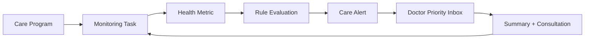
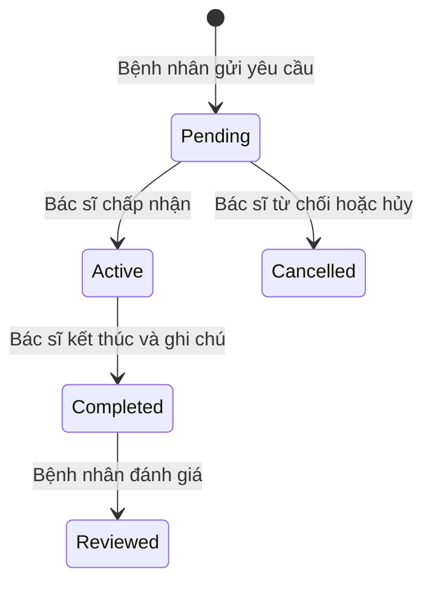
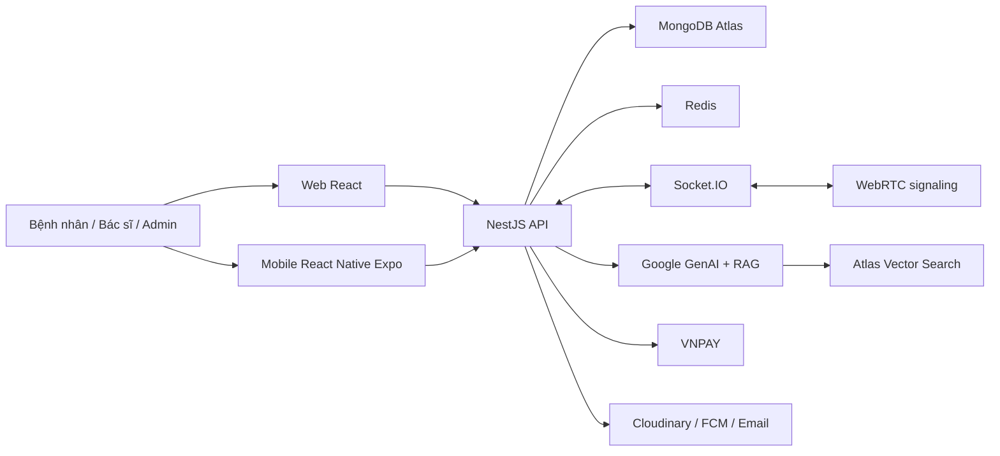

# Healthcare Application tích hợp AI

Tài liệu này tổng hợp dự án **HealthAI Chronic Care — Theo dõi và hỗ trợ chăm sóc bệnh mạn từ xa** theo hướng cập nhật từ Đồ án 1 (DA1) sang Đồ án 2 (DA2). DA1 là nền tảng web quản lý sức khỏe, tư vấn qua tin nhắn thời gian thực và trợ lý AI RAG. DA2 dùng nền tảng đó để xây vòng lặp chăm sóc liên tục cho bệnh nhân bệnh mạn: Care Program, lịch theo dõi, phân tầng ưu tiên, bác sĩ xử lý cảnh báo và AI tóm tắt có kiểm soát.

> Phạm vi DA2 là mục tiêu phát triển cho giai đoạn 09/2026–12/2026. Những hạng mục như WebRTC, ứng dụng React Native, VNPAY, Redis, k6 và CI/CD được mô tả là phần nâng cấp so với nền tảng DA1, không mặc định là đã hoàn thành trong bản DA1.

Kế hoạch phạm vi, backlog và cut-line Chronic Care chi tiết nằm tại `healthcare-monorepo/plan/chronic-care-plan.md`; quy tắc chuẩn nằm tại `healthcare-monorepo/docs/BUSINESS_RULES.md`.

## 1. Tổng quan

### Bài toán

Người bệnh mạn cần theo dõi chỉ số và duy trì tái khám trong thời gian dài, nhưng dữ liệu thường rời rạc, nhập không đều và chỉ được xem khi đã tới buổi khám. DA1 đã có quản lý hồ sơ sức khỏe, nhắn tin bác sĩ–bệnh nhân, cảnh báo chỉ số và chatbot AI, nhưng chưa có Care Program, lịch theo dõi, quy trình xử lý alert và Priority Inbox cho bác sĩ. Vì vậy DA2 tập trung biến các chức năng sẵn có thành một quy trình chăm sóc bệnh mạn có hành động tiếp theo và giá trị vận hành đo được.

### Mục tiêu DA2

- Xây dựng Chronic Care MVP cho cả tăng huyết áp và tiểu đường trên cùng Program engine.
- Cho phép bệnh nhân tham gia Care Program, nhận lịch đo và xem báo cáo 7/30 ngày.
- Cung cấp rule engine version hóa, Care Alert và Doctor Priority Inbox có audit.
- Dùng AI để tóm tắt dữ liệu đã chuẩn hóa và giải thích kiến thức từ RAG; AI không quyết định severity hoặc chẩn đoán.
- Tích hợp hội viên Premium và thanh toán VNPAY Sandbox để quản lý quyền lợi cũng như định mức AI.
- Kiểm soát lượt dùng AI, tối ưu realtime khi tải cao và tự động hóa kiểm thử/triển khai; WebRTC/Mobile đầy đủ là P1 sau Chronic Care P0.
- Duy trì mô hình ba vai trò: Bệnh nhân, Bác sĩ và Quản trị viên; không mở rộng mảng mạng xã hội trong DA2.

### Phạm vi nền tảng

| Kênh | Đối tượng chính | Vai trò |
| --- | --- | --- |
| Web Admin | Quản trị viên | Vận hành người dùng, bác sĩ, AI, gói hội viên, thanh toán và báo cáo vi phạm. |
| Web Client | Bệnh nhân, bác sĩ | Theo dõi sức khỏe, tư vấn, chat, video call, hồ sơ và dashboard. |
| Mobile App | Bệnh nhân, bác sĩ, quản trị viên | Truy cập nghiệp vụ trên thiết bị di động, nhận push notification và đồng bộ dữ liệu sức khỏe. |

## 2. Chức năng theo vai trò

### Bệnh nhân

- Đăng ký/đăng nhập, xác thực Email OTP; trên Mobile định hướng hỗ trợ sinh trắc học.
- Quản lý hồ sơ cá nhân và các chỉ số như huyết áp, nhịp tim, đường huyết; xem lịch sử, biểu đồ và cảnh báo bất thường.
- Tham gia Care Program, nhận nhiệm vụ đo theo lịch, theo dõi adherence và báo cáo 7/30 ngày.
- Nhận Care Alert có lý do giải thích được và chuyển sang đặt lịch/tư vấn khi cần.
- Tìm kiếm/lọc bác sĩ theo chuyên khoa, xem hồ sơ và gửi yêu cầu tư vấn kèm tóm tắt triệu chứng.
- Chat thời gian thực, gửi hình ảnh/tệp liên quan; gọi video/audio với bác sĩ trong phiên tư vấn.
- Trao đổi với trợ lý AI có lưu lịch sử; số lượt hỏi phụ thuộc gói hội viên/định mức.
- Mua hoặc gia hạn gói Premium qua VNPAY, nhận thông báo về phiên tư vấn, tin nhắn, thanh toán và cảnh báo sức khỏe.
- Chọn tier Free, Plus hoặc Care: Free cho theo dõi cơ bản, Plus cho tự quản lý nâng cao, Care cho chương trình có Doctor/Clinic đồng hành.
- Đánh giá bác sĩ sau phiên tư vấn và gửi báo cáo vi phạm kèm bằng chứng hình ảnh khi cần.

### Bác sĩ

- Đăng ký, cập nhật hồ sơ chuyên môn và tải chứng chỉ hành nghề để chờ quản trị viên phê duyệt.
- Chuyển trạng thái Online/Offline, theo dõi dashboard hiệu suất, danh sách yêu cầu chờ, phiên đang diễn ra và lịch sử tư vấn.
- Tiếp nhận/từ chối yêu cầu tư vấn; chat, chia sẻ tệp và gọi video/audio với bệnh nhân.
- Xem hồ sơ cùng biểu đồ chỉ số sức khỏe của bệnh nhân ngay trong ngữ cảnh phiên tư vấn.
- Enroll bệnh nhân vào Care Program đã duyệt, xem Priority Inbox và xử lý Care Alert.
- Dùng báo cáo xác định và AI summary để đọc nhanh dữ liệu; AI không thay thế quyết định chuyên môn.
- Nhận đánh giá, theo dõi hiệu suất và báo cáo hành vi không phù hợp của bệnh nhân.

### Quản trị viên

- Theo dõi dashboard: người dùng, bác sĩ, phiên tư vấn, tài liệu AI, hoạt động/doanh thu liên quan.
- Quản lý tài khoản; khóa/mở khóa khi cần và kiểm duyệt hồ sơ, bằng cấp của bác sĩ.
- Quản lý kho tri thức RAG: tải lên/xóa tài liệu, theo dõi xử lý tài liệu; quản lý từ khóa cấm để lọc đầu vào AI.
- Admin và Doctor tạo/chỉnh draft Care Program theo permission; Admin quản lý lifecycle, nguồn, version và publish/retire Care Rule Set/ngưỡng.
- Cấu hình gói hội viên Premium, theo dõi giao dịch VNPAY.
- Quản lý báo cáo vi phạm: xem bằng chứng ảnh/đoạn chat, phân loại mức độ `Low`/`Medium`/`High`, cập nhật trạng thái `Pending` → `Processing` → `Resolved` hoặc `Dismissed`, áp dụng biện pháp xử lý khi cần.
- Định hướng dùng AI để hỗ trợ phân loại báo cáo, nhưng quyết định xử lý thuộc về quản trị viên.

## 3. Nghiệp vụ cốt lõi

### 3.1. Đăng ký và xác thực tài khoản

1. Người dùng chọn đăng ký Bệnh nhân hoặc Bác sĩ, nhập thông tin và xác thực Email OTP.
2. Hệ thống kiểm tra dữ liệu, băm mật khẩu và tạo tài khoản theo vai trò.
3. Bệnh nhân có thể dùng hệ thống sau khi xác thực; Bác sĩ phải tải hồ sơ/chứng chỉ và có trạng thái `Pending`.
4. Quản trị viên xem hồ sơ bác sĩ, phê duyệt để chuyển sang `Active` hoặc từ chối/khóa khi không đạt yêu cầu.
5. Hệ thống gửi thông báo/email về kết quả. Khi tài khoản bị khóa, phiên đăng nhập đang hoạt động phải bị thu hồi và người dùng không thể tiếp tục truy cập.

### 3.2. Theo dõi chỉ số và cảnh báo sức khỏe

1. Bệnh nhân nhập hoặc đồng bộ dữ liệu sinh hiệu từ Mobile (định hướng tương lai: thiết bị IoT/Apple Health/Google Fit).
2. Hệ thống lưu dữ liệu theo thời điểm, hiển thị biểu đồ và lịch sử đo.
3. Nếu Patient thuộc Care Program active, HealthMetric có thể hoàn thành Monitoring Task và kích hoạt Care Evaluation.
4. Rule engine version hóa trả `normal|attention|urgent` kèm reason codes; kết quả là phân tầng ưu tiên, không phải chẩn đoán.
5. Nếu cần chú ý, hệ thống tạo Care Alert, gửi thông báo và đưa Patient vào Priority Inbox của Doctor phụ trách.
6. Báo cáo 7/30 ngày được backend tính xác định; AI chỉ diễn đạt từ payload chuẩn hóa và phải fallback khi provider lỗi.
7. Với `urgent`, hệ thống hiển thị safety template yêu cầu liên hệ cơ sở y tế/cấp cứu phù hợp, không chờ AI hoặc cam kết Doctor phản hồi tức thời.

### 3.3. Vòng lặp Chronic Care

1. Doctor `active + approved` được phân công bắt buộc, chọn template đã duyệt và enroll Patient sau khi Patient consent.
2. Worker sinh Monitoring Task idempotent theo timezone của enrollment.
3. HealthMetric là source of truth; Chronic Care chỉ tham chiếu, không sao chép dữ liệu chỉ số.
4. Doctor acknowledge/xử lý alert, liên kết Consultation và ghi follow-up có audit.
5. KPI MVP gồm monitoring adherence, alert acknowledgment time và follow-up conversion; không tuyên bố hiệu quả lâm sàng.

### 3.4. Vòng đời phiên tư vấn Telemedicine

1. Bệnh nhân chọn bác sĩ, nhập tóm tắt triệu chứng và gửi yêu cầu.
2. Bác sĩ nhận thông báo, xem yêu cầu và chọn chấp nhận, từ chối hoặc xử lý theo chính sách hệ thống.
3. Khi được chấp nhận, phiên chuyển sang `Active`; hai bên chat qua Socket.IO, gửi tệp/hình ảnh và thực hiện video/audio call qua WebRTC.
4. Trong phiên, bác sĩ xem hồ sơ, biểu đồ sức khỏe và có thể yêu cầu AI tóm tắt dữ liệu bệnh nhân để hỗ trợ đọc nhanh thông tin.
5. Bác sĩ kết thúc phiên, nhập ghi chú lâm sàng; khung chat được khóa theo trạng thái phiên.
6. Bệnh nhân đánh giá và nhận xét. Hệ thống lưu review, cập nhật điểm trung bình của bác sĩ và lưu lịch sử phiên.

### 3.5. Tư vấn với AI theo RAG và hạn mức sử dụng

1. Quản trị viên tải tài liệu y khoa đã chọn lọc. Hệ thống chia tài liệu thành các đoạn, tạo embedding và lưu để truy xuất ngữ nghĩa.
2. Bệnh nhân gửi câu hỏi. Hệ thống kiểm tra xác thực, từ khóa cấm và quyền lợi/lượt hỏi còn lại của gói hội viên.
3. Redis hỗ trợ đếm/rate-limit lượt hỏi theo ngày; Guard từ chối yêu cầu khi vượt định mức. Cron job thực hiện đặt lại hạn mức theo lịch cấu hình.
4. Với yêu cầu hợp lệ, hệ thống truy xuất các đoạn tài liệu phù hợp từ MongoDB Atlas Vector Search rồi đưa chúng làm ngữ cảnh cho LLM.
5. Phản hồi cùng lịch sử hội thoại được lưu lại. Câu trả lời cần được trình bày như thông tin tham khảo y tế, có giới hạn an toàn và không thay thế chẩn đoán chuyên môn.

### 3.6. Hội viên Premium và thanh toán

1. Bệnh nhân chọn tier: Free giữ dữ liệu/cảnh báo an toàn cơ bản; Plus bổ sung báo cáo, AI summary, smart reminder và export; Care bổ sung Doctor-assigned Program, review, follow-up và ưu đãi consultation theo Plan.
2. Khi mua Plus/Care, hệ thống tạo yêu cầu thanh toán và chuyển đến VNPAY Sandbox.
3. VNPAY trả kết quả giao dịch về hệ thống qua luồng callback/xác thực giao dịch.
4. Chỉ giao dịch hợp lệ mới kích hoạt hoặc gia hạn gói; hệ thống lưu trạng thái giao dịch và gửi thông báo cho bệnh nhân.
5. Quyền lợi được kiểm tra phía backend từ Subscription snapshot; client không tự khai tier, AI quota, consultation limit hoặc quyền Doctor review.
6. `consultationLimitPerCycle` mặc định là Free `1`, Plus `3`, Care `6`; hệ thống đếm trực tiếp số Consultation đã dùng/còn lại. Chi phí từng phiên là chính sách giá riêng.
7. Reservation/count/release phải idempotent; cancel đúng policy hủy reservation, Patient no-show được count theo policy. `AiQuestionQuota` chỉ đếm câu hỏi AI và hoàn toàn độc lập.
8. Downgrade/hết hạn không xóa dữ liệu và không tắt safety alert; Plan trả phí không thay đổi severity hoặc ưu tiên lâm sàng.
9. Quản trị viên cấu hình gói và theo dõi giao dịch/doanh thu; các lỗi thanh toán cần được lưu để đối soát, không tự động cấp quyền trả phí.

### 3.7. Báo cáo vi phạm và kiểm duyệt

1. Bệnh nhân hoặc bác sĩ tạo báo cáo, chọn đối tượng, loại vi phạm, mô tả lý do và đính kèm bằng chứng nếu có.
2. Hệ thống lưu báo cáo với mức độ và trạng thái ban đầu `Pending`; bằng chứng được lưu an toàn trên dịch vụ lưu trữ tệp.
3. Quản trị viên xem chi tiết, có thể dùng gợi ý AI để hỗ trợ phân loại nhưng phải tự xác nhận quyết định.
4. Quản trị viên chuyển báo cáo sang `Processing`, sau đó `Resolved` hoặc `Dismissed`; các hành vi nghiêm trọng có thể dẫn đến khóa tài khoản.
5. Hệ thống lưu vết xử lý và gửi thông báo cho các bên liên quan theo chính sách bảo mật.

## 4. Dữ liệu và kiến trúc nghiệp vụ

Các thực thể kế thừa từ DA1 gồm tài khoản, hồ sơ vai trò, HealthMetrics, Consultations/Messages, Reviews, AI Conversations/Messages/Documents/Chunks, Notifications, ViolationReports và BlacklistKeywords. DA2 bổ sung `CareProgramTemplates`, `CareEnrollments`, `MonitoringTasks`, `CareRuleSets`, `CareEvaluations`, `CareAlerts`, `CareSummaries`; đồng thời mở rộng mô hình dữ liệu cho gói hội viên, quota AI và các integration còn trong cut-line.

## 5. Công nghệ

| Nhóm | Công nghệ | Mục đích |
| --- | --- | --- |
| Thiết kế | Figma | Thiết kế UI/UX và prototype. |
| Web frontend | React.js, JavaScript/TypeScript, Vite, Tailwind CSS, Shadcn UI, React Query, Chart.js | Xây giao diện, truy vấn dữ liệu, dashboard và biểu đồ sức khỏe. |
| Mobile | React Native, Expo, React Native WebRTC, CallKeep | Ứng dụng đa nền tảng, cuộc gọi và trải nghiệm nhận cuộc gọi. |
| Backend | Node.js, NestJS, Guards, Cron Job | API, phân quyền, nghiệp vụ và tác vụ định kỳ. |
| Xác thực | JWT, OAuth, Email OTP, sinh trắc học trên Mobile | Xác thực và kiểm soát truy cập theo vai trò. |
| Dữ liệu | MongoDB Atlas, MongoDB Atlas Vector Search | Dữ liệu nghiệp vụ và tìm kiếm ngữ nghĩa phục vụ RAG. |
| AI | Google GenAI SDK; Gemini 2.5 Flash là lựa chọn được nêu trong phần nền tảng DA2 | Chatbot, tóm tắt sức khỏe và RAG. |
| Realtime | Socket.IO, WebRTC, Socket.IO Redis Adapter | Chat/thông báo realtime, signaling cuộc gọi và mở rộng WebSocket. |
| Cache và giới hạn | Redis | Cache, đếm quota/rate limit AI và hỗ trợ scaling realtime. |
| Tích hợp ngoài | VNPAY Sandbox, Firebase Cloud Messaging, Cloudinary, Nodemailer | Thanh toán, push notification, lưu tệp/hình ảnh và email. |
| Chất lượng & vận hành | Jest, k6, GitHub Actions, Postman, GitHub | Unit/integration/load test, CI/CD, kiểm thử API và quản lý mã nguồn. |

**Lưu ý thống nhất tài liệu:** phần phương pháp DA2 có nhắc Express.js, nhưng phần kiến trúc và nền tảng công nghệ xác định NestJS; tài liệu này chọn **NestJS** là backend mục tiêu vì nhất quán với kiến trúc DA1 và mô tả DA2 về Guards/Cron Job.

## 6. Chuyển đổi từ DA1 sang DA2

| Nền tảng DA1 | Cập nhật DA2 |
| --- | --- |
| Web React + NestJS + MongoDB; chat bác sĩ–bệnh nhân; RAG; theo dõi chỉ số và cảnh báo. | Giữ nền tảng lõi, mở rộng Web và Mobile React Native/Expo. |
| Health Metrics và cảnh báo đơn lẻ. | Care Program, lịch theo dõi, versioned rule engine, Care Alert, Priority Inbox và báo cáo 7/30 ngày. |
| Tư vấn qua chữ, hình ảnh và tệp. | Gọi video/audio WebRTC, Socket.IO signaling và CallKeep. |
| AI hỗ trợ theo RAG nhưng chưa kiểm soát chi phí chặt chẽ. | Gói Free/Premium, thanh toán VNPAY, Redis rate limit/quota và Cron reset. |
| Hạ tầng realtime cơ bản. | Redis adapter để scale WebSocket, bổ sung chiến lược cache. |
| Kiểm thử/vận hành chưa được tự động hóa đầy đủ. | Jest, k6 và GitHub Actions cho kiểm thử, CI/CD. |
| Báo cáo vi phạm cơ bản. | Trạng thái xử lý rõ ràng, mức độ nghiêm trọng, bằng chứng và AI hỗ trợ phân loại. |

## 7. Định hướng sau DA2

- Đồng bộ tự động với thiết bị IoT y tế qua Bluetooth/Wi-Fi để giảm nhập liệu thủ công.
- Mở rộng Care Program sang medication adherence và các bệnh mạn khác sau khi tăng huyết áp/tiểu đường P0 ổn định.
- Bổ sung caregiver/family sharing sau khi có consent và permission model riêng.
- Nghiên cứu AI phân tích hình ảnh lâm sàng và dữ liệu CT/MRI với quy trình kiểm định chuyên môn phù hợp.
- Kết nối nhiều phòng khám/bệnh viện và tăng khả năng liên thông hồ sơ y tế.
- Tiếp tục tăng cường bảo mật dữ liệu sức khỏe, xác thực đa yếu tố, mã hóa và kiểm thử trước mỗi đợt phát hành.
