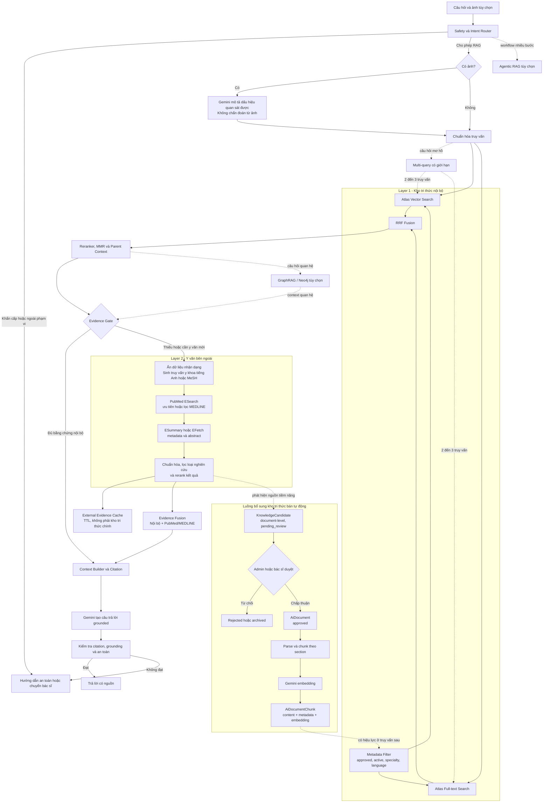

# Blueprint nâng cấp RAG cho HealthcareApp

## 1. Mục tiêu

Tài liệu này mô tả kiến trúc RAG mục tiêu cho HealthcareApp: giải thích từng thành phần, vai trò, công nghệ phù hợp và luồng xử lý tổng quát. Mục tiêu không phải thay thế toàn bộ hệ thống hiện có, mà là nâng dần từ **Vector RAG cơ bản** sang hệ thống có nguồn tin cậy, citation rõ ràng và cơ chế an toàn phù hợp cho tư vấn sức khỏe.

## 2. Hiện trạng và định hướng

Hệ thống hiện có các thành phần chính:

```text
Tài liệu → LlamaParse → chunk → Gemini embedding → MongoDB Atlas Vector Search
→ Gemini tạo câu trả lời
```

Đây là nền tảng hợp lý. Hướng nâng cấp là bổ sung các lớp kiểm soát, truy xuất hai lớp và chọn lọc bằng chứng. Phạm vi xử lý ảnh được giữ theo source hiện tại: Gemini chỉ chuyển ảnh thành mô tả dấu hiệu quan sát được; hệ thống không bổ sung CLIP, FAISS ảnh, ViT hay anomaly map.



### Quy ước hai lớp retrieval

- **Layer 1** là nguồn chính: tài liệu nội bộ đã được admin/bác sĩ duyệt, tìm bằng Atlas Vector Search + Atlas Search + metadata filter.
- **Layer 2** là nguồn bổ sung: gọi PubMed qua NCBI E-utilities và ưu tiên/lọc các bản ghi MEDLINE khi Layer 1 thiếu bằng chứng hoặc người dùng yêu cầu y văn mới.
- Layer 2 không phải Multi-query và cũng không phải Hybrid Search. Đây là **multi-source/cascaded retrieval**: truy xuất tuần tự từ nguồn nội bộ sang nguồn y văn bên ngoài.
- Không gửi ảnh hoặc dữ liệu nhận dạng bệnh nhân sang PubMed. Chỉ gửi truy vấn y khoa đã được chuẩn hóa và loại bỏ PII/PHI.
- Kết quả Layer 2 được dùng trực tiếp cho câu trả lời hiện tại và cache tạm thời; không tự động trở thành chunks trong Vector DB.
- Nguồn Layer 2 có giá trị được lưu trước ở cấp document dưới dạng `KnowledgeCandidate`. Chỉ sau khi được duyệt mới chuyển thành `AiDocument`, cắt thành `AiDocumentChunk`, tạo embedding và bổ sung vào Layer 1.
- Nếu cả hai lớp không cung cấp đủ bằng chứng, hệ thống phải hỏi làm rõ, nêu giới hạn hoặc chuyển bác sĩ thay vì dùng kiến thức chung của LLM để kết luận.

## 3. Khái niệm nền tảng

| Khái niệm | Định nghĩa | Vai trò |
|---|---|---|
| Document | File tài liệu gốc, ví dụ PDF guideline hoặc DOCX hướng dẫn. | Nguồn tri thức có thể quản trị, duyệt và versioning. |
| Chunk | Một đoạn nhỏ được tách từ document. | Đơn vị được tìm kiếm và đưa vào context. |
| Embedding | Mảng số biểu diễn ý nghĩa ngữ nghĩa của content. | Cho phép tìm đoạn gần nghĩa với câu hỏi. |
| Vector Search | Tìm các embedding gần embedding của câu hỏi. | Tìm thông tin theo ý nghĩa, không chỉ theo từ khóa. |
| Metadata | Dữ liệu mô tả có cấu trúc cạnh chunk. | Lọc nguồn, quản trị hiệu lực và tạo citation chính xác. |
| Context | Các chunks được chọn đưa vào prompt cho LLM. | Là bằng chứng để LLM tạo câu trả lời grounded. |
| Citation | Tham chiếu về document, trang và section của context. | Minh bạch nguồn và hỗ trợ kiểm tra câu trả lời. |

### Embedding và metadata không thay thế nhau

```json
{
  "content": "Metformin không dùng cho bệnh nhân suy thận nặng...",
  "embedding": [0.018, -0.221, 0.093],
  "documentTitle": "Hướng dẫn điều trị đái tháo đường 2025",
  "pageNumber": 18,
  "sectionPath": ["Điều trị", "Chống chỉ định"],
  "specialty": "endocrinology",
  "reviewStatus": "approved",
  "isActive": true
}
```

- `embedding` trả lời: **nội dung nào gần nghĩa với câu hỏi?**
- `metadata` trả lời: **nội dung đó thuộc nguồn nào, có được phép dùng không và phải trích dẫn thế nào?**

## 4. Các nâng cấp đề xuất

### 4.1. Metadata enrichment

**Định nghĩa:** Lưu metadata từ document và cấu trúc của tài liệu vào mỗi chunk, thay vì chỉ lưu `content` và `embedding`.

**Vai trò:**

- Chỉ truy xuất tài liệu đã duyệt, còn hiệu lực và đúng chuyên khoa.
- Hiển thị citation có tên tài liệu, trang và mục.
- Hỗ trợ quản lý phiên bản guideline.
- Là điều kiện cần cho metadata filtering, parent-child retrieval và audit.

**Nhóm metadata nên dùng:**

| Nhóm | Field đề xuất | Nguồn tạo |
|---|---|---|
| Quản trị document | `documentTitle`, `sourceOrganization`, `reviewStatus`, `guidelineVersion`, `publishedAt`, `effectiveUntil` | Admin hoặc quy trình duyệt tài liệu |
| Phạm vi y khoa | `specialty`, `language`, `audience` | Admin hoặc taxonomy chuẩn |
| Vị trí trong tài liệu | `pageNumber`, `sectionPath`, `chunkIndex` | Parser và chunker |
| Kỹ thuật | `tokenCount`, `contentHash`, `parentChunkId`, `ingestionVersion` | Pipeline ingestion |

**Logic tổng quát:**

```text
Upload document
→ admin gắn metadata nguồn và trạng thái duyệt
→ parser giữ page/section
→ chunker kế thừa metadata document + thêm metadata chunk
→ MongoDB lưu content + embedding + metadata
→ vector search filter theo metadata trước khi xếp hạng semantic
```

**Công nghệ:** Mongoose schema, MongoDB Atlas Vector Search filter fields, MongoDB indexes. Không cần thay vector database.

### 4.2. Structured document parsing và chunking

**Định nghĩa:** Trích xuất nội dung nhưng không làm mất cấu trúc như trang, heading, bảng và danh sách.

**Vai trò:** Giữ trọn ý nghĩa của phần liều dùng, chống chỉ định, cảnh báo; đồng thời tạo citation chính xác.

**Logic tổng quát:**

```text
PDF/DOCX
→ parser trả về các phần { text, pageNumber, markdown structure }
→ phân tích hierarchy heading
→ chunk theo section trước
→ chỉ cắt recursive nếu section quá dài
→ gắn pageNumber và sectionPath cho từng chunk
```

**Nguyên tắc:**

- Không cắt ngang bảng hoặc list quan trọng nếu có thể.
- Dùng kích thước chunk và overlap được đo bằng token, không chỉ ký tự.
- Khi gặp heading mới, phải xóa heading cấp con cũ để `sectionPath` đúng.
- Không tự suy đoán `reviewStatus` hay `sourceOrganization` bằng LLM; đây là metadata quản trị cần được kiểm duyệt.

**Công nghệ:** LlamaParse hiện có; `@langchain/textsplitters` hiện có; tokenizer tương thích model Gemini nếu cần đếm token chính xác.

### 4.3. Parent-child retrieval

**Định nghĩa:** Index các child chunks nhỏ để tìm chính xác, nhưng đưa parent section lớn hơn vào LLM để đủ ngữ cảnh.

**Vai trò:** Tránh trường hợp tìm được câu “không dùng khi suy thận nặng” mà không biết nó nói về thuốc nào.

**Logic tổng quát:**

```text
Section "Chống chỉ định metformin" (parent)
└── child chunk A: suy thận nặng
└── child chunk B: suy gan nặng

Query → search child A → lấy parent section → xây context cho LLM
```

**Công nghệ:** MongoDB collection hiện có; thêm `parentChunkId` hoặc một collection `AiDocumentSection`. Không cần Neo4j.

### 4.4. Hybrid search

**Định nghĩa:** Chạy semantic vector search và full-text search song song rồi hợp nhất kết quả.

**Vai trò:**

- Vector search tốt với câu hỏi diễn đạt tự nhiên.
- Full-text search tốt với tên thuốc, mã bệnh, liều lượng, xét nghiệm và từ viết tắt.

**Logic tổng quát:**

```text
Question
├── embedding → Atlas Vector Search
└── keyword query → Atlas Search / full-text Search
                     ↓
                hai danh sách kết quả
```

**Công nghệ:** MongoDB Atlas Vector Search hiện có + MongoDB Atlas Search index mới. Không cần cài thêm package Node.js để chạy aggregation pipeline.

### 4.5. Metadata filtering

**Định nghĩa:** Áp điều kiện metadata ngay trong retrieval trước khi chọn kết quả tương đồng.

**Vai trò:** Ngăn một chunk gần nghĩa nhưng không đáng tin cậy đi vào prompt.

**Ví dụ:**

```text
isActive = true
reviewStatus = approved
language = vi
specialty = endocrinology
effectiveUntil >= today
```

**Công nghệ:** Khai báo các field cần filter trong Atlas Vector Search index và lưu field tương ứng vào chunk.

### 4.6. RRF — Reciprocal Rank Fusion

**Định nghĩa:** Cách hợp nhất thứ hạng của nhiều retriever mà không cộng trực tiếp các score khác thang đo.

**Vai trò:** Ưu tiên chunk vừa được vector search đánh giá cao, vừa có keyword khớp chính xác.

**Logic tổng quát:**

```text
Vector ranking:     A, B, C
Full-text ranking:  B, A, D

RRF ranking:        A và B cao nhất, sau đó C/D
```

**Công nghệ:** Service TypeScript nội bộ. Đây là thuật toán nhỏ, không cần framework mới.

### 4.7. Reranking

**Định nghĩa:** Một model đọc cặp `(question, candidate chunk)` để chấm lại độ liên quan sau bước retrieval nhanh.

**Vai trò:** Lấy 15–30 candidates nhanh từ Atlas, sau đó chọn chính xác 4–6 chunks tốt nhất cho LLM.

**Logic tổng quát:**

```text
Hybrid search → 20 candidates
→ reranker chấm relevance từng candidate
→ top 4–6 chunks
→ context builder
```

**Công nghệ lựa chọn:**

- API bên ngoài: Cohere Rerank hoặc nhà cung cấp có hỗ trợ đa ngôn ngữ.
- Tự host: FastAPI + `sentence-transformers` + cross-encoder reranker đa ngôn ngữ.

**Lưu ý:** Nếu query/context có thông tin sức khỏe nhạy cảm, self-host hoặc hợp đồng xử lý dữ liệu rõ ràng là lựa chọn an toàn hơn.

### 4.8. MMR — Maximal Marginal Relevance

**Định nghĩa:** Chọn kết quả vừa liên quan, vừa khác nhau để context không bị lặp.

**Vai trò:** Thay vì gửi năm chunks nói cùng một ý, gửi các chunks bổ sung nhau: triệu chứng, dấu hiệu nguy hiểm, chẩn đoán, điều trị, theo dõi.

**Logic tổng quát:**

```text
Candidate 1: triệu chứng
Candidate 2: triệu chứng lặp lại
Candidate 3: dấu hiệu nguy hiểm
Candidate 4: điều trị

MMR ưu tiên 1, 3, 4 thay vì 1, 2 và các đoạn trùng lặp.
```

**Công nghệ:** Có thể tự cài đặt cosine similarity; cũng có thể tận dụng các abstraction của LangChain. Không yêu cầu dịch vụ mới.

### 4.9. Multi-query retrieval

**Định nghĩa:** Tạo một số cách diễn đạt có kiểm soát cho câu hỏi mơ hồ, sau đó search song song.

**Vai trò:** Bù khoảng cách giữa cách nói dân gian của người dùng và thuật ngữ y khoa trong tài liệu.

**Ví dụ:**

```text
“Đau dạ dày có nguy hiểm không?”
→ “Dấu hiệu cảnh báo đau thượng vị”
→ “Khi nào đau dạ dày cần khám khẩn?”
```

**Logic tổng quát:**

```text
Intent router đánh dấu query mơ hồ
→ Gemini sinh tối đa 2–3 query JSON đã validate
→ retrieval song song
→ RRF
→ rerank
```

**Công nghệ:** Gemini gateway hiện có; `zod` hoặc DTO/class-validator để validate output có cấu trúc; Redis để cache kết quả.

**Giới hạn:** Không bật cho mọi câu hỏi vì làm tăng latency và chi phí.

### 4.10. Multi-source RAG hai lớp: nội bộ và PubMed/MEDLINE

**Định nghĩa:** Kiến trúc truy xuất theo tầng, trong đó hệ thống ưu tiên kho tri thức nội bộ đã kiểm duyệt và chỉ gọi nguồn y văn bên ngoài khi evidence nội bộ không đủ hoặc cần thông tin nghiên cứu mới.

**Vai trò của từng lớp:**

| Layer | Nguồn | Vai trò |
|---|---|---|
| Layer 1 | MongoDB Atlas chứa tài liệu nội bộ | Nguồn chính, đã duyệt, có metadata, phù hợp chính sách của HealthcareApp. |
| Layer 2 | PubMed/MEDLINE | Mở rộng bằng chứng, tìm citation và abstract từ y văn bên ngoài. |

**Phân biệt MEDLINE và PubMed:** MEDLINE là tập dữ liệu y văn được tuyển chọn và lập chỉ mục bằng MeSH; MEDLINE là thành phần chính của PubMed. Khi triển khai, backend gọi PubMed thông qua NCBI E-utilities rồi ưu tiên/lọc bản ghi MEDLINE, thay vì tìm một “MEDLINE API” riêng.

**Điều kiện gọi Layer 2:**

- Layer 1 không có kết quả hoặc confidence thấp.
- Câu hỏi yêu cầu nghiên cứu, bằng chứng hoặc tài liệu mới.
- Nội dung liên quan thuốc, tương tác hoặc kiến thức có thể thay đổi theo thời gian.
- Người dùng yêu cầu nguồn PubMed/MEDLINE.

**Không gọi Layer 2 khi:**

- Safety router phát hiện tình huống cần cấp cứu.
- Câu hỏi không thuộc y khoa hoặc chỉ là tác vụ hành chính.
- Câu hỏi còn mơ hồ và cần người dùng bổ sung thông tin trước.
- Layer 1 đã có guideline nội bộ được duyệt và đủ evidence.

**Logic tổng quát:**

```text
Query đã chuẩn hóa
→ Layer 1: Atlas Hybrid Retrieval
→ Evidence Gate
   ├── đủ evidence → Context Builder
   └── thiếu/cần mới
       → loại PII/PHI khỏi query
       → chuyển query sang thuật ngữ tiếng Anh/MeSH
       → PubMed ESearch lấy PMID
       → ESummary/EFetch lấy title, abstract, journal, year, publication type
       → lọc/rerank
       → Evidence Fusion với kết quả Layer 1
→ Citation-aware Context Builder
```

**Metadata chuẩn hóa cho nguồn ngoài:**

```json
{
  "sourceType": "medline",
  "pmid": "12345678",
  "title": "Article title",
  "journal": "Journal name",
  "publicationYear": 2025,
  "publicationTypes": ["Systematic Review"],
  "meshTerms": ["..."],
  "abstract": "...",
  "url": "https://pubmed.ncbi.nlm.nih.gov/12345678/",
  "retrievedAt": "..."
}
```

**Thứ tự ưu tiên bằng chứng:**

```text
1. Guideline nội bộ đã được duyệt
2. Hướng dẫn chính thức của cơ quan y tế
3. Systematic review / meta-analysis
4. Clinical trial và nghiên cứu quan sát
5. Không đủ evidence → không kết luận
```

**Công nghệ:** NestJS HTTP client, PubMed E-utilities (`ESearch`, `ESummary`, `EFetch`), Redis cache/rate limit, BullMQ cho prefetch hoặc tác vụ nền, reranker hiện có và citation normalizer. Cấu hình cần có `NCBI_API_KEY`, `NCBI_TOOL` và `NCBI_EMAIL` khi triển khai theo chính sách NCBI.

**Service đề xuất:**

```text
MedicalEvidenceRetriever
├── InternalAtlasRetriever
└── PubMedMedlineRetriever

EvidenceRouter
EvidenceGate
EvidenceFusionService
CitationNormalizer
```

#### Luồng bổ sung tri thức từ Layer 2 vào Layer 1

Kết quả lấy từ PubMed/MEDLINE không được ghi trực tiếp thành chunks. Hệ thống áp dụng quy trình **document-first, chunks-after-approval**:

```text
PubMed/MEDLINE result
→ ExternalEvidenceCache để phục vụ truy vấn hiện tại
→ KnowledgeCandidate ở cấp article/document
→ kiểm tra trùng PMID, retraction/correction, loại nghiên cứu và quyền sử dụng
→ admin/bác sĩ duyệt
   ├── rejected → không đưa vào kho tri thức
   └── approved
       → tạo AiDocument
       → parse/normalize nội dung được phép lưu
       → chunk theo section
       → tạo embedding
       → lưu AiDocumentChunk
       → được Layer 1 sử dụng ở các truy vấn sau
```

**Ranh giới dữ liệu:**

| Collection | Đơn vị dữ liệu | Mục đích | Có embedding? |
|---|---|---|---|
| `externalEvidenceCache` | Kết quả PubMed của một query/PMID | Cache ngắn hạn cho trả lời trực tuyến; có TTL | Không |
| `knowledgeCandidates` | Một bài báo hoặc một PMID | Hàng đợi nguồn chờ kiểm duyệt | Không |
| `aiDocuments` | Một nguồn tri thức đã duyệt | Quản lý lifecycle, nguồn, version và trạng thái | Không bắt buộc |
| `aiDocumentChunks` | Các section/chunks của document | Retrieval trong Layer 1 | Có |

**Ví dụ `KnowledgeCandidate`:**

```json
{
  "sourceType": "medline",
  "externalId": "PMID:12345678",
  "title": "Article title",
  "abstract": "...",
  "journal": "Journal name",
  "publicationYear": 2025,
  "publicationTypes": ["Systematic Review"],
  "meshTerms": ["..."],
  "sourceUrl": "https://pubmed.ncbi.nlm.nih.gov/12345678/",
  "discoveryCount": 4,
  "reviewStatus": "pending_review",
  "reviewedBy": null,
  "ingestedDocumentId": null
}
```

**Điều kiện tối thiểu trước khi promote:**

```text
MEDLINE indexed hoặc nguồn được whitelist
AND không bị retracted
AND không trùng PMID/contentHash
AND loại nghiên cứu nằm trong chính sách cho phép
AND có quyền lưu abstract/full text tương ứng
AND reviewStatus = approved
```

Nếu chỉ được phép lưu abstract, `AiDocument` có `contentType = abstract` và thường sinh một hoặc vài chunks. Nếu có full text hợp pháp từ PMC/open access, hệ thống chunk theo các section như Abstract, Methods, Results, Discussion và Conclusion.

### 4.11. Xử lý ảnh bằng Gemini description

**Định nghĩa:** Ảnh người dùng được Gemini chuyển thành mô tả có cấu trúc; mô tả được dùng để làm giàu query văn bản. Pipeline này không phân loại ảnh bằng CLIP/FAISS và không tạo anomaly map.

**Vai trò:** Cho phép ảnh hỗ trợ retrieval mà không biến HealthcareApp thành mô hình chẩn đoán hình ảnh chuyên biệt.

**Logic tổng quát:**

```text
Ảnh → kiểm tra file và phạm vi ảnh y khoa
→ Gemini mô tả dấu hiệu quan sát được
→ validate JSON
→ ghép observation với câu hỏi người dùng
→ Layer 1 / Layer 2 retrieval
```

**Output đề xuất:**

```json
{
  "isUsableMedicalImage": true,
  "observations": [
    {
      "type": "mảng đỏ",
      "color": "đỏ hồng",
      "shape": "không đều",
      "distribution": "khu trú"
    }
  ],
  "uncertainObservations": ["không xác định được kích thước thực tế"],
  "diagnosis": null
}
```

**Nguyên tắc:** Không cho Gemini chẩn đoán từ ảnh; không gửi lại ảnh ở bước sinh câu trả lời cuối; mọi observation từ ảnh được xem là dữ liệu chưa xác nhận và phải kết hợp với mô tả của người dùng/citation y khoa.

**Công nghệ:** Gemini gateway và upload flow hiện có; bổ sung JSON schema/Zod hoặc DTO validation.

### 4.12. Safety router và intent router

**Định nghĩa:** Lớp quyết định loại câu hỏi và workflow được phép trước khi retrieval/LLM trả lời.

**Vai trò:**

- Nhận diện triệu chứng cấp cứu và hướng dẫn hành động ngay.
- Phân biệt kiến thức y khoa, dữ liệu hồ sơ cá nhân, tìm bác sĩ và câu hỏi ngoài phạm vi.
- Áp quy tắc citation bắt buộc cho nội dung có rủi ro.
- Ngăn LLM tự kết luận khi thiếu nguồn.

**Logic tổng quát:**

```text
Question
→ emergency? → hướng dẫn cấp cứu / chuyển người thật
→ personal data? → xác thực quyền sở hữu dữ liệu
→ knowledge question? → RAG có source đã duyệt
→ source không đủ? → nói rõ giới hạn / đề nghị khám bác sĩ
```

**Công nghệ:** NestJS service và rule engine nội bộ; Gemini chỉ nên hỗ trợ phân loại, không là điểm quyết định duy nhất.

### 4.13. Grounded answer và citation validation

**Định nghĩa:** Chỉ cho phép câu trả lời dựa trên context đã truy xuất, đồng thời liên kết từng câu trả lời với nguồn cụ thể.

**Vai trò:** Giảm hallucination, tăng minh bạch và hỗ trợ audit.

**Logic tổng quát:**

```text
Context gồm chunk + citation metadata
→ prompt yêu cầu chỉ dùng context
→ LLM trả lời kèm danh sách chunkId được dùng
→ backend kiểm tra chunkId có thật và đang active
→ trả lời + citation cho giao diện
```

**Công nghệ:** Prompt builder và context builder hiện có; JSON schema/Zod; MongoDB query kiểm chứng citation.

### 4.14. Cache, jobs và re-ingestion

**Định nghĩa:** Tách các tác vụ nặng và có thể lặp lại khỏi HTTP request chính.

**Vai trò:**

- Cache query embedding, rewrite, retrieval nội bộ và PubMed/MEDLINE phổ biến.
- Chạy parse, embedding và re-ingestion nền.
- Re-index tài liệu khi metadata, parser hoặc embedding model thay đổi.

**Công nghệ:** Redis và BullMQ đã có trong dự án.

**Logic tổng quát:**

```text
Upload → tạo document trạng thái processing
→ BullMQ ingestion job
→ parse/chunk/embed/upsert có idempotency
→ active hoặc error

Metadata đổi / guideline hết hạn
→ enqueue re-ingestion hoặc deactivate chunks liên quan
```

### 4.15. Evaluation và observability

**Định nghĩa:** Bộ câu hỏi chuẩn và trace để đo retrieval, citation, an toàn, độ trễ và chi phí.

**Vai trò:** Trả lời bằng số liệu liệu một nâng cấp có làm hệ thống tốt hơn không.

**Bộ dữ liệu evaluation tối thiểu:**

```json
{
  "question": "Metformin chống chỉ định trong trường hợp nào?",
  "expectedDocumentIds": ["diabetes-guideline-2025"],
  "expectedKeywords": ["suy thận"],
  "requiresCitation": true,
  "expectedSafetyAction": "normal"
}
```

**Chỉ số:**

| Chỉ số | Ý nghĩa |
|---|---|
| Recall@K | Nguồn/chunk đúng có xuất hiện trong top K không. |
| Citation accuracy | Citation có trỏ đúng nguồn và trang/section không. |
| External evidence precision | Bài PubMed/MEDLINE được chọn có thực sự hỗ trợ câu hỏi không. |
| Layer-2 activation rate | Tỷ lệ truy vấn phải gọi nguồn bên ngoài. |
| Groundedness | Câu trả lời có được hỗ trợ bởi context không. |
| Unsupported-answer rate | Tỷ lệ trả lời khi không có đủ bằng chứng. |
| Emergency recall | Tỷ lệ nhận diện đúng tình huống cần cấp cứu. |
| Latency/cost | Thời gian và chi phí mỗi truy vấn. |

**Công nghệ:** Jest dataset nội bộ; OpenTelemetry cho traces; Langfuse self-host hoặc nền tảng quan sát phù hợp với chính sách dữ liệu.

### 4.16. Agentic RAG

**Định nghĩa:** RAG có một lớp điều phối chọn tool, chọn nguồn, kiểm tra kết quả và có thể retrieval lại theo workflow có giới hạn.

**Vai trò:** Phù hợp cho câu hỏi cần nhiều bước, ví dụ kết hợp kiến thức RAG, hồ sơ bệnh nhân được cấp quyền và danh bạ bác sĩ.

**Logic tổng quát:**

```text
Router
→ chọn tool phù hợp
→ retrieve
→ kiểm tra evidence
→ retry tối đa một lần nếu evidence yếu
→ cited answer hoặc escalation
```

**Công nghệ:** `@langchain/langgraph` khi cần state machine, retry và human-in-the-loop.

**Nguyên tắc an toàn:** Không để agent tự do gọi mọi tool; whitelist tool, giới hạn số vòng lặp, log tool calls và luôn để safety router đứng trước agent.

### 4.17. GraphRAG và Neo4j

**Định nghĩa:** Bổ sung knowledge graph lưu thực thể và quan hệ; GraphRAG truy xuất context bằng vector search kết hợp graph traversal.

**Ví dụ graph:**

```text
(Bệnh) ──có triệu chứng──> (Triệu chứng)
(Thuốc) ──chống chỉ định với──> (Bệnh nền)
(Bệnh) ──khám tại──> (Chuyên khoa)
```

**Vai trò:** Phù hợp với câu hỏi cần nối nhiều quan hệ như tương tác thuốc, chống chỉ định theo bệnh nền, hoặc symptom → specialty → doctor.

**Công nghệ:** Neo4j Community/Aura, `neo4j-driver`, Cypher. Có thể giữ MongoDB Atlas làm vector store chính; Neo4j là nguồn bổ sung, không phải thay thế bắt buộc.

**Điều kiện áp dụng:** Chỉ triển khai sau khi evaluation chứng minh vector/hybrid RAG không giải tốt nhóm câu hỏi quan hệ. Các fact lâm sàng trong graph phải có schema và quy trình duyệt nguồn rõ ràng.

## 5. Công nghệ theo giai đoạn

| Giai đoạn | Thành phần | Công nghệ nên dùng |
|---|---|---|
| 1 — nền tảng tin cậy | Metadata, citation, document lifecycle, chunking có cấu trúc | NestJS, Mongoose, LlamaParse, MongoDB Atlas |
| 2 — retrieval chất lượng | Full-text, hybrid search, RRF, rerank, MMR, parent-child | Atlas Search, Atlas Vector Search, TypeScript service, optional reranker |
| 3 — kiểm soát và truy xuất hai lớp | Safety router, Evidence Gate, PubMed/MEDLINE, evidence fusion, knowledge candidate workflow | NestJS, NCBI E-utilities, MongoDB, Redis, reranker |
| 4 — vận hành | Cache, jobs, evaluation, trace | Redis, BullMQ, Jest, OpenTelemetry, optional Langfuse |
| 5 — suy luận phức tạp | Multi-query, agent workflow | Gemini, Zod, `@langchain/langgraph` |
| 6 — quan hệ dữ liệu | GraphRAG | Neo4j, `neo4j-driver`, Cypher |

## 6. Lộ trình triển khai khuyến nghị

### Giai đoạn 1: Làm nguồn tri thức đáng tin

1. Mở rộng schema `AiDocument` và `AiDocumentChunk` cho metadata cần thiết.
2. Persist `chunk.metadata` khi upsert vào MongoDB.
3. Giữ `pageNumber` và `sectionPath` từ parser tới chunk.
4. Đồng bộ trạng thái document/chunk: archive phải làm các chunks không thể truy xuất.
5. Xây citation trả về tên tài liệu, trang, section và version.
6. Có re-ingestion cho tài liệu cũ sau khi thay schema.

### Giai đoạn 2: Tăng chất lượng tìm kiếm

1. Tạo Atlas Search index cho full-text.
2. Tạo `HybridRetrievalService` chạy vector + text song song.
3. Hợp nhất bằng RRF.
4. Thêm reranker và MMR.
5. Thêm parent-child context.
6. Hiệu chỉnh threshold bằng evaluation set, không dùng ngưỡng cố định toàn hệ thống.

### Giai đoạn 3: Kiểm soát và truy xuất hai lớp

1. Thêm safety/intent router.
2. Thêm `EvidenceGate` để quyết định Layer 1 đã đủ bằng chứng hay chưa.
3. Tạo `PubMedMedlineRetriever` và `CitationNormalizer`.
4. Thêm bước loại PII/PHI trước truy vấn bên ngoài.
5. Thêm evidence fusion, ưu tiên nguồn nội bộ đã duyệt.
6. Tạo `externalEvidenceCache` có TTL và `knowledgeCandidates` có lifecycle kiểm duyệt.
7. Tạo promotion job idempotent: candidate đã duyệt → `AiDocument` → chunks → embeddings.
8. Chặn trùng lặp bằng PMID và `contentHash`; không auto-promote nguồn chưa duyệt.

### Giai đoạn 4: Vận hành và đánh giá

1. Tạo evaluation dataset tiếng Việt được bác sĩ/admin review.
2. Theo dõi metrics, trace, chi phí, Layer-2 activation rate và feedback.
3. Cache kết quả PubMed/MEDLINE và tuân thủ rate limit NCBI.
4. Đưa ingestion/re-ingestion và prefetch phù hợp vào BullMQ.

### Giai đoạn 5: Mở rộng có điều kiện

1. Bật multi-query cho câu hỏi mơ hồ.
2. Thêm Agentic RAG khi workflow thực sự cần nhiều tools.
3. Thêm Neo4j GraphRAG khi có nhóm câu hỏi quan hệ được benchmark xác nhận.

## 7. Các nguyên tắc bắt buộc cho dữ liệu y tế

- Không coi kết quả vector search là nguồn y khoa đã được kiểm duyệt.
- Không dùng document `inactive`, `error`, hết hạn hoặc chưa duyệt trong context.
- Citation là bắt buộc cho lời khuyên có ảnh hưởng y khoa.
- Khi không đủ evidence, hệ thống phải nêu rõ giới hạn thay vì suy đoán.
- Tình huống cấp cứu phải đi qua safety rule trước mọi workflow LLM.
- Dữ liệu hồ sơ bệnh nhân phải kiểm tra quyền truy cập trước khi dùng làm context.
- Đánh giá toàn bộ thay đổi retrieval bằng benchmark trước khi rollout.

## 8. Quyết định kiến trúc ngắn gọn

```text
Nên làm ngay:
metadata + citation + hybrid search + evaluation + safety router

Nên làm sau khi có benchmark:
reranker + MMR + parent-child + Layer 2 PubMed/MEDLINE

Chỉ làm khi có use case rõ ràng:
multi-query + Agentic RAG + Neo4j GraphRAG
```

Kiến trúc đích không phải là “nhiều framework nhất”, mà là pipeline có thể giải thích được: **mỗi câu trả lời biết mình dựa vào tài liệu nào, tại sao tài liệu đó được phép dùng và khi nào phải từ chối hoặc chuyển bác sĩ.**
