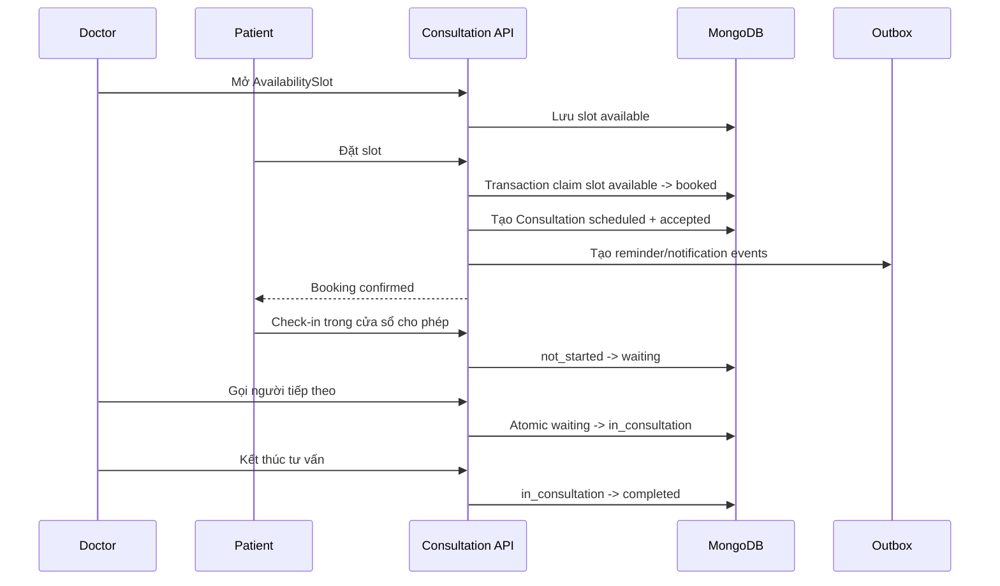
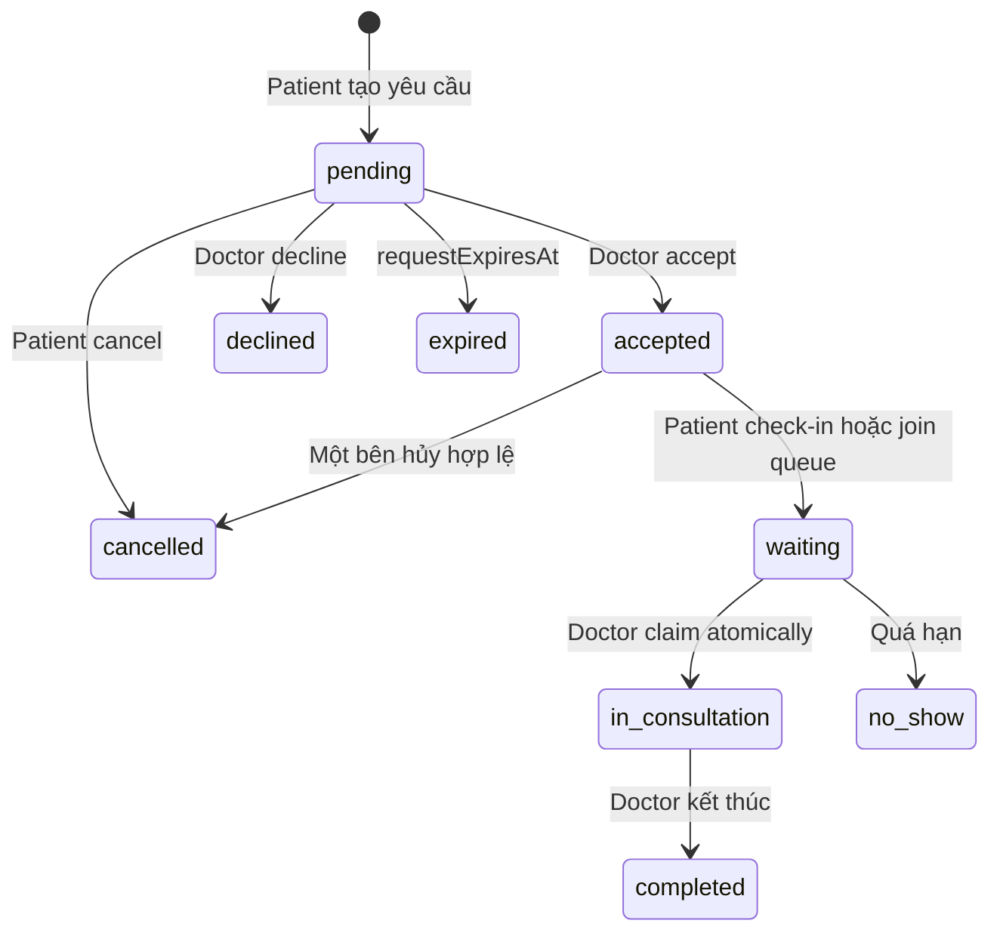
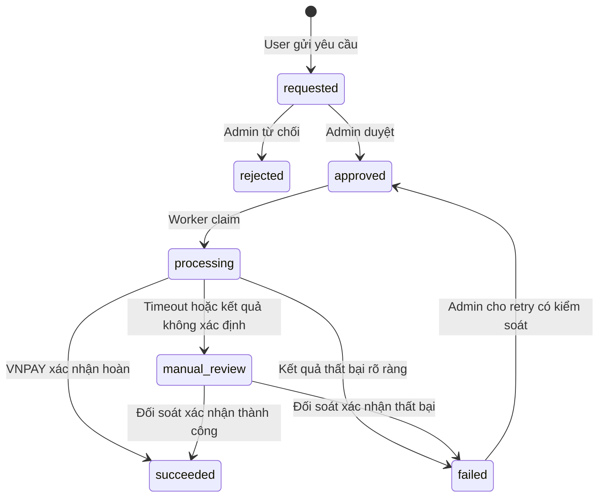

# Kế hoạch refactor hệ thống Healthcare

## 1. Thông tin tài liệu

| Thuộc tính | Giá trị |
|---|---|
| Trạng thái | Baseline kế hoạch refactor, có thể cập nhật theo từng sprint |
| Ngày lập | 11/09/2026 |
| Deadline mục tiêu | 31/12/2026 |
| Phạm vi | Backend, cơ sở dữ liệu, hợp đồng API, hạ tầng, kiểm thử, CI/CD và kế hoạch tách frontend |
| Quyết định kiến trúc | Refactor có kiểm soát; không rebuild toàn bộ |
| Kiến trúc backend đích | Modular Monolith, domain-oriented modules, DDD-lite cho domain phức tạp |
| Kiến trúc frontend đích | Một repository riêng chứa Web Client, Web Admin, Mobile và các package dùng chung |
| Chiến lược dữ liệu | MongoDB Atlas mới, Mongoose làm ODM, migration có version; MongoDB driver cho migration và tính năng đặc thù khi cần |
| Nguồn nghiệp vụ chính | `docs/BUSINESS_RULES.md` và `docs/db-template-v7.dbml` |

Tài liệu này là kế hoạch thực thi. Khi có xung đột giữa code cũ, README cũ và nghiệp vụ mới, thứ tự ưu tiên là:

1. Quyết định sản phẩm đã thống nhất: hệ thống **tư vấn sức khỏe**, không phải hệ thống khám hoặc chẩn đoán.
2. `BUSINESS_RULES.md`.
3. `docs/db-template-v7.dbml`.
4. Hợp đồng API đã được phê duyệt và xuất thành OpenAPI.
5. Code hiện tại.

## 2. Kết luận kiến trúc

### 2.1 Quyết định chính

Không rebuild toàn bộ hệ thống. Áp dụng chiến lược **selective rewrite trong cùng codebase**, thay lần lượt các domain có mô hình cũ không còn phù hợp, đồng thời giữ lại những phần có giá trị như UI, luồng xác thực, health metrics, RAG, upload, Socket.IO và các API có thể tương thích ngược.

Ba phần cần xây lõi mới hoặc refactor sâu nhất là:

1. `consultations`: thay thế mô hình `sessions` cũ bằng consultation hỗ trợ `on_demand`, `scheduled`, slot và hàng đợi.
2. `identity-access`: hợp nhất các User schema, session đăng nhập, OAuth và OTP.
3. `ai-advisory`: hợp nhất các module AI trùng lặp và chia nhỏ service điều phối quá lớn.

### 2.2 DDD và layer được dùng như thế nào

DDD không thay thế layer. Cấu trúc đích sử dụng hai chiều tổ chức:

- Cấp hệ thống: chia dọc theo domain hoặc business capability.
- Bên trong domain phức tạp: chia thành `domain`, `application`, `infrastructure`, `presentation`.
- Với module CRUD đơn giản: chỉ cần controller, service, repository/schema; không tạo aggregate và repository interface hình thức.

Quy tắc phụ thuộc:

```text
presentation  ──> application ──> domain
infrastructure ────────────────> domain
infrastructure ────────────────> application ports
domain ──> không phụ thuộc NestJS, Mongoose, MongoDB driver, Socket.IO, Redis hoặc Cloudinary
```

### 2.3 Những kiến trúc không chọn

| Lựa chọn | Quyết định | Lý do |
|---|---|---|
| Rebuild toàn bộ | Không | Khối lượng hiện tại lớn, thiếu test hồi quy, dễ mất các luồng đã hoạt động |
| Layer ngang toàn hệ thống | Không | Làm domain bị rải giữa thư mục controller/service/repository và tăng coupling |
| Full tactical DDD cho mọi module | Không | Quá nhiều boilerplate cho CRUD và không phù hợp deadline |
| Microservices | Không | Chưa có nhu cầu deploy độc lập hoặc tải đủ lớn để bù chi phí vận hành |
| Kafka | Không | Chưa có event streaming nhiều consumer; BullMQ và outbox đủ cho phạm vi hiện tại |
| Event Sourcing | Không | Tăng mạnh độ phức tạp migration, truy vấn và debug |
| Nest CQRS framework | Chưa dùng | Có thể tổ chức command/query bằng thư mục và use case trước, không cần thêm framework |

## 3. Phạm vi sản phẩm đã chuẩn hóa

### 3.1 Trong phạm vi

- Đăng ký, đăng nhập, JWT, refresh-token rotation, email OTP và OAuth.
- Quản lý bệnh nhân, bác sĩ, admin và duyệt hồ sơ bác sĩ.
- Bệnh nhân chủ động đặt lịch từ slot bác sĩ mở sẵn.
- Bệnh nhân gửi yêu cầu tư vấn nhanh `on_demand`; bác sĩ chấp nhận hoặc từ chối.
- Check-in và hàng đợi theo từng bác sĩ.
- Chat realtime và signaling WebRTC trong consultation được phép.
- Theo dõi chỉ số sức khỏe và cảnh báo tham khảo.
- AI tư vấn thông tin, tóm tắt và RAG; không chẩn đoán.
- Subscription, quota AI, thanh toán VNPAY Sandbox, hủy payment order chưa thanh toán và yêu cầu full refund có admin duyệt.
- Notification trong ứng dụng, FCM, email, outbox và worker.
- Review sau consultation và quản lý báo cáo vi phạm.
- Web Client, Web Admin và React Native Mobile App ở repository frontend riêng.
- Unit test, integration test, E2E, WebSocket test và k6 load test.

### 3.2 Ngoài phạm vi MVP đến 31/12

- Chẩn đoán bệnh hoặc thay thế bác sĩ.
- AI tự động khóa tài khoản hoặc tự đưa ra quyết định y khoa.
- Hồ sơ bệnh án điện tử chuẩn bệnh viện hoặc liên thông quốc gia.
- Kết nối thiết bị IoT y tế thật.
- Kafka, microservices, service mesh hoặc Kubernetes.
- Admin mobile đầy đủ nếu Web Admin đã đáp ứng nghiệp vụ.
- Huấn luyện mô hình AI chẩn đoán hình ảnh chuyên sâu.
- Partial refund, nhiều lần refund trên một payment, chargeback/dispute và tự động duyệt refund.
- Tự động refund do hủy consultation; payment hiện mua subscription, không thanh toán riêng cho từng consultation.

### 3.3 Mâu thuẫn cần sửa trong đề cương và README

| Nội dung hiện tại | Điều chỉnh bắt buộc |
|---|---|
| “Khám bệnh trực tuyến”, “độ chính xác chẩn đoán”, “AI preliminary diagnosis/triage” | Đổi thành “tư vấn trực tuyến”, “hỗ trợ cung cấp thông tin”, “cảnh báo tham khảo”; thêm tuyên bố không chẩn đoán |
| Đề cương tập trung hàng đợi nhưng chưa mô tả rõ đặt lịch theo slot | Bổ sung AvailabilitySlot, bệnh nhân chủ động đặt, check-in và quan hệ với Consultation |
| Backend được ghi Node.js Express.js ở một phần và NestJS ở phần khác | Chuẩn hóa thành NestJS chạy trên Node.js; Express chỉ là HTTP adapter mặc định |
| Gemini 2.0 Flash và 2.5 Flash xuất hiện không nhất quán | Chọn một model qua biến cấu hình, không gắn phiên bản model vào business rule |
| Đề cương ghi `react-query` nhưng code chưa dùng | Hoặc thêm TanStack Query trong refactor frontend, hoặc xóa công nghệ này khỏi đề cương |
| README nói “Book a consultation” nhưng code chỉ tạo session với thời gian tùy ý | Cập nhật sau khi slot booking được hoàn thành |
| README lặp nguyên một README thứ hai bên trong mục Setup | Viết lại README sau khi tách repository |
| “Tự động hóa 100% deploy” | Đổi thành pipeline build, test và triển khai tự động cho môi trường demo/staging |

## 4. Hiện trạng codebase

### 4.1 Quy mô đã rà soát

| Khu vực | File TS/TSX | LOC xấp xỉ |
|---|---:|---:|
| `apps/api/src` | 181 | 17.911 |
| `apps/client/src` | 95 | 16.617 |
| `apps/admin/src` | 54 | 8.462 |
| `packages/ui/src` | 42 | 5.045 |
| `packages/shared-types/src` | 7 | 90 |
| Tổng | 379 | 48.125 |

### 4.2 Điểm có thể giữ lại

- NestJS, MongoDB Atlas và prefix `/api/v1`.
- ValidationPipe, Swagger cơ bản và phân quyền hiện tại làm nền cho contract mới.
- Các màn hình Web Client và Web Admin.
- Socket.IO chat, notification và presence làm đầu vào refactor.
- Health Metrics, biểu đồ và cảnh báo hiện có.
- RAG, MongoDB Atlas Vector Search, Cloudinary và Google GenAI SDK.
- Review đã được tách collection riêng.
- Turborepo phù hợp với repository frontend sau khi tách vì frontend có nhiều app và package dùng chung.

### 4.3 Vấn đề chặn phát triển tính năng mới

#### Build và test

- API hiện không build do Mongo shell script `src/createIndex.ts` bị TypeScript compile và do code vẫn import `Doctor`, `DoctorSchema` trong khi schema đã chuyển sang `DoctorProfile` embedded.
- Client và Admin không qua TypeScript build; có lỗi contract, missing module, unused declaration và xung đột nhiều bản React types.
- Hai test Auth dừng ngay lúc import schema; không có test nghiệp vụ hữu ích chạy thành công.
- CI đang comment lint/typecheck và dùng `continue-on-error: true` cho build.
- CI upload coverage nhưng không chạy `test:cov`.

#### Ranh giới domain

- Có hai `User` schema với `password` và `passwordHash` khác nhau.
- Đồng thời tồn tại `admin` và `admins`, `users` và `patients`.
- Đồng thời tồn tại AI CRUD modules cũ và `ai-assistant` mới.
- `notifications` đăng ký cả `UploadController` và `CloudinaryService`, làm notification phụ thuộc vào file storage không đúng chiều.
- Nhiều module inject trực tiếp Mongoose model của module khác thay vì gọi public facade.
- Database/index hiện được mô tả bằng Mongoose schema và Mongo shell script nhưng chưa có migration history có version.

#### Nghiệp vụ consultation

- `SessionStatus.ACTIVE` vừa mang nghĩa đã xác nhận vừa mang nghĩa đang tư vấn.
- Hủy consultation đang được lưu thành `REJECTED`.
- Session cũ cho phép bệnh nhân chọn `scheduledAt` tùy ý, không bảo vệ bằng AvailabilitySlot.
- Chưa có check-in window, no-show policy, hàng đợi atomic và chống double booking.
- Socket event status không đồng nhất với entity status.

#### Chất lượng triển khai

- `AiAssistantService` và nhiều page/service dài từ 500 đến hơn 1.000 dòng.
- Review helpful/flag hiện trả success nhưng chưa cập nhật dữ liệu.
- Rating doctor được cập nhật bằng bù trừ thủ công, chưa đảm bảo transaction.
- Presence và connected users dùng `Map` trong process, không hoạt động đúng khi scale nhiều instance.
- Một số WebSocket gateway cho phép CORS `*` và lặp logic xác thực JWT.
- Nhiều controller CRUD AI cung cấp endpoint quản trị quá rộng mà chưa thể hiện policy rõ ràng.

## 5. Chiến lược tách repository frontend

### 5.1 Repository đích

```text
healthcare-api/
├── src/
├── test/
├── scripts/
├── database/
│   ├── migrations/
│   ├── seeds/
│   ├── atlas/
│   ├── migration-runner.ts
│   └── verify-database.ts
├── docs/
├── package.json
├── pnpm-lock.yaml
├── Dockerfile
└── README.md

healthcare-frontend/
├── apps/
│   ├── web-client/
│   ├── web-admin/
│   └── mobile/
├── packages/
│   ├── ui/
│   ├── api-client/
│   ├── realtime-contracts/
│   ├── config-eslint/
│   └── config-typescript/
├── package.json
├── pnpm-workspace.yaml
├── turbo.json
└── README.md
```

Backend chỉ còn một app nên không cần giữ Turborepo. Frontend vẫn nên dùng pnpm workspace và Turborepo vì có Web Client, Web Admin, Mobile và package dùng chung.

### 5.2 Thứ tự tách an toàn

1. Gắn tag Git `pre-frontend-split-2026-09` sau khi build baseline được ghi nhận.
2. Tạo repository frontend bằng công cụ giữ lịch sử Git, ưu tiên `git filter-repo`; không copy-paste rồi mất history.
3. Giữ nguyên code frontend trong repository cũ tạm thời cho đến khi pipeline repository mới build được.
4. Tạo biến môi trường `VITE_API_BASE_URL`, `VITE_SOCKET_URL` và cấu hình tương ứng cho Expo.
5. Chuyển `apps/client`, `apps/admin`, `packages/ui`, config React/TypeScript sang frontend repo.
6. Không chuyển `packages/shared-types` nguyên trạng. Backend phải sở hữu domain enum; REST type phía frontend được sinh từ OpenAPI.
7. Chuyển dependency `cloudinary`, `multer` đang đặt ở package root về `healthcare-api/package.json`.
8. Chỉ xóa frontend khỏi backend repo sau khi web-client và web-admin ở repo mới build xanh.
9. Cập nhật CI, README, CORS origin và link giữa hai repository.

### 5.3 Hợp đồng giữa hai repository

REST API dùng OpenAPI làm nguồn chuẩn:

```text
NestJS DTO + decorators
        │
        ▼
openapi.json được tạo trong CI backend
        │
        ▼
frontend generate api-client và TypeScript types
```

Quy tắc:

- Backend không import type từ frontend.
- Frontend không chép tay enum nghiệp vụ đã có trong OpenAPI.
- Breaking change phải tăng version API hoặc có compatibility adapter.
- CI backend lưu `openapi.json` artifact và kiểm tra diff contract.
- CI frontend chạy `generate:api` rồi typecheck; generated code không chứa business UI logic.
- Socket.IO không được mô tả bởi OpenAPI. Duy trì `docs/realtime-events.md` trong backend và sinh `realtime-contracts` từ JSON Schema hoặc một package versioned nhỏ.

### 5.4 Cấu trúc frontend sau khi tách

```text
apps/web-client/src/
├── app/
│   ├── router/
│   └── providers/
├── features/
│   ├── auth/
│   ├── consultation/
│   ├── scheduling/
│   ├── waiting-queue/
│   ├── health-metrics/
│   └── ai-advisory/
├── entities/
└── shared/

packages/ui/src/                 # Chỉ component trình bày thuần
packages/api-client/src/         # Axios, generated REST client, query keys
packages/realtime-contracts/src/ # Socket event names và payload types
```

Các thay đổi bắt buộc cho frontend:

- Chuyển `react` và `react-dom` của `packages/ui` sang `peerDependencies` để tránh nhiều bản React/@types React.
- Chuyển `useAuthStore`, profile page và các business modal ra khỏi package UI thuần.
- Hợp nhất hai Axios client đang lặp ở Client/Admin vào `packages/api-client`.
- Dùng TanStack Query cho server state nếu giữ công nghệ đã ghi trong đề cương; Zustand chỉ giữ auth/session UI state và local UI state.
- Tách các page 700-900 dòng thành page container, section component, hook và mapper.
- Mobile dùng cùng generated API client nhưng có auth token storage adapter riêng; không tái sử dụng component DOM cho React Native.

## 6. Kiến trúc backend đích

### 6.1 Cấu trúc thư mục

```text
src/
├── main.ts
├── app.module.ts
├── config/
│   ├── app.config.ts
│   ├── auth.config.ts
│   ├── consultation.config.ts
│   ├── redis.config.ts
│   ├── payment.config.ts
│   └── validation.ts
├── shared/
│   ├── domain/
│   │   ├── domain-event.ts
│   │   └── domain-error.ts
│   ├── application/
│   │   ├── clock.port.ts
│   │   └── id-generator.port.ts
│   ├── infrastructure/
│   │   ├── database/
│   │   │   ├── mongoose/
│   │   │   ├── migrations/
│   │   │   └── transaction/
│   │   ├── redis/
│   │   ├── jobs/
│   │   ├── logging/
│   │   └── files/
│   └── presentation/
│       ├── filters/
│       ├── guards/
│       ├── interceptors/
│       └── websocket/
└── modules/
    ├── identity-access/
    ├── practitioner-management/
    ├── consultations/
    ├── health-tracking/
    ├── ai-advisory/
    ├── billing/
    ├── notifications/
    └── moderation/
```

### 6.2 Module ownership

| Module đích | Collection sở hữu | Module hiện tại được thay thế hoặc nhập vào |
|---|---|---|
| `identity-access` | Users, OAuthAccounts, AuthSessions, AuthEvents, UserDevices | auth, users, patients, admins một phần |
| `practitioner-management` | Doctor profile embedded trong Users; policy duyệt bác sĩ | users doctor profile, admin doctor verification |
| `consultations` | AvailabilitySlots, Consultations, ConsultationMessages, Reviews | sessions, chat, reviews, presence một phần |
| `health-tracking` | HealthMetrics; health alerts nếu lưu bền vững | health-metrics, ai-health-insights có chọn lọc |
| `ai-advisory` | AiConversations, AiMessages, AiUsageDaily, AiDocuments, AiDocumentChunks, BlacklistKeywords | ai-assistant, rag, ai-sessions, ai-messages, ai-feedbacks, ai-documents, ai-document-chunks |
| `billing` | Plans, Subscriptions, PaymentOrders, PaymentTransactions, PaymentRefunds | module mới |
| `notifications` | NotificationCampaigns, Notifications, OutboxEvents | notifications; email/FCM workers |
| `moderation` | ViolationReports và moderation policy | violations, admin moderation |
| `shared/files` | Không sở hữu business data; adapter Cloudinary | cloudinary và upload controller |

### 6.3 Ranh giới dependency

- Mỗi module chỉ export application facade hoặc query port cần thiết.
- Không inject Mongoose Model, Mongo collection hoặc persistence model thuộc module khác.
- Không import DTO từ controller module khác.
- Cross-domain write đi qua use case của domain sở hữu dữ liệu.
- Cross-domain async side effect đi qua outbox event.
- Shared chỉ chứa primitive kỹ thuật thật sự dùng chung; không đặt `UserService`, `ConsultationService` hoặc business enum tùy tiện trong shared.
- Không dùng circular dependency/`forwardRef` để che ranh giới sai. Nếu phát sinh vòng, tách port hoặc đổi quyền sở hữu dữ liệu.

### 6.4 Mẫu module phức tạp

```text
modules/consultations/
├── domain/
│   ├── entities/
│   ├── value-objects/
│   ├── policies/
│   ├── events/
│   └── errors/
├── application/
│   ├── commands/
│   ├── queries/
│   ├── ports/
│   └── dto/
├── infrastructure/
│   ├── persistence/mongoose/
│   ├── persistence/vector-search/
│   ├── jobs/
│   └── realtime/
├── presentation/
│   ├── http/
│   └── websocket/
└── consultations.module.ts
```

Với module đơn giản như blacklist keyword, có thể dùng:

```text
blacklist-keywords/
├── blacklist-keywords.controller.ts
├── blacklist-keywords.service.ts
├── blacklist-keyword.schema.ts
└── blacklist-keywords.module.ts
```

## 7. Thiết kế domain Consultation

### 7.1 Aggregate và trách nhiệm

`Consultation` là aggregate root của một lần tư vấn. Nó chịu trách nhiệm bảo vệ:

- Patient và doctor thuộc phiên.
- Mode `on_demand` hoặc `scheduled`.
- Request lifecycle và session lifecycle.
- Quyền vào phòng chat/video.
- Check-in, hàng đợi, gọi bệnh nhân và hoàn thành.
- Consent và ghi nhận thời gian cuộc gọi.

`AvailabilitySlot` là aggregate riêng nhưng thuộc cùng bounded context scheduling/consultation. Booking cần transaction giữa slot và consultation.

`ConsultationMessage` và `Review` là collection riêng để tránh document consultation tăng không giới hạn.

### 7.2 Luồng scheduled



### 7.3 Luồng on-demand



### 7.4 Trạng thái bắt buộc

`requestStatus`:

- `pending`
- `accepted`
- `declined`
- `cancelled`
- `expired`

`sessionStatus`:

- `not_started`
- `waiting`
- `in_consultation`
- `completed`
- `no_show`

Không dùng một trạng thái `active` cho cả accepted và in-progress. Không dùng `rejected` để biểu diễn cancel.

### 7.5 Hàng đợi

Hàng đợi bệnh nhân là **truy vấn nghiệp vụ từ MongoDB**, không phải BullMQ queue.

Nguồn dữ liệu chuẩn của hàng đợi là consultation có:

```text
requestStatus = accepted
sessionStatus = waiting
queueJoinedAt != null
```

Đề xuất bổ sung `queuePriorityAt` vào `Consultations`:

- Scheduled: `queuePriorityAt = scheduledStartAt` khi check-in.
- On-demand: `queuePriorityAt = queueJoinedAt`.
- Index: `(doctorId, sessionStatus, queuePriorityAt, queueJoinedAt)`.

Khi bác sĩ gọi người tiếp theo, dùng một `findOneAndUpdate` có filter `waiting`, sort theo priority và đổi atomically thành `in_consultation`. Thêm partial unique index để một doctor chỉ có tối đa một consultation `in_consultation`.

Không lưu `queuePosition` làm nguồn chuẩn. API tính position tại thời điểm trả về; `estimatedWaitMinutes` chỉ là snapshot.

### 7.6 Quy tắc cạnh tranh dữ liệu

- Claim slot bằng conditional update `status: available -> booked` trong Mongo transaction.
- Tạo Consultation và OutboxEvent trong cùng transaction.
- Partial unique index ngăn một patient có hai yêu cầu on-demand pending tới cùng doctor.
- Partial unique index ngăn doctor có hai consultation `in_consultation`.
- Kiểm tra slot overlap ở application/domain service; unique `doctorId + startAt` không ngăn hai khoảng thời gian giao nhau.
- Endpoint booking, accept, check-in và call-next nhận `Idempotency-Key` hoặc có điều kiện trạng thái để retry an toàn.
- Mọi timestamp lưu UTC; timezone phải là tên IANA hợp lệ.

### 7.7 Các quyết định đã đưa vào DB v7

| Collection | Điều chỉnh trong v7 | Mức ưu tiên |
|---|---|---|
| Consultations | Thêm `queuePriorityAt` | P0 |
| Consultations | Thêm `cancelledAt`, `cancelledBy`, `cancellationReason` | P0 |
| Consultations | Thêm partial unique index cho doctor `in_consultation` | P0 |
| Consultations | Thêm partial unique index cho pending on-demand theo patient + doctor | P0 |
| AvailabilitySlots | Bổ sung service-level overlap check; giữ unique doctor + startAt | P0 |
| Reviews | Giữ unique consultationId; cập nhật rating trong transaction | P0 |
| PaymentOrders | Thêm trạng thái `refund_pending`, `refunded`; cancel chỉ áp dụng trước khi thanh toán | P0/P1 |
| PaymentRefunds | Thêm collection riêng cho request/approval/provider result; full refund duy nhất trong MVP | P1 |
| PaymentTransactions | Giữ bản ghi payment capture; chỉ thêm PaymentWebhookEvents nếu cần audit mọi lần IPN retry | P1 |
| AI Health Insights | Không có trong DB v7; chỉ tạo lại dưới health-tracking nếu cần lưu insight dài hạn | P1 |
| OutboxEvents | Bổ sung TTL/archive policy cho completed/dead event sau thời gian audit | P1 |

## 8. Kế hoạch refactor theo module

### 8.1 Identity Access

Mục tiêu: một User schema duy nhất và một luồng session an toàn.

Thực hiện:

- Chọn `users/entities/user.schema.ts` làm dữ liệu nền; đổi tên/move vào identity module.
- Xóa schema User trong Auth sau khi mọi import đã chuyển.
- Dùng duy nhất `passwordHash`; cho phép null với tài khoản OAuth-only.
- Không lưu OTP trong User hoặc MongoDB; lưu `{codeHash, attempts, expiresAt}` ở Redis với TTL.
- Tạo OAuthAccounts, AuthSessions, AuthEvents và UserDevices đúng DB v7.
- Refresh token chỉ lưu hash; triển khai rotation theo `familyId` và phát hiện replay.
- Password change, ban account và logout-all phải revoke session liên quan.
- Dùng access token ngắn hạn; refresh token ưu tiên HTTP-only Secure cookie cho web và secure storage cho mobile.
- OAuth dùng `state`, PKCE khi phù hợp và callback URI allowlist.
- Thêm rate limit riêng cho login, OTP send/verify, refresh và OAuth callback.

Definition of Done:

- Chỉ còn một Mongoose User schema/model cho collection Users và một domain mapper chuẩn.
- Login local và OAuth trả cùng một principal shape.
- Refresh replay revoke đúng token family.
- OTP hết hạn tự động và không xuất hiện trong Mongo dump.
- Unit/integration test cho login, rotate, replay, logout, password change và ban.

### 8.2 Practitioner Management

- Doctor vẫn là User role `doctor` với `doctorProfile` embedded theo DB v7.
- Không tái tạo collection Doctor riêng nếu không có lý do truy vấn/ownership rõ ràng.
- Tất cả truy vấn doctor đi qua PractitionerQueryService thay vì inject User model ở nhiều module.
- Duyệt hồ sơ có state machine `pending -> approved|rejected`; ghi `verifiedAt`, reviewer/audit event và reason.
- Chỉ doctor active + approved được mở slot, nhận on-demand hoặc bắt đầu tư vấn.
- Booking settings được validate và có default tập trung trong config.

### 8.3 Consultations, Chat và Review

- Tạo module `consultations-v2` song song với sessions cũ trong giai đoạn chuyển đổi.
- Viết use case: create slot, block slot, book slot, cancel booking, request on-demand, accept, decline, check-in, call-next, start, complete và mark no-show.
- Message chỉ truy cập khi consultation accepted và user là participant.
- Một WebSocket namespace/adapter dùng chung xác thực token, origin và room authorization.
- Review chỉ được tạo bởi patient sau consultation completed.
- Thay helpful placeholder bằng collection voter riêng hoặc bỏ tính năng khỏi API MVP. Không trả success giả.
- Flag review phải đổi moderation state và tạo violation/outbox event.
- Rating summary của doctor cập nhật transactionally hoặc được rebuild từ Reviews bằng job đối soát.

### 8.4 Health Tracking

- Giữ MongoDB time-series cho HealthMetrics nếu Atlas/local version hỗ trợ đúng cách.
- Tách `MetricRuleEvaluator` khỏi CRUD service.
- Cảnh báo quan trọng tạo Notification + OutboxEvent, không gọi Socket/AI trực tiếp trong transaction.
- AI summary đọc qua `HealthProfileReader` port; AI module không inject HealthMetric model.
- Lưu rõ `source: manual|device`, unit và timezone/recordedAt.
- Không quảng bá threshold alert là chẩn đoán.

### 8.5 AI Advisory và RAG

Hợp nhất module cũ thành các capability:

```text
ai-advisory/
├── conversation/
├── generation/
├── usage/
├── knowledge-base/
├── safety/
└── infrastructure/
```

Tách service:

- `AiConversationService`: lifecycle và persistence.
- `AiResponseOrchestrator`: điều phối message, prompt và kết quả.
- `RagRetrievalService`: tìm tài liệu và citation metadata.
- `MedicalImageInformationService`: mô tả/thông tin ảnh; không chẩn đoán.
- `AiUsageService`: reserve/commit/release quota.
- `AiSafetyService`: blacklist, disclaimer và response policy.
- `DocumentIngestionWorker`: extract, chunk, embed và activate tài liệu.

Quy tắc quota:

1. Reserve quota atomically trong Redis trước lời gọi LLM.
2. Nếu request tới provider thất bại trước khi có kết quả, release reservation theo policy.
3. Sau thành công, ghi AiMessage token usage và cập nhật AiUsageDaily.
4. Job đối soát so sánh Redis với AiUsageDaily.
5. Không reset toàn bộ key bằng cron; dùng key theo ngày có TTL.

Loại bỏ sau migration:

- CRUD endpoint công khai không cần thiết của `ai-sessions`, `ai-messages`, `ai-feedbacks`.
- Một trong hai mô hình conversation đang trùng lặp.
- Logic upload/RAG/LLM/statistics trộn trong một service.

### 8.6 Billing và VNPAY

Billing/VNPAY hiện là module mới, chưa có implementation trong `apps/api/src`. Vì vậy payment cơ bản phải đạt gate trước khi bắt đầu refund; không phát triển hai luồng song song từ ngày đầu.

Phân biệt ba hành vi:

1. **Cancel payment order**: hủy ý định thanh toán khi order còn `created|pending`; không có tiền cần hoàn.
2. **Cancel subscription**: dừng quyền lợi theo policy sản phẩm; không đồng nghĩa tiền tự động được hoàn. MVP không có auto-renew nên chỉ dùng khi refund thành công hoặc admin thu hồi.
3. **Refund**: hoàn lại giao dịch đã `paid`; bắt buộc có PaymentRefund riêng, approval, gọi VNPAY và đối soát.

Luồng thanh toán cơ bản:

1. Tạo order từ plan hiện hành nhưng snapshot giá, thời hạn, quota và feature.
2. Tiền VND dùng integer; không dùng floating point.
3. Return URL chỉ hiển thị trạng thái đã biết; không kích hoạt subscription.
4. Chỉ IPN có chữ ký hợp lệ được xử lý thanh toán.
5. Transaction reference và provider transaction number có unique index.
6. Xử lý IPN trong transaction: upsert PaymentTransaction, đổi PaymentOrder sang `paid`, tạo Subscription và OutboxEvent.
7. Duplicate IPN phải idempotent, không tạo hai subscription.
8. Mỗi payment order thành công tạo một subscription grant riêng; không cộng dồn âm thầm vào record cũ. Cách này giúp refund có thể revoke đúng grant đã mua.

Luồng cancel order:

```text
created|pending -- user/admin cancel --> cancelled
created|pending -- expiresAt ---------> expired
created|pending -- valid paid IPN ----> paid
cancelled       -- valid late IPN ----> paid + cảnh báo reconciliation
```

- Cancel endpoint dùng conditional update và idempotency key; chỉ thành công nếu order chưa `paid|refund_pending|refunded`.
- Cancel trên ứng dụng không đảm bảo gateway đã dừng xử lý. Nếu IPN hợp lệ đến sau cancel, không được bỏ qua tiền đã thu: ghi payment, chuyển order sang `paid`, cấp grant và thông báo để người dùng có thể yêu cầu refund.
- Không gọi refund API trong request cancel.

Luồng full refund MVP:



Quy tắc refund MVP:

- Chỉ **full refund một lần** cho một order; không partial refund và không nhiều refund thành công cộng dồn.
- Patient tạo refund request kèm reason; admin approve/reject. Không để client tự gọi provider.
- Khi tạo request: transaction tạo PaymentRefund `requested` và đổi PaymentOrder `paid -> refund_pending`. Khi reject hoặc thất bại có kết luận: order quay về `paid`; khi processing/manual review: giữ `refund_pending`; khi thành công: chuyển `refunded`.
- Điều kiện mặc định có thể cấu hình: order đã paid, trong refund window, subscription grant thuộc order chưa bị refund và không có refund active khác.
- Nếu muốn chặn refund sau khi đã dùng quyền lợi AI, lưu usage snapshot khi request và để admin quyết định; không tự động suy luận từ Redis hiện tại.
- Khi admin approve, transaction chỉ đổi refund sang `approved` và ghi OutboxEvent. Worker gọi VNPAY bên ngoài MongoDB transaction.
- `providerRequestId`/request date/idempotency key phải ổn định khi retry; timeout không được gửi lại bằng mã mới trước khi query/đối soát trạng thái.
- Chỉ khi provider xác nhận thành công mới chạy transaction: PaymentRefund `succeeded`, PaymentOrder `refunded`, Subscription grant `cancelled`, ghi Auth/Billing audit và OutboxEvent notification.
- Nếu refund thất bại hoặc chưa rõ kết quả, giữ subscription và order ở trạng thái không kết luận; đưa vào `manual_review`, không revoke quyền lợi sớm.
- Refund response/request được sanitize; không lưu secret/hash key. Reconciliation command phải xử lý pending/unknown refund.

Thay đổi dữ liệu tối thiểu:

| Collection | Field/index cần bổ sung |
|---|---|
| PaymentOrders | `cancelledAt`, `cancelledBy`, `cancellationReason`, `refundId`, `refundedAt`; status thêm `refund_pending|refunded` |
| Subscriptions | `sourceOrderId` unique, `cancelledAt`, `cancellationReason`; mỗi order paid tạo một grant riêng |
| PaymentRefunds | `orderId`, `paymentTransactionId`, `userId`, `amount`, `currency`, `reason`, `status`, approval fields, provider request/result fields, timestamps và sanitized payload |

Index cho PaymentRefunds:

- `orderId` unique trong MVP để một order chỉ có một refund lifecycle; retry cập nhật cùng document.
- `providerRequestId` sparse unique để chống gửi trùng tới provider.
- `(status, updatedAt)` cho worker/reconciliation.
- `(userId, createdAt)` cho lịch sử người dùng.

PaymentRefund status gồm `requested|approved|rejected|processing|succeeded|failed|manual_review`. `amount` phải bằng captured amount đối với full-refund MVP và luôn được kiểm tra ở server.

Giới hạn để bảo vệ deadline:

- Không partial refund.
- Không chargeback/dispute workflow.
- Không auto-approve hoặc auto-refund khi consultation bị hủy.
- Không refund nhiều payment trong một thao tác.
- Không xây accounting ledger kép; PaymentTransactions + PaymentRefunds + immutable snapshots đủ cho đồ án.

Để thêm refund mà không trượt deadline, ưu tiên RF-052 cao hơn WebRTC foreground/CallKeep hoặc AI moderation tự động. Không thực hiện đồng thời toàn bộ ba nhóm P1 nếu Sprint 5 chưa hoàn tất payment cơ bản trước 22/11.

Trước khi commit RF-052, chạy một sandbox spike xác nhận merchant account có quyền gọi transaction query/refund và thống nhất cách nhận biết kết quả thành công, thất bại, trùng request và timeout. Nếu sandbox không cấp quyền, release chỉ trình bày refund-request/admin workflow với provider adapter giả lập và phải ghi rõ giới hạn; không mô tả đó là hoàn tiền VNPAY thật.

### 8.7 Notifications, Outbox và Worker

HTTP request chỉ ghi business entity, Notification và OutboxEvent. Worker chịu trách nhiệm side effect:

```text
Mongo transaction
  ├── Consultation/Payment/Violation thay đổi
  ├── Notification được tạo
  └── OutboxEvent pending
             │
             ▼
       Outbox dispatcher
             │
             ▼
          BullMQ
   ┌─────────┼─────────┐
Socket.IO   FCM       Email
```

BullMQ dùng cho:

- Reminder trước lịch 24 giờ và 15 phút.
- No-show/expiration delayed job.
- Notification retry.
- Campaign fan-out theo batch.
- RAG document ingestion.
- Payment/refund processing, query reconciliation và subscription expiry notice.

Outbox dispatcher cần atomic claim bằng `lockedAt`, `lockedBy`, lease timeout và attempts. Job BullMQ dùng `jobId = idempotencyKey` để hạn chế enqueue trùng. Consumer phải tự idempotent vì delivery thực tế là at-least-once.

### 8.8 Presence và Realtime

- Thay process-local Map bằng Redis presence với TTL/heartbeat.
- Thêm Socket.IO Redis Adapter khi chạy nhiều API instance.
- Gom xác thực socket vào một shared adapter/guard.
- Cấm CORS `*`; dùng allowlist từ config.
- Chuẩn hóa event name có version, ví dụ `consultation.v1.updated`, `queue.v1.changed`.
- Client join room chỉ sau server-side authorization; không tin roomId gửi tự do từ client.
- WebRTC signaling không lưu MongoDB; chỉ lưu call start/end và consent.
- Nếu demo qua internet, chuẩn bị TURN server; STUN-only không đủ tin cậy cho nhiều mạng NAT.

### 8.9 Moderation

- Chuẩn hóa `pending -> processing -> resolved|dismissed`.
- Severity `low|medium|high`.
- Evidence tham chiếu consultation/message/AI message hoặc Cloudinary metadata.
- AI classification chỉ đề xuất category/severity; admin quyết định chế tài.
- Không hard-delete report/review có liên quan audit.
- Ban/unban phải tạo AuthEvent, revoke AuthSessions và gửi notification.

## 9. Công nghệ và dependency

### 9.1 Giữ

- Node.js, TypeScript, NestJS.
- MongoDB Atlas.
- Mongoose và `@nestjs/mongoose`.
- Socket.IO.
- Google GenAI SDK và MongoDB Atlas Vector Search.
- Cloudinary.
- React, React Native Expo, Tailwind/Shadcn cho web.
- Jest, Supertest, k6 và GitHub Actions.

Giữ Mongoose làm ODM chính. Refactor tập trung vào hợp nhất schema, giới hạn quyền sở hữu Model theo module và đưa truy cập dữ liệu qua repository/facade; không thay ODM trong deadline hiện tại.

### 9.2 Bổ sung

| Công nghệ | Mục đích |
|---|---|
| Migration runner TypeScript | Áp dụng migration MongoDB theo version, checksum, lock và verify |
| MongoDB Node.js driver | Dùng trực tiếp trong migration/Atlas provisioning hoặc tính năng MongoDB Mongoose không biểu diễn thuận tiện |
| Redis | OTP TTL, quota, cache, distributed presence, lock ngắn hạn |
| `@nestjs/bullmq` + BullMQ | Delayed job, retry và worker |
| Socket.IO Redis Adapter | Đồng bộ rooms/events giữa nhiều instance |
| `@nestjs/throttler` với Redis storage | Rate limit phân tán |
| Structured JSON logger | Correlation ID, request/job/payment audit |
| Nest Terminus hoặc health endpoints tương đương | Liveness/readiness cho Mongo, Redis và worker |
| OpenAPI client generator | Contract type-safe giữa backend và frontend repo |
| Test MongoDB replica set | Kiểm thử transaction giống Atlas |

### 9.3 Chưa bổ sung

- Kafka.
- RabbitMQ/NATS.
- Elasticsearch.
- Kubernetes.
- Event Sourcing.
- Một database riêng cho từng module.

## 10. Mongoose và chiến lược tạo database mới

### 10.1 Quyết định

Vì hệ thống dùng MongoDB, thuật ngữ chính xác là **collection**, không phải table. Giữ **Mongoose 9 + `@nestjs/mongoose`** làm ODM chính vì codebase đã sử dụng chúng. Database mới vẫn phải được tạo bằng **migration file có version**; không tiếp tục dùng một file `createIndex.ts` chạy thủ công và không dựa vào `autoIndex` hoặc `syncIndexes()` để deploy staging/production.

Phân chia trách nhiệm:

| Thành phần | Trách nhiệm |
|---|---|
| Mongoose schema/model | Mapping document, application validation, query và persistence trong runtime |
| Domain/application | Business invariant, state transition, authorization và orchestration |
| Migration runner | Tạo/sửa collection, index, validator, backfill và ghi lịch sử schema |
| MongoDB driver/`connection.db` | Lệnh MongoDB đặc thù, time-series, Atlas provisioning và migration |
| `database:verify` | Phát hiện drift giữa database thực tế với manifest mong đợi |

Schema Mongoose là mô tả cấu trúc runtime, không phải lịch sử thay đổi database. Migration mới là artifact thể hiện database đã chuyển từ version nào sang version nào.

Mongoose không cung cấp sẵn một migration history engine cho các thay đổi schema/index/data. Với phạm vi dự án này, dùng một migration runner TypeScript nhỏ là đủ và dễ kiểm soát hơn việc tiếp tục tích lũy script rời; không cần thêm Prisma chỉ để có migration.

### 10.2 Vì sao không dùng cách hiện tại

Cách hiện tại gồm Mongoose schema cộng với Mongo shell `src/createIndex.ts`, nhưng không có trạng thái migration, checksum, lock hoặc verification. Điều này dẫn đến các môi trường có thể sở hữu index khác nhau và không biết script nào đã chạy.

Không dùng các cơ chế sau làm deployment migration:

- `autoIndex`: chỉ tiện cho local development; việc tạo index khi ứng dụng khởi động làm startup khó dự đoán và nhiều instance có thể cùng thực hiện.
- `Model.syncIndexes()`: có thể drop index không còn trong schema; không được chạy tự động trên shared environment.
- `Model.createIndexes()`: chỉ tạo index, không giải quyết collection options, validator, backfill hoặc migration history.
- Mongo shell/script một lần không lưu version: không chứng minh được môi trường nào đã apply.

Quy định theo môi trường:

| Môi trường | `autoIndex` | `syncIndexes()` | Migration versioned |
|---|---|---|---|
| Local throw-away | Có thể bật | Chỉ chạy có chủ đích | Khuyến nghị |
| Local database dùng chung | Tắt | Không tự động | Bắt buộc |
| CI | Tắt | Không | Bắt buộc từ database rỗng |
| Staging | Tắt | Chỉ dùng như công cụ audit, không tự drop | Bắt buộc |
| Demo/production-like | Tắt | Không | Bắt buộc, có backup và verify |

### 10.3 Version và dependency policy

Codebase hiện khai báo `mongoose ^9.3.0`, `@nestjs/mongoose ^11.0.4` và `mongodb ^7.1.0`. Giữ major hiện tại, nhưng lockfile phải được commit và CI dùng `--frozen-lockfile`. Không nâng Mongoose/MongoDB driver cùng PR với một domain migration lớn.

Trước Sprint 1 cần tạo ADR ghi rõ:

- Exact version đã resolve trong lockfile.
- MongoDB Atlas/server version và Feature Compatibility Version.
- `autoIndex: false`, `autoCreate: false` cho staging/demo.
- Transaction API chuẩn của dự án.
- Cách migration runner dùng `mongoose.connection.db` hay một `MongoClient` riêng có lifecycle độc lập.

Nếu dùng MongoClient riêng cho migration CLI, connection phải được mở/đóng bởi runner. Runtime API ưu tiên dùng cùng Mongoose connection và session để tránh nhiều connection pool không cần thiết.

### 10.4 Cấu trúc database trong backend repository

```text
database/
├── migrations/
│   ├── 202609210001_init_core_collections.ts
│   ├── 202609210002_init_core_indexes.ts
│   ├── 202609210003_init_health_metrics_timeseries.ts
│   ├── 202609210004_init_partial_ttl_indexes.ts
│   └── 202609210005_init_collection_validators.ts
├── seeds/
│   ├── reference.seed.ts
│   └── demo.seed.ts
├── atlas/
│   └── vector-search-index.json
├── migration-runner.ts
├── migration-context.ts
├── migration-lock.ts
└── verify-database.ts
```

Không đặt migration trong `src/` để Nest application build compile chúng như runtime code. Migration runner là entry point CLI riêng. Mongoose schemas vẫn đặt trong infrastructure của module sở hữu dữ liệu.

### 10.5 Hợp đồng migration file

```ts
export interface DatabaseMigration {
  version: string;
  name: string;
  checksum: string;
  up(context: MigrationContext): Promise<void>;
  verify(context: MigrationContext): Promise<void>;
  down?(context: MigrationContext): Promise<void>; // Chỉ dùng local nếu an toàn
}
```

Mỗi migration phải:

1. Có version tăng đơn điệu theo UTC timestamp.
2. Chỉ giải quyết một thay đổi logic rõ ràng.
3. Idempotent hoặc có precondition cụ thể.
4. Có `verify()` kiểm tra hậu điều kiện.
5. Không được sửa sau khi đã apply ở shared environment.
6. Có checksum; runner dừng nếu checksum đã apply bị thay đổi.
7. Không tự động drop collection/index hoặc chấp nhận data loss.
8. Backfill lớn phải chạy theo batch, có resume cursor và progress log.
9. Có timeout, structured log và không chứa secret.

Collection `_schema_migrations` lưu:

```text
version, name, checksum, status,
startedAt, appliedAt, durationMs,
appliedBy, appVersion, error, metadata
```

Collection `_migration_lock` hoặc lock tương đương đảm bảo chỉ một runner apply migration. Migration lỗi giữ trạng thái `failed`; API/worker không được rollout nếu schema version thấp hơn `MIN_SCHEMA_VERSION` của release.

### 10.6 Migration khởi tạo database rỗng

Trình tự initial migrations:

1. Tạo core collections: Users, OAuthAccounts, AuthSessions, AuthEvents, UserDevices.
2. Tạo AvailabilitySlots, Consultations, ConsultationMessages và Reviews.
3. Tạo AiConversations, AiMessages, AiUsageDaily, AiDocuments, AiDocumentChunks và BlacklistKeywords.
4. Tạo Plans, Subscriptions, PaymentOrders, PaymentTransactions và PaymentRefunds.
5. Tạo NotificationCampaigns, Notifications, OutboxEvents và ViolationReports.
6. Tạo HealthMetrics dạng time-series nếu spike xác nhận query/update pattern phù hợp.
7. Apply `$jsonSchema` validators cho collection cần database-level protection.
8. Tạo standard, unique và compound indexes từ DB v7.
9. Tạo partial indexes P0 cho pending on-demand và doctor in-consultation.
10. Tạo TTL indexes cho AuthSessions/AuthEvents/Outbox retention theo policy.
11. Provision Atlas Vector Search index từ JSON riêng và đợi trạng thái ready trước RAG E2E.
12. Chạy `database:verify` để so collection options, validator và index với manifest.

Không cần tạo trước mọi collection CRUD đơn giản chỉ để “có sẵn”, nhưng initial migration nên tạo rõ những collection cần options, validator hoặc index để mọi môi trường tái tạo giống nhau.

### 10.7 Convention cho Mongoose schema

- Mỗi collection chỉ có một canonical schema/model và một module sở hữu.
- Luôn khai báo `collection` rõ ràng trong `@Schema()`; không phụ thuộc pluralization tự động.
- Dùng `Types.ObjectId` trong document type và `Schema.Types.ObjectId` trong decorator/schema definition đúng ngữ cảnh.
- Bật `timestamps`; đặt naming `createdAt`, `updatedAt` nhất quán.
- Aggregate có concurrent write dùng `versionKey` và optimistic concurrency hoặc conditional update rõ ràng; không giả định mọi `findOneAndUpdate()` tự kiểm tra version.
- Embedded subdocument chỉ dùng khi cùng lifecycle và không tăng vô hạn, như Address, DoctorProfile và snapshot nhỏ.
- Message, Review, PaymentTransaction, OutboxEvent và AI Message là collection riêng.
- Không dùng `populate()` như cơ chế thay thế ranh giới module; query cross-domain đi qua facade/query port.
- Query đọc lớn dùng projection và `lean()` khi không cần document methods/change tracking.
- Update query phải dùng DTO whitelist và `runValidators: true` khi phù hợp; business invariant vẫn phải nằm trong domain/use case.
- Secret field đặt `select: false` và mapper public không bao giờ trả `passwordHash`, `refreshTokenHash` hoặc OAuth token.
- Index có thể được khai báo cạnh schema để dễ đọc, nhưng migration manifest mới là nguồn triển khai index cho shared environment.
- Không trả Mongoose Document trực tiếp khỏi repository hoặc API; luôn map sang domain object/read model/response DTO.

### 10.8 Transaction với Mongoose

Các use case bắt buộc transaction:

- Claim AvailabilitySlot + tạo Consultation + Notification + OutboxEvent.
- Cancel scheduled consultation + reopen slot + OutboxEvent.
- Create/update/hide Review + cập nhật doctor rating summary.
- VNPAY IPN + PaymentTransaction + PaymentOrder + Subscription + OutboxEvent.
- Refund finalize + PaymentRefund + PaymentOrder + Subscription grant + OutboxEvent.
- Ban account + revoke AuthSessions + AuthEvent + Notification/OutboxEvent.

Chuẩn hóa một `TransactionManager` dùng `Connection#transaction()` hoặc `session.withTransaction()`. Tất cả Mongoose operation bên trong phải nhận cùng `ClientSession`; thiếu `session` ở một write sẽ làm write đó nằm ngoài transaction. Không chạy `Promise.all()` hoặc thao tác song song trong cùng transaction.

```ts
export interface TransactionManager {
  execute<T>(work: (uow: UnitOfWork) => Promise<T>): Promise<T>;
}
```

Repository nhận transaction context qua `UnitOfWork`, không để controller tự tạo session. Test transaction phải chạy trên MongoDB replica set giống Atlas.

Transaction không chứa lời gọi Gemini, Cloudinary, FCM, email, VNPAY outbound hoặc Socket.IO. Chỉ ghi OutboxEvent trong transaction rồi thực hiện side effect sau commit.

### 10.9 Seed không phải migration schema

Tách ba loại dữ liệu:

- Migration: collection, index, validator và backfill bắt buộc.
- Reference seed idempotent: default Plans, system configuration và blacklist baseline.
- Demo seed: patient/doctor/admin, health metrics, consultations và AI conversations giả.

Demo seed chỉ chạy khi `ALLOW_DEMO_SEED=true`, không chạy tự động ở production. Seed dùng stable key/email để upsert và có cleanup command riêng cho local/staging.

### 10.10 CI và schema drift

Backend CI database stage:

```text
start ephemeral MongoDB replica set
  -> run db:migrate
  -> run db:verify
  -> compile Mongoose schemas/application
  -> integration tests
  -> run db:migrate again to prove no-op/idempotency
```

Các script chuẩn:

```json
{
  "db:migrate": "tsx database/migration-runner.ts up",
  "db:migrate:status": "tsx database/migration-runner.ts status",
  "db:verify": "tsx database/verify-database.ts",
  "db:seed:reference": "tsx database/seeds/reference.seed.ts",
  "db:seed:demo": "tsx database/seeds/demo.seed.ts",
  "db:index:audit": "tsx database/verify-database.ts --indexes"
}
```

`db:verify` phải kiểm tra collection options, `$jsonSchema`, unique/compound/partial/TTL index definitions, time-series options và Atlas Search definition. Chênh lệch phải làm CI fail; công cụ không được tự drop index để “sửa” drift.

### 10.11 Trình tự refactor persistence Mongoose hiện tại

Không viết lại tất cả schema/service trong một PR. Refactor theo vertical slice:

1. Tạo DatabaseModule chuẩn, cấu hình connection, transaction manager và migration runner.
2. Inventory model token, schema trùng, collection thực tế và module đang inject từng Model.
3. Chọn một canonical schema cho collection của slice; viết migration nếu field/index thay đổi.
4. Đặt schema/model trong infrastructure của module sở hữu dữ liệu.
5. Tạo repository interface ở application/domain boundary cho aggregate phức tạp.
6. Viết Mongoose repository và mapper; repository contract test chạy với MongoDB thật/replica set.
7. Chuyển use case/controller sang repository hoặc facade mới bằng provider token/feature flag.
8. Loại bỏ cross-module `@InjectModel()` và thay bằng application query/command port.
9. Chạy unit, integration, E2E, concurrency và query performance check.
10. Xóa schema/model/service trùng chỉ sau khi không còn consumer.
11. Lặp theo thứ tự: Identity -> Practitioner -> Consultation -> Review -> Notifications -> Billing -> Health -> AI/RAG -> Moderation.
12. Cuối mỗi slice chạy tìm kiếm `@InjectModel`, model token và collection name để phát hiện đường truy cập cũ.

Atlas Vector Search có thể dùng aggregation qua Mongoose Model hoặc một adapter MongoDB chuyên biệt phía sau `VectorSearchPort`; không để pipeline vector xuất hiện trong domain/application.

### 10.12 Dữ liệu cũ khi database mới hoàn toàn

Vì database đích được tạo mới, migration dữ liệu cũ **không nằm trong critical path**. Mặc định dùng reference seed và demo seed mới, không copy dữ liệu lỗi/mơ hồ từ database cũ.

Chỉ viết legacy import nếu cần giữ tài khoản hoặc dữ liệu demo cũ. Khi đó mapping là:

| Nguồn hiện tại | Đích | Xử lý |
|---|---|---|
| Hai User schema cùng collection | Users | Chuyển `password` sang `passwordHash`, bỏ OTP fields, normalize role/status |
| Patient collection/profile cũ | Users/patient data phù hợp | Merge theo userId; không tạo profile trùng |
| Doctor collection giả định cũ | Users.doctorProfile | Merge specialty, documents, rating và verification |
| Sessions | Consultations | Migrate thành `on_demand` nếu không chứng minh có slot; map status thận trọng |
| Chat Messages | ConsultationMessages | Map sessionId sang consultationId và chuẩn hóa attachment |
| Reviews | Reviews | Gắn consultationId, enforce unique, recompute rating summary |
| AiSessions + AiMessages | AiConversations + AiMessages | Preserve timestamps, role, content, token usage nếu có |
| AiAssistant embedded messages | AiMessages | Tách message nếu chọn collection riêng; không duy trì cả embedded và separate |
| Notifications | Notifications | Normalize resourceType/resourceId và readAt |
| Violation cũ | ViolationReports | Map status/severity; thiếu dữ liệu đánh dấu migration note |

Legacy importer chạy theo cơ chế extract -> normalize -> validate -> load, ghi ID mapping và rejection report. Không tự suy luận record mơ hồ vào database mới.

### 10.13 Triển khai migration giữa các môi trường

1. CI tạo database rỗng và apply toàn bộ migration để chứng minh reproducibility.
2. Deploy artifact ứng dụng backward-compatible.
3. Backup database staging/demo trước migration thay đổi dữ liệu.
4. Chạy `db:migrate:status`; fail nếu checksum drift hoặc có migration failed.
5. Acquire migration lock và apply migration.
6. Chạy `db:verify` và smoke query.
7. Chỉ khởi động API/worker khi schema version đạt minimum required version.
8. Nếu verify fail, dừng rollout; restore backup hoặc viết forward-fix migration.
9. Không tự chạy destructive `down` trên shared environment.

## 11. API và realtime contract

### 11.1 REST convention

- Giữ prefix `/api/v1` trong deadline hiện tại; không đổi version chỉ vì refactor nội bộ.
- Chỉ tạo `/api/v2` nếu response/request breaking và không thể cung cấp adapter.
- Response lỗi chuẩn gồm `code`, `message`, `details`, `correlationId`.
- Pagination chuẩn gồm `items`, `page`, `limit`, `total`, `hasNext`.
- Command nhạy cảm nhận `Idempotency-Key`.
- Tất cả DTO có validation và Swagger metadata.
- Không expose Mongoose Document hoặc raw MongoDB document trực tiếp; mapper trả API response model.

Endpoint nhóm consultation đề xuất:

```text
POST   /availability-slots
GET    /doctors/:doctorId/availability-slots
PATCH  /availability-slots/:id/block
DELETE /availability-slots/:id

POST   /consultations/scheduled
POST   /consultations/on-demand
GET    /consultations
GET    /consultations/:id
POST   /consultations/:id/accept
POST   /consultations/:id/decline
POST   /consultations/:id/cancel
POST   /consultations/:id/check-in
POST   /doctors/me/queue/call-next
POST   /consultations/:id/complete

GET    /consultations/:id/messages
POST   /consultations/:id/messages
POST   /consultations/:id/review

POST   /billing/orders
GET    /billing/orders/:id
POST   /billing/orders/:id/cancel
POST   /billing/orders/:id/refunds
GET    /billing/refunds/:id
GET    /admin/billing/refunds
POST   /admin/billing/refunds/:id/approve
POST   /admin/billing/refunds/:id/reject
```

### 11.2 Socket contract tối thiểu

| Event | Chiều | Payload chính |
|---|---|---|
| `consultation.v1.join` | client -> server | consultationId |
| `consultation.v1.updated` | server -> client | consultationId, requestStatus, sessionStatus, version |
| `message.v1.send` | client -> server | consultationId, clientMessageId, content, attachments |
| `message.v1.created` | server -> client | message DTO |
| `queue.v1.changed` | server -> client | consultationId, position snapshot, estimatedWaitMinutes |
| `call.v1.offer/answer/ice` | hai chiều | consultationId, signaling payload |
| `notification.v1.created` | server -> client | notification DTO |

Mọi event client gửi phải được validate và authorize. Dùng `clientMessageId` để message retry không tạo bản ghi trùng.

## 12. Kiểm thử

### 12.1 Kim tự tháp test

| Loại | Mục tiêu |
|---|---|
| Domain unit test | State transition, invariant, policy thời gian, quota và payment rules |
| Application unit test | Use case orchestration với fake ports |
| Integration test | Mongoose/native Mongo repository, unique/partial index, Mongo transaction, Redis và BullMQ |
| API E2E | Auth, booking, on-demand, queue, chat authorization, payment IPN |
| Contract test | OpenAPI generation và frontend client compilation |
| WebSocket test | Join room, auth, reconnect, duplicate message, multi-instance adapter |
| Load test | Booking race, queue claim, REST throughput và concurrent sockets |

### 12.2 Test bắt buộc trước release

- 20 request đồng thời đặt cùng một slot: đúng một request thành công.
- Hai call-next đồng thời của cùng doctor: chỉ một consultation chuyển `in_consultation`.
- Patient không thuộc consultation không đọc/gửi được message.
- Scheduled consultation ngoài check-in window bị từ chối.
- No-show job chạy lặp không đổi record completed/cancelled.
- Duplicate VNPAY IPN không tạo hai subscription.
- Invalid VNPAY signature không đổi PaymentOrder.
- Cancel cùng payment order hai lần vẫn trả kết quả idempotent; order paid không bị cancel.
- Valid late IPN của order đã cancel vẫn được ghi nhận và đưa về `paid`, không làm mất dấu tiền đã thu.
- Hai refund request đồng thời cho cùng order: tối đa một request active được tạo.
- Duplicate refund worker/retry không hoàn tiền hoặc revoke subscription grant hai lần.
- Refund timeout chuyển `manual_review`; không tự retry bằng provider request ID mới.
- Refund chỉ revoke subscription grant sau khi provider xác nhận thành công.
- Refresh token replay revoke family.
- OTP hết hạn, vượt attempts và resend rate limit.
- Outbox worker crash sau khi gửi nhưng trước khi mark completed không tạo side effect nghiêm trọng lặp.
- Review thứ hai cho cùng consultation bị unique index chặn.
- Ban user ngắt session và từ chối socket reconnect.

### 12.3 Ngưỡng chất lượng

- Domain/application critical code: branch coverage mục tiêu từ 80%.
- Tổng backend: line coverage mục tiêu từ 70%; không dùng coverage để thay thế test case nghiệp vụ.
- Không merge nếu build, lint, typecheck hoặc critical E2E fail.
- k6 threshold ban đầu: error rate dưới 1%, p95 REST thông thường dưới 500 ms trong môi trường test; endpoint AI đo riêng.
- Chỉ tuyên bố hỗ trợ số lượng kết nối WebSocket đã được đo trên staging tương đương deployment demo.

## 13. CI CD cho hai repository

### 13.1 Backend pipeline

```text
install --frozen-lockfile
  -> lint không --fix
  -> typecheck
  -> khởi tạo MongoDB replica set + Redis cho CI
  -> db:migrate + db:verify từ database rỗng
  -> unit test + coverage
  -> integration test
  -> chạy lại db:migrate để chứng minh no-op/idempotency
  -> build
  -> generate/diff openapi.json
  -> container build
  -> E2E staging
  -> deploy demo/staging
```

Bắt buộc bỏ `continue-on-error: true`. Coverage artifact chỉ upload khi lệnh thực sự tạo coverage.

### 13.2 Frontend pipeline

```text
install --frozen-lockfile
  -> generate API client từ contract version đã pin
  -> lint
  -> typecheck packages và từng app
  -> unit/component test
  -> build web-client + web-admin
  -> Expo checks/mobile build theo milestone
  -> smoke test staging
```

### 13.3 Môi trường

| Môi trường | Mục đích | Dữ liệu |
|---|---|---|
| Local | Phát triển | Seed giả; Mongo replica set + Redis qua Docker Compose |
| Test CI | Unit/integration | Ephemeral; không dùng secret thật |
| Staging | E2E, k6, demo nội bộ | Dữ liệu giả, VNPAY Sandbox, FCM test |
| Demo/Production-like | Bảo vệ bản trình diễn | Không load test trực tiếp; backup và monitoring |

## 14. Security và privacy

- Helmet/security headers và CORS allowlist theo môi trường.
- Rate limit cho auth, OTP, AI, upload, booking và Socket.IO.
- Không log password, token, OTP, VNPAY secret, health content hoặc raw AI prompt chứa dữ liệu nhạy cảm.
- Refresh token hash trong Mongo; OTP hash trong Redis.
- Cloudinary upload giới hạn MIME, kích thước, số lượng và ownership; loại bỏ debug/list endpoint khỏi production.
- Message/file access kiểm tra participant ở server.
- Consent policyVersion trước audio/video.
- AI response luôn có disclaimer phù hợp; cảnh báo khẩn cấp hướng người dùng tới cơ sở y tế/dịch vụ cấp cứu thay vì chẩn đoán.
- Retention policy cho AuthEvents, OutboxEvents, notification, attachment và AI conversation.
- Audit các thao tác admin: duyệt bác sĩ, ban/unban, sửa plan, xử lý violation và moderation review.
- Secrets chỉ qua secret manager/environment; `.env.example` không chứa giá trị thật.

## 15. Observability và vận hành

- Structured log JSON có `correlationId`, `userId` đã mask khi cần, `consultationId`, `jobId`, `orderCode`.
- Request logging không ghi body nhạy cảm mặc định.
- Health endpoint tách liveness và readiness.
- Metrics tối thiểu:
  - API latency/error rate.
  - Mongo/Redis connection health.
  - Socket connections và reconnect rate.
  - BullMQ waiting/active/failed/dead jobs.
  - Outbox oldest pending age.
  - Booking conflict rate.
  - AI provider latency/error/token usage.
  - Payment IPN invalid signature/duplicate rate.
  - Refund requested/processing/succeeded/failed/manual-review và oldest pending age.
- Alert demo/staging cho worker dead jobs, outbox backlog, payment mismatch và refund stuck/unknown.
- Có command đối soát rating, AI usage, payment/refund và stuck outbox.

## 16. Lộ trình đến cuối tháng 12

Kế hoạch giả định hai workstream có thể chạy song song: Backend/Platform và Frontend/Mobile. Không cố định tên người để nhóm tự phân công.

### 16.1 Trình tự refactor đầy đủ theo phase

Không đổi thứ tự các phase nền tảng. Một phase chỉ bắt đầu khi gate của phase trước đạt, ngoại trừ công việc frontend độc lập đã có contract ổn định.

```mermaid
flowchart LR
    A[Phase 0 Audit và freeze] --> B[Phase 1 Stabilize]
    B --> C[Phase 2 Tách repository]
    C --> D[Phase 3 Mongoose và DB mới]
    D --> E[Phase 4 Identity]
    E --> F[Phase 5 Consultation]
    F --> G[Phase 6 Async và realtime]
    G --> H[Phase 7 AI Billing Moderation]
    H --> I[Phase 8 Frontend Mobile]
    I --> J[Phase 9 Hardening Cutover]
```



#### Phase 0 Audit, scope freeze và baseline

Mục tiêu: biết chính xác hành vi nào được giữ, thay hoặc loại bỏ trước khi sửa code.

Các bước:

1. Tạo tag/branch baseline từ commit hiện tại; ghi lại dirty files và không trộn thay đổi ngoài phạm vi.
2. Inventory toàn bộ REST endpoint, Socket.IO event, cron/job, collection, index và external integration.
3. Map từng endpoint frontend tới endpoint backend đang gọi.
4. Đánh dấu mỗi capability: `keep`, `refactor`, `replace`, `remove`, `defer`.
5. Chốt thuật ngữ ubiquitous language: User, DoctorProfile, AvailabilitySlot, Consultation, RequestStatus, SessionStatus, Notification, OutboxEvent.
6. Chốt P0/P1/P2 và sửa mâu thuẫn “tư vấn” so với “khám/chẩn đoán” trong docs.
7. Chốt DB v7 và migration manifest từ mục 7.7.
8. Lập risk register, owner, deadline và dependency cho RF tasks.
9. Lưu output baseline: build logs, test logs, endpoint inventory, schema inventory và known defects.

Deliverables:

- `docs/current-state/endpoints.md`.
- `docs/current-state/realtime-events.md`.
- `docs/current-state/database-inventory.md`.
- `docs/adr/ADR-001-modular-monolith.md`.
- Backlog RF có owner/priority.

Exit gate:

- Không còn yêu cầu lõi chưa rõ làm thay đổi mô hình Consultation hoặc DB.
- Mọi module hiện tại đã có disposition keep/refactor/replace/remove/defer.

#### Phase 1 Stabilize codebase hiện tại

Mục tiêu: tạo safety net tối thiểu trước khi đổi kiến trúc.

Các bước backend:

1. Đưa Mongo shell `createIndex.ts` ra khỏi `src` hoặc exclude khỏi application build.
2. Sửa mismatch `Doctor`/`DoctorProfile`, nhưng chưa redesign domain trong cùng commit.
3. Sửa User schema enum metadata để test có thể khởi động.
4. Sửa TypeScript build theo nhóm root cause, không tắt strict rule để che lỗi.
5. Viết characterization test cho auth, user/profile, session, chat, health metrics, AI và review.
6. Chụp OpenAPI hiện tại và lưu làm contract baseline.
7. Bật lint/typecheck/build trong CI; xóa `continue-on-error`.
8. Tách test unit, integration và E2E commands.

Các bước frontend:

1. Đồng bộ React/@types React.
2. Chuyển React của shared UI sang peerDependencies.
3. Khôi phục các notification service/store bị thiếu ở Admin.
4. Sửa API type mismatch và unused/type-only import.
5. Build Web Client và Web Admin độc lập.

Exit gate:

- Backend, Web Client và Web Admin build xanh.
- CI fail khi cố tình tạo type error.
- Có ít nhất smoke/characterization test cho critical current flows.

Rollback:

- Các commit sửa build nhỏ, độc lập; revert từng commit mà không đổi database.

#### Phase 2 Tách repository và thiết lập contract

Mục tiêu: backend và frontend có lifecycle độc lập nhưng không làm vỡ tích hợp.

Các bước:

1. Gắn tag `pre-frontend-split-2026-09`.
2. Tạo frontend repo bằng `git filter-repo` hoặc phương pháp giữ history tương đương.
3. Thiết lập pnpm workspace/Turborepo cho web-client, web-admin, mobile và packages.
4. Thiết lập backend repo standalone và chuyển dependency root vào đúng package.
5. Tạo OpenAPI generation trong backend CI.
6. Tạo API client generation trong frontend CI.
7. Tạo realtime event contract versioned.
8. Duy trì `docs/fe-integration.md`: page → DTO → REST/event → query key → permission/state.
9. Chuẩn hóa URL/CORS/env cho local, staging và demo.
10. Chạy contract smoke test giữa hai repo.
11. Chỉ xóa frontend khỏi backend repo khi hai pipeline xanh trên cùng contract version.

Exit gate:

- Hai repository clone/build/test độc lập từ máy sạch.
- Không còn workspace import từ frontend vào backend.
- Frontend có thể pin contract/backend release version.

Rollback:

- Repository cũ vẫn giữ tag đầy đủ; chưa xóa code frontend trước gate.

#### Phase 3 Mongoose foundation và database mới

Mục tiêu: database rỗng có thể được tạo lặp lại từ source control, không thao tác tay.

Các bước:

1. Inventory tất cả Mongoose schema/model token, collection name và cross-module `@InjectModel()`.
2. Chốt ADR về Mongoose/MongoDB version, `autoIndex`, connection lifecycle và transaction strategy.
3. Tạo DatabaseModule chuẩn, connection config và health/lifecycle hooks.
4. Tắt `autoIndex`/`autoCreate` ở staging và demo; local chỉ bật khi có chủ đích.
5. Tạo migration runner, migration lock và `_schema_migrations`.
6. Tạo `database:verify` cùng collection/index/validator manifest.
7. Chọn canonical schema và explicit collection name cho Identity + Consultation trước.
8. Viết initial collection migrations.
9. Viết standard/unique/partial/TTL index migrations.
10. Viết HealthMetrics time-series migration và Atlas Vector Search provisioning.
11. Tạo reference seed và demo seed riêng.
12. CI apply migration từ database rỗng hai lần, lần hai phải no-op.
13. Chạy transaction proof: slot + consultation + outbox rollback toàn bộ khi cố tình throw.

Exit gate:

- Một command tạo được database local/CI hoàn chỉnh từ rỗng.
- Schema/index/search definition không cần thao tác Mongo shell thủ công.
- Transaction proof pass trên replica set.
- `autoIndex` và `syncIndexes()` không được dùng như migration trong staging/demo pipeline.

Rollback:

- Database rỗng có thể drop/recreate ở local/CI.
- Shared environment dùng backup/forward-fix; không chạy down phá dữ liệu tự động.

#### Phase 4 Identity và Practitioner vertical slices

Mục tiêu: tạo nền principal/user duy nhất trước các domain phụ thuộc user.

Các bước Identity:

1. Viết domain policy cho account status, role, local password và OAuth-only account.
2. Tạo Mongoose repositories cho Users, OAuthAccounts, AuthSessions, AuthEvents, UserDevices.
3. Viết mapper giữa Mongoose document, domain object và API DTO.
4. Chuyển register/login/me/password change.
5. Chuyển Redis OTP và rate limit.
6. Chuyển refresh rotation/family replay detection.
7. Thêm OAuth link/login/callback.
8. Chuyển logout, logout-all và account ban session revocation.
9. Chạy security/integration/E2E tests.
10. Feature-flag provider mới, chuyển staging rồi xóa Auth User schema cũ.

Các bước Practitioner:

1. Chuyển DoctorProfile embedded mapping.
2. Chuyển doctor search/profile query.
3. Chuyển verification workflow và admin audit.
4. Chuyển booking settings.
5. Xóa `patients`, `admins` và Doctor model trùng khi không còn consumer.

Exit gate:

- Một User source of truth.
- Không còn plaintext refresh token/OTP trong MongoDB.
- Auth/role/doctor approval E2E pass.

#### Phase 5 Consultation vertical slices

Mục tiêu: thay Session cũ bằng domain Consultation mới mà không làm gián đoạn frontend.

Thứ tự slice bắt buộc:

1. Domain types, state machines, policies và invariant tests.
2. AvailabilitySlot create/list/block/expire.
3. Scheduled booking atomic.
4. Scheduled cancel/reopen policy.
5. On-demand request/accept/decline/expire.
6. Check-in window và waiting transition.
7. Queue query, `queuePriorityAt` và atomic call-next.
8. No-show worker transition.
9. Consultation room authorization.
10. Message persistence/retry/idempotency.
11. Review unique, rating transaction và moderation.
12. Legacy `/sessions` compatibility adapter.
13. OpenAPI/realtime contract update.
14. Frontend staging cutover theo từng slice.
15. Xóa Session/Chat code cũ chỉ sau E2E và data verification.

Mỗi slice thực hiện cùng một mini-cycle:

```text
characterize old behavior
 -> define business rule
 -> domain test
 -> schema/migration
 -> repository contract test
 -> application use case
 -> HTTP/socket adapter
 -> E2E
 -> feature flag staging
 -> observe
 -> remove old path
```

Exit gate:

- Scheduled và on-demand chạy end-to-end.
- Concurrency tests double-booking/call-next pass.
- Không còn `ACTIVE`/`REJECTED` mang hai nghĩa.

#### Phase 6 Async processing và realtime scaling

Mục tiêu: side effect có retry, quan sát được và không mất khi process restart.

Các bước:

1. Provision Redis và cấu hình namespace/key convention.
2. Tạo BullMQ queues, default retry/backoff, dead-job policy.
3. Tạo Outbox repository và transaction integration.
4. Tạo dispatcher claim/lease/idempotency.
5. Tách worker process khỏi API process.
6. Chuyển email, FCM, Socket notification sang worker.
7. Chuyển reminders, expirations, no-show và campaign fan-out.
8. Chuyển AI document ingestion.
9. Thay in-memory presence bằng Redis TTL/heartbeat.
10. Thêm Socket.IO Redis Adapter và shared auth guard.
11. Test worker crash/restart, duplicate delivery và multi-instance socket.
12. Thêm metrics/health cho Redis, queues và outbox backlog.

Exit gate:

- API restart không mất event pending.
- Job retry không tạo duplicate business effect.
- Socket multi-instance test pass.

#### Phase 7 AI, Billing và Moderation

Thực hiện theo thứ tự để giảm coupling:

AI:

1. Chốt một AI Conversation/Message model.
2. Chuyển persistence sang canonical Mongoose repositories và vector adapter.
3. Tách orchestration, RAG, image information, safety và usage.
4. Tạo Redis quota reserve/commit/release.
5. Chuyển document ingestion sang BullMQ.
6. Xóa CRUD AI endpoints/module trùng sau frontend cutover.

Billing:

1. Xác nhận VNPAY Sandbox merchant có quyền payment/query/refund và ghi kết quả spike.
2. Tạo Plan/Order/Transaction/Subscription/Refund migrations và repository.
3. Tạo order snapshot.
4. Tạo VNPAY URL và signature service.
5. Tạo IPN idempotent transaction.
6. Tạo một subscription grant cho mỗi order paid.
7. Tạo cancel order bằng conditional update và xử lý late IPN.
8. Tạo refund request + admin approve/reject.
9. Tạo refund worker, provider idempotency và trạng thái `manual_review`.
10. Finalize refund transactionally và revoke đúng subscription grant.
11. Tạo payment/refund reconciliation command và notification events.

Moderation:

1. Chuyển four-state workflow.
2. Chuyển evidence references và Cloudinary metadata.
3. Thêm AI classification draft.
4. Thêm admin decision/audit và account sanction integration.

Exit gate:

- AI quota, duplicate IPN, cancel/late-IPN, full refund và moderation workflow E2E pass.
- Không còn service AI nguyên khối hoặc endpoint success giả.

#### Phase 8 Frontend và Mobile cutover

Mục tiêu: frontend dùng contract mới và không mang lại coupling với backend source.

Các bước:

1. Hoàn thiện generated API client và auth storage adapters.
2. Chuyển Web Client theo feature: auth -> practitioner -> slot -> consultation -> queue -> chat -> AI -> billing.
3. Chuyển Web Admin: verification -> users -> AI knowledge -> plans/payment -> moderation.
4. Tách shared UI thuần khỏi feature/business components.
5. Đưa server state sang TanStack Query nếu giữ trong đề cương.
6. Tạo mobile foundation và reuse API/realtime contracts, không reuse DOM component.
7. Chuyển mobile patient/doctor critical flow.
8. Thêm FCM và secure token storage.
9. Thêm WebRTC foreground call; CallKeep/background là scope sau gate.
10. Chạy browser/mobile smoke test với backend staging pinned version.

Exit gate:

- Không còn gọi legacy `/sessions` từ frontend.
- Web critical journeys xanh.
- Mobile P1 journey chạy trên thiết bị/emulator mục tiêu.

#### Phase 9 Hardening, cutover và cleanup

Mục tiêu: release có thể tái tạo, quan sát và rollback.

Các bước:

1. Feature freeze.
2. Apply toàn bộ migrations trên staging database rỗng và database snapshot.
3. Full unit/integration/E2E/contract/socket suites.
4. k6 booking race, REST load và socket soak test.
5. Security review auth, OAuth, upload, payment, room access và logs.
6. Outbox/payment/rating/AI usage reconciliation.
7. Backup/restore và rollback rehearsal.
8. Canary/feature-flag cutover.
9. Theo dõi logs/metrics trong observation window.
10. Xóa compatibility adapters, schema/model Mongoose trùng và legacy collections sau sign-off.
11. Cập nhật README, đề cương, ERD/DBML, OpenAPI, realtime events và runbook.
12. Tag Release Candidate và final release.

Exit gate:

- Không có P0 bug; P1 có owner/workaround rõ.
- Rebuild từ repo sạch và database rỗng thành công.
- Demo không cần sửa database thủ công.

### 16.2 Checklist refactor áp dụng cho mọi module

Trước khi refactor một module:

- [ ] Xác định owner dữ liệu và public API.
- [ ] Liệt kê consumer backend/frontend.
- [ ] Viết characterization tests.
- [ ] Chốt keep/remove behavior.
- [ ] Chốt schema/index/migration.

Trong khi refactor:

- [ ] Viết domain rule trước persistence cho logic phức tạp.
- [ ] Tạo repository/port và mapper.
- [ ] Không leak Mongoose Document khỏi infrastructure.
- [ ] Tạo use case nhỏ theo command/query.
- [ ] Giữ controller/gateway mỏng.
- [ ] Tạo transaction/outbox ở đúng boundary.
- [ ] Cập nhật OpenAPI/realtime contract.
- [ ] Viết unit/integration/E2E.

Sau khi refactor:

- [ ] Cutover bằng provider token hoặc feature flag.
- [ ] So sánh output/metrics với baseline.
- [ ] Xóa dead code và dependency cũ.
- [ ] Chạy full build/test từ máy sạch.
- [ ] Cập nhật ADR, README và runbook.
- [ ] Không đóng task khi vẫn còn TODO/placeholder trả success giả.

### 16.3 Ánh xạ phase vào lịch sprint

#### Sprint 0 từ 11/09 đến 20/09: Stabilization

Backend/Platform:

- [ ] Di chuyển `createIndex.ts` ra khỏi `src`.
- [ ] Hợp nhất import DoctorProfile để API build.
- [ ] Sửa `@Prop({ type: String, enum: ... })` cho enum schema lỗi.
- [ ] Bật lint/typecheck/build fail-fast trong CI.
- [ ] Viết characterization test cho auth, sessions, chat và reviews hiện tại.
- [ ] Review/chốt DB v7 cùng migration manifest ở mục 7.7.

Frontend:

- [ ] Đồng bộ React/@types React và peer dependencies.
- [ ] Sửa missing notification modules của Admin.
- [ ] Đưa Client/Admin về trạng thái typecheck và build xanh.
- [ ] Lập contract inventory cho các service frontend đang gọi.

Exit criteria: API, Client, Admin build xanh; CI đỏ thật khi lỗi; không thêm feature mới khi chưa đạt.

#### Sprint 1 từ 21/09 đến 04/10: Repository split, Mongoose foundation và Identity

Backend/Platform:

- [ ] Tạo repository backend standalone và cấu trúc module đích.
- [ ] Chốt Mongoose/database ADR, canonical schemas và tạo migration runner.
- [ ] Tạo database rỗng từ initial versioned migrations và verify trong CI.
- [ ] Hợp nhất User/Auth; tạo AuthSessions, OAuthAccounts, AuthEvents, UserDevices.
- [ ] Redis OTP, refresh rotation và auth rate limit.
- [ ] Generate OpenAPI artifact.

Frontend:

- [ ] Tách repository frontend có giữ Git history.
- [ ] Tạo `packages/api-client` và cấu hình môi trường.
- [ ] Di chuyển auth store/business component ra khỏi `packages/ui`.
- [ ] Tích hợp contract auth mới.

Exit criteria: login local cũ vẫn chạy; OAuth foundation và session tests chạy; hai repository build độc lập.

#### Sprint 2 từ 05/10 đến 18/10: Slot và Scheduled Consultation

Backend/Platform:

- [ ] AvailabilitySlot CRUD + overlap policy.
- [ ] Atomic booking, cancel, reopen và expire slot.
- [ ] Consultation aggregate và scheduled flow.
- [ ] Notification/outbox record trong transaction.

Frontend:

- [ ] Doctor quản lý slot.
- [ ] Patient xem lịch và đặt slot.
- [ ] Danh sách upcoming/cancel.

Exit criteria: concurrency test một slot chỉ được book một lần; UI không còn gửi scheduledAt tùy ý.

#### Sprint 3 từ 19/10 đến 01/11: On-demand, Queue, Chat và Review

Backend/Platform:

- [ ] On-demand request accept/decline/expire.
- [ ] Check-in, queue priority, call-next atomic và no-show.
- [ ] Migrate chat sang consultationId và chuẩn hóa socket auth.
- [ ] Review unique + rating transaction + moderation state.

Frontend:

- [ ] Patient on-demand request và waiting screen.
- [ ] Doctor queue dashboard.
- [ ] Chat/review chuyển sang consultation contract.

Exit criteria: cả hai luồng scheduled/on-demand chạy E2E; không truy cập room trái phép.

#### Sprint 4 từ 02/11 đến 15/11: Redis, BullMQ, Outbox, FCM và Realtime scaling

- [ ] Redis presence/heartbeat.
- [ ] BullMQ module và worker process.
- [ ] Outbox dispatcher, retry, dead state và dashboard/log cơ bản.
- [ ] Appointment reminders, campaign batch và no-show jobs.
- [ ] Socket.IO Redis Adapter.
- [ ] UserDevices và FCM delivery.
- [ ] WebRTC signaling + TURN configuration cho demo.

Exit criteria: restart worker không mất job; multi-instance socket test; reminder retry an toàn.

#### Sprint 5 từ 16/11 đến 29/11: AI quota, RAG refactor và Billing

Backend/Platform:

- [ ] Tách AiAssistantService theo capability.
- [ ] Migrate AI conversation/message model.
- [ ] Redis daily quota + AiUsageDaily reconciliation.
- [ ] Plans, Orders, Transactions, Subscriptions.
- [ ] VNPAY Sandbox payment/query/refund capability spike.
- [ ] VNPAY create URL, return và IPN idempotent.
- [ ] Cancel unpaid order + late-IPN handling.
- [ ] PaymentRefund request/approve/reject và full-refund worker sau feature flag.

Frontend/Mobile:

- [ ] Plan/subscription/payment screens.
- [ ] Cancel order, refund request và admin refund-review screens tối thiểu.
- [ ] AI quota status và hết lượt UX.
- [ ] Mobile auth, consultation list/chat foundation.

Exit criteria: duplicate IPN, cancel race và full-refund idempotency test pass; quota retry an toàn; AI disclaimer đúng phạm vi tư vấn. Nếu refund chưa đạt gate trước 29/11, tắt `VNPAY_REFUND_ENABLED` và giữ payment/cancel cơ bản cho release.

#### Sprint 6 từ 30/11 đến 13/12: Moderation, Mobile và Hardening

- [ ] Violation workflow bốn trạng thái + severity + evidence.
- [ ] AI classification có human approval.
- [ ] Mobile patient/doctor core flow.
- [ ] Audio/video call foreground demo.
- [ ] Security test, upload validation, audit logs.
- [ ] k6 baseline REST và WebSocket.

Exit criteria: critical user journey chạy trên web và ít nhất một Android/iOS demo target; moderation audit đầy đủ.

#### Release Candidate từ 14/12 đến 23/12

- [ ] Freeze feature.
- [ ] Full regression, diễn tập bootstrap database từ rỗng và legacy import dry-run nếu thực sự cần dữ liệu cũ.
- [ ] Fix P0/P1 bugs.
- [ ] Backup/restore rehearsal.
- [ ] Demo script và seed data ổn định.
- [ ] Cập nhật đề cương, README, architecture diagram và API docs.

#### Buffer từ 24/12 đến 31/12

- [ ] Chỉ sửa blocker, security issue và lỗi demo.
- [ ] Không thêm tính năng mới.
- [ ] Tag release và lưu migration/rollback guide.

## 17. Ước lượng công việc

| Work package | Ước lượng person-days | Ưu tiên |
|---|---:|---|
| Stabilize build, dependency và CI | 7-10 | P0 |
| Tách repositories và API contract | 5-8 | P0 |
| Chuẩn hóa Mongoose schema và hạ tầng migration DB mới | 6-10 | P0 |
| Identity, OAuth, AuthSessions, Redis OTP | 9-13 | P0 |
| Consultation aggregate + migration | 7-10 | P0 |
| AvailabilitySlot + atomic booking | 7-10 | P0 |
| On-demand + queue + no-show | 8-12 | P0 |
| Chat/socket authorization migration | 6-9 | P0 |
| Review/rating/moderation | 5-8 | P0/P1 |
| Redis/BullMQ/outbox/notification | 10-14 | P0 |
| AI refactor + quota | 9-14 | P0 |
| Billing/VNPAY payment cơ bản | 9-13 | P0 nếu demo thanh toán bắt buộc |
| Cancel unpaid order | 1-2 | P0 |
| Full refund request/admin approval/worker | 5-8 | P1 có feature flag |
| Frontend web migration/refactor | 15-22 | P0 |
| Mobile core patient/doctor | 15-25 | P1 |
| WebRTC + TURN + mobile foreground call | 10-18 | P1 |
| Test, k6, security và observability | 15-22 | P0 |

Tổng toàn phạm vi sau khi thêm cancel và full refund khoảng 148-228 person-days. Đây là ước lượng thô, có phần giao nhau giữa hạ tầng Mongoose/migration và từng vertical slice. Với hai thành viên và thời gian học tập song song, phạm vi đầy đủ có rủi ro cao. Refund chỉ an toàn cho deadline nếu thay thế một phần P1 khác, không cộng thêm vô điều kiện vào toàn bộ scope.

- Release bắt buộc: build xanh, identity, slot, scheduled/on-demand, queue, chat, notification/outbox, AI quota, VNPAY cơ bản, cancel unpaid order, web và test critical flow.
- Release nếu còn thời gian/gate đạt trước 29/11: full refund có admin duyệt, mobile patient/doctor core, video foreground và FCM.
- Hoãn: partial refund, chargeback, auto-approve refund, Admin mobile đầy đủ, CallKeep background chuyên nghiệp, AI image diagnosis và scale “hàng ngàn concurrent users” nếu chưa có kết quả đo.

## 18. Work breakdown và phụ thuộc

| ID | Công việc | Phụ thuộc | Done khi |
|---|---|---|---|
| RF-001 | Build baseline xanh | Không | Ba app build; CI fail đúng |
| RF-002 | Chốt DB/index v7 | RF-001 | Schema review + index tests |
| RF-003 | Tách frontend repo | RF-001 | Hai repo build độc lập |
| RF-004 | OpenAPI generated client | RF-003 | Frontend compile từ contract |
| RF-005 | Audit và chuẩn hóa Mongoose persistence | RF-001, RF-002 | ADR khóa version, model ownership, connection/index và transaction strategy |
| RF-006 | Canonical schemas + Mongo migration runner | RF-005 | Database rỗng migrate/verify được; lần chạy thứ hai no-op |
| RF-007 | Initial collections/indexes/validators | RF-006 | CI drift/index/validator tests pass |
| RF-008 | Reference seed + demo seed | RF-007 | Seed idempotent; demo seed bị chặn ở production |
| RF-010 | Canonical User | RF-006 | Một User model |
| RF-011 | AuthSessions/rotation | RF-010 | Replay tests pass |
| RF-012 | Redis OTP/OAuth | RF-010 | TTL/rate-limit tests pass |
| RF-020 | Consultation aggregate | RF-007 | State tests pass |
| RF-021 | AvailabilitySlot | RF-020 | Overlap/atomic claim tests pass |
| RF-022 | Scheduled booking | RF-021 | E2E booking pass |
| RF-023 | On-demand | RF-020 | Accept/decline/expire pass |
| RF-024 | Queue/call-next/no-show | RF-022, RF-023 | Race tests pass |
| RF-025 | Message migration | RF-020 | Auth/socket tests pass |
| RF-026 | Review/rating | RF-020 | Unique + transaction pass |
| RF-030 | Redis presence/socket adapter | RF-012 | Multi-instance test pass |
| RF-031 | Outbox/BullMQ | RF-007 | Crash/retry test pass |
| RF-032 | FCM/email/reminders | RF-031 | Idempotent delivery pass |
| RF-040 | AI model consolidation | RF-001 | Legacy model removed after migration |
| RF-041 | AI quota | RF-012, RF-040 | Concurrency/reconcile test pass |
| RF-050 | Billing/VNPAY payment cơ bản | RF-010, RF-031 | Signature/IPN/idempotency E2E pass |
| RF-051 | Cancel unpaid payment order | RF-050 | Conditional cancel + late-IPN race tests pass |
| RF-052 | Full refund workflow | RF-050, RF-031 | Request/approval/provider retry/reconciliation E2E pass |
| RF-060 | Moderation | RF-010, RF-020 | Workflow/audit E2E pass |
| RF-070 | Mobile core | RF-003, RF-004, RF-022 | Demo flow pass |
| RF-071 | WebRTC | RF-024, RF-030, RF-070 | Two-device call demo pass |
| RF-080 | Load/security hardening | Critical features | Thresholds pass |
| RF-090 | Cutover/cleanup | All P0 | Rollback rehearsal + sign-off |

## 19. Definition of Done chung

Một task chỉ được Done khi:

- Business rule được chỉ ra rõ và code không mâu thuẫn rule.
- DTO/contract được cập nhật.
- Unit/integration test phù hợp đã pass.
- Không phát sinh TypeScript, lint hoặc build error.
- Có authorization và validation cho endpoint/event mới.
- Log không chứa dữ liệu nhạy cảm.
- Migration/index được cập nhật nếu thay data model.
- OpenAPI/realtime documentation được cập nhật.
- Frontend staging đã kiểm tra nếu contract thay đổi.
- Không để endpoint placeholder trả success mà không thay đổi dữ liệu.

Release chỉ được chấp nhận khi:

- Hai repository có CI xanh.
- Critical E2E suite xanh.
- Bootstrap database từ rỗng, migration dry-run và rollback/forward-fix rehearsal hoàn thành.
- Không còn P0 bug.
- VNPAY Sandbox, Redis, worker, Socket.IO và Mongo readiness pass.
- Demo không phụ thuộc dữ liệu chỉnh tay trong database.

## 20. Feature flags và rollback

Feature flags đề xuất:

```text
CONSULTATIONS_V2_ENABLED
SCHEDULED_BOOKING_ENABLED
ON_DEMAND_QUEUE_ENABLED
OUTBOX_DELIVERY_ENABLED
AI_DAILY_QUOTA_ENABLED
VNPAY_ENABLED
VNPAY_REFUND_ENABLED
WEBRTC_ENABLED
```

Rollback nguyên tắc:

- Deploy code backward-compatible trước migration phá vỡ.
- Migration chỉ additive ở giai đoạn đầu.
- Không xóa field/collection cũ trong cùng release cutover.
- Có backup Mongo và export index definitions.
- Worker có kill switch nhưng OutboxEvents vẫn giữ pending để xử lý lại.
- `VNPAY_ENABLED` chỉ chặn tạo order mới; không chặn xử lý IPN hợp lệ của order đã tạo.
- `VNPAY_REFUND_ENABLED` chỉ chặn tạo/approve refund mới; refund đã `approved|processing|manual_review` vẫn phải được worker/reconciliation xử lý đến trạng thái kết luận.
- Nếu consultations v2 rollback, frontend chuyển về compatibility endpoint; không dual-write ngược dữ liệu mới một cách âm thầm.

## 21. Rủi ro và biện pháp giảm thiểu

| Rủi ro | Xác suất/Tác động | Biện pháp |
|---|---|---|
| Refactor khi build chưa xanh | Cao/Cao | Sprint 0 hard gate |
| Tách repo làm vỡ shared types | Cao/Cao | OpenAPI generated client trước khi xóa shared workspace |
| Double booking/call-next race | Cao/Cao | Conditional update, partial unique index, transaction và concurrency tests |
| Mongo local không hỗ trợ transaction | Cao/Cao | Docker Compose replica set cho local/CI |
| Worker gửi notification/IPN lặp | Trung bình/Cao | Idempotency key, BullMQ jobId, consumer idempotent |
| WebRTC không kết nối qua NAT | Cao/Trung bình | TURN cho demo, test hai mạng thật |
| Scope Mobile + WebRTC quá lớn | Cao/Cao | Cut-line P0/P1, foreground call trước CallKeep |
| AI API quota/cost | Cao/Trung bình | Redis reserve quota, token accounting, timeout/fallback |
| Refund API timeout hoặc kết quả không xác định | Trung bình/Cao | Stable providerRequestId, `manual_review`, query/reconciliation trước retry |
| Refund làm revoke sai quyền lợi đã mua | Trung bình/Cao | Một subscription grant cho mỗi paid order; finalize trong transaction; full refund only |
| Dữ liệu y tế xuất hiện trong log | Trung bình/Cao | Redaction, structured logger allowlist |
| Đề cương và sản phẩm dùng thuật ngữ “khám/chẩn đoán” | Cao/Cao | Documentation alignment trong Sprint 0 và RC |
| Hai thành viên sửa cùng domain | Trung bình/Trung bình | Module ownership, small PR, contract-first |

## 22. Quy tắc làm việc nhóm

- Mỗi PR chỉ nên xử lý một vertical slice hoặc một migration rõ ràng.
- PR lớn hơn khoảng 500 dòng logic mới cần tách nếu có thể; generated code/migration data được loại trừ.
- Không refactor format toàn repository cùng feature PR.
- Commit migration, schema, use case và test liên quan cùng nhau.
- Dùng Architecture Decision Record trong `docs/adr/` cho quyết định khó đảo ngược.
- Tối thiểu cần các ADR:
  - ADR-001 Modular Monolith và DDD-lite.
  - ADR-002 Tách frontend repository và OpenAPI contract.
  - ADR-003 Consultation status model.
  - ADR-004 Redis, BullMQ và Transactional Outbox.
  - ADR-005 OAuth/refresh-token rotation.
  - ADR-006 VNPAY payment, cancel, refund idempotency và entitlement rollback.
  - ADR-007 Mongoose model ownership, MongoDB migration runner và transaction strategy.
- Không merge trực tiếp vào nhánh release; PR cần một người còn lại review.
- Mỗi sprint demo luồng end-to-end, không chỉ báo cáo số file đã viết.

## 23. Checklist bắt đầu ngay

Thứ tự thực thi trong tuần đầu:

1. [ ] Tạo issue RF-001 đến RF-008 và gắn owner cho stabilization, database và repository split.
2. [ ] Sửa API build bằng cách đưa Mongo shell script ra ngoài `src`.
3. [ ] Chọn canonical User/DoctorProfile và sửa toàn bộ import bị gãy.
4. [ ] Đồng bộ React types và sửa build Client/Admin.
5. [ ] Bật lại lint/typecheck; xóa `continue-on-error` trong CI.
6. [ ] Chốt bốn thay đổi P0 cho `Consultations` trong DB.
7. [ ] Viết test cho trạng thái Session cũ để làm characterization trước migration.
8. [ ] Xuất OpenAPI hiện tại và lập danh sách endpoint frontend đang dùng.
9. [ ] Audit Mongoose models trên một vertical slice nhỏ; ghi ADR-007 về model ownership, index và transaction.
10. [ ] Tạo canonical schemas, migration runner, `_schema_migrations`, database verifier và CI bootstrap từ MongoDB rỗng.
11. [ ] Gắn Git tag trước khi split.
12. [ ] Tạo repository frontend, build xanh rồi mới xóa code frontend ở backend.

Không bắt đầu BullMQ, VNPAY hoặc WebRTC trước khi RF-001 hoàn thành. Nếu nền build/test chưa ổn định, các tính năng hạ tầng mới sẽ làm tăng số biến lỗi và kéo dài thời gian tích hợp.

## 24. Tài liệu tham chiếu

Nguồn nội bộ:

- `BUSINESS_RULES.md`.
- `docs/db-template-v7.dbml`.
- `docs/overview.md` và `docs/fe-integration.md`.
- `README.md` và `apps/api/README.md`.
- `apps/api/src/app.module.ts`.
- `apps/api/src/modules/auth/entities/user.schema.ts`.
- `apps/api/src/modules/users/entities/user.schema.ts`.
- `apps/api/src/modules/sessions`.
- `apps/api/src/modules/ai-assistant` và `apps/api/src/modules/rag`.
- `.github/workflows/ci.yml`.
- Đề cương `23520657_23520682_Healthcare_Application_DA2.docx`, cập nhật ngày 10/09/2026.

Nguồn kỹ thuật chính thức:

- [NestJS Modules](https://docs.nestjs.com/modules).
- [NestJS OpenAPI](https://docs.nestjs.com/openapi/introduction).
- [NestJS Queues and BullMQ](https://docs.nestjs.com/techniques/queues).
- [NestJS Rate Limiting](https://docs.nestjs.com/security/rate-limiting).
- [MongoDB Transactions](https://www.mongodb.com/docs/manual/core/transactions/).
- [Mongoose schemas và index](https://mongoosejs.com/docs/guide.html#indexes).
- [Mongoose `Model.syncIndexes()`](<https://mongoosejs.com/docs/api/model.html#Model.syncIndexes()>).
- [Mongoose transactions](https://mongoosejs.com/docs/transactions.html).
- [MongoDB Node.js driver transactions](https://www.mongodb.com/docs/drivers/node/current/crud/transactions/).
- [VNPAY Sandbox payment, query và refund API](https://sandbox.vnpayment.vn/apis/docs/thanh-toan-pay/pay.html).
- [Socket.IO Redis Adapter](https://socket.io/docs/v4/redis-adapter/).
- [Microsoft guidance on applying rich DDD selectively](https://learn.microsoft.com/en-us/dotnet/architecture/microservices/microservice-ddd-cqrs-patterns/microservice-domain-model).

## 25. Tóm tắt quyết định cuối cùng

1. Giữ NestJS, MongoDB, Socket.IO và code có giá trị; không rebuild toàn bộ.
2. Backend trở thành repository độc lập, không cần Turborepo.
3. Frontend chuyển sang repository monorepo riêng cho Web Client, Web Admin và Mobile.
4. REST contract được sinh từ OpenAPI; không chia sẻ source TypeScript thủ công giữa hai repository.
5. Backend dùng Modular Monolith; DDD-lite chỉ áp dụng sâu cho consultation, identity, billing và AI usage.
6. Giữ Mongoose 9 và `@nestjs/mongoose`; không chuyển sang Prisma.
7. Database MongoDB mới được dựng bằng migration file có version; không dùng `createIndex.ts`, `autoIndex` hoặc `syncIndexes()` như cơ chế deploy môi trường dùng chung.
8. Mongoose quản lý mapping/validation/query runtime; migration runner quản lý collection, index, validator và backfill; MongoDB driver chỉ dùng cho thao tác đặc thù.
9. Consultation v2 thay Session cũ và hỗ trợ đồng thời scheduled booking cùng on-demand request.
10. Hàng đợi bệnh nhân nằm trong dữ liệu Consultation; BullMQ chỉ là hàng đợi tác vụ nền.
11. Redis + BullMQ + transactional outbox được bổ sung; Kafka chưa cần.
12. Cancel unpaid payment order là P0; full refund một lần có admin duyệt là P1 sau feature flag và dùng PaymentRefunds riêng.
13. Partial refund, chargeback, auto-approve và auto-refund do hủy consultation nằm ngoài deadline.
14. Sprint 0 đưa build/test/CI về xanh là điều kiện bắt buộc trước feature mới.
15. Deadline 31/12 khả thi cho P0 nếu giữ cut-line; muốn đưa full refund vào release thì nên hoãn ít nhất một P1 như WebRTC foreground hoặc AI moderation tự động.
