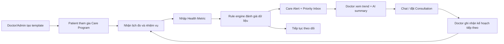

# HealthAI Chronic Care — Kế hoạch sản phẩm DA2

> **Trạng thái rà soát: 28/09/2026 — READY WITH GATES.** Refactor RF-0..RF-13 đã hoàn tất trong source hiện tại, nhưng chưa có module/migration Chronic Care hoặc Billing. Mốc 15/09–28/09 cũ vì vậy được xem là baseline đã trễ, không phải phần việc đã hoàn thành. Kế hoạch thực thi được rebaseline từ 29/09 tại mục 10; thứ tự bắt đầu code nằm tại mục 9.1.
>
> **Thứ tự nguồn chuẩn khi có xung đột:** `docs/chronic-care-spec.md` (quyết định và command contract) → `docs/product-spec.md` (ràng buộc sản phẩm/safety) → `docs/data-model.dbml` (schema target) → tài liệu này (roadmap/exit gate) → `plan/archive/refactor-history.md` (dependency/tóm tắt) → `docs/integration-contract.md` (consumer contract). `docs/current-state/*` chỉ là bằng chứng refactor/lịch sử, không phải contract feature DA2.

## 1. Quyết định sản phẩm

HealthAI DA2 được định vị là nền tảng **theo dõi và hỗ trợ chăm sóc bệnh mạn từ xa**. MVP bắt buộc có hai Care Program cho người trưởng thành: **tăng huyết áp** và **tiểu đường**; cả hai dùng chung Program engine, chỉ khác metric context, rule set và nội dung đã duyệt.

Thiết kế dữ liệu đã được duyệt nằm tại `docs/data-model.dbml` và là target schema của DA2. Việc được duyệt không đồng nghĩa các collection/index đã tồn tại; triển khai vẫn phải đi qua migration có version và `database:verify`.

Sản phẩm không khám bệnh, không chẩn đoán, không kê đơn và không thay thế bác sĩ hoặc cơ sở y tế. Hệ thống giúp bệnh nhân duy trì việc theo dõi giữa hai lần khám, giúp bác sĩ nhận biết bệnh nhân cần chú ý và hỗ trợ hai bên kết nối đúng thời điểm.

Định vị ngắn gọn:

> HealthAI Chronic Care biến dữ liệu chỉ số rời rạc thành một quy trình chăm sóc liên tục: theo dõi, nhắc việc, phân tầng ưu tiên, tóm tắt cho bác sĩ và tái tư vấn.

## 2. Bài toán và giá trị

### 2.1 Bài toán thực tế

- Bệnh nhân thường quên đo chỉ số, ghi nhận không đều hoặc bỏ tái khám.
- Một giá trị bất thường đơn lẻ thiếu bối cảnh; bác sĩ cần xem xu hướng nhiều ngày.
- Bác sĩ không thể đọc thủ công toàn bộ dữ liệu của mọi bệnh nhân mỗi ngày.
- Chatbot sức khỏe tổng quát không tạo ra vòng lặp chăm sóc hoặc hành động tiếp theo.
- Phòng khám chưa có công cụ đơn giản để cung cấp dịch vụ theo dõi giữa hai lần khám.

### 2.2 Giá trị theo vai trò

| Vai trò | Giá trị nhận được                                                                                   |
| ------- | --------------------------------------------------------------------------------------------------- |
| Patient | Kế hoạch theo dõi rõ ràng, nhắc đúng lịch, biết khi nào nên liên hệ bác sĩ, xem tiến triển dễ hiểu. |
| Doctor  | Priority Inbox, xu hướng chỉ số, tóm tắt trước tư vấn và giảm thời gian đọc dữ liệu thô.            |
| Admin   | Quản lý chương trình, gói dịch vụ, chất lượng vận hành và chỉ số sử dụng.                           |

### 2.3 Giá trị kinh tế

MVP chứng minh mô hình kinh doanh trực tiếp với Patient:

1. **B2C subscription:** bệnh nhân mua gói theo dõi theo tháng, gồm Care Program, báo cáo định kỳ, quota AI và quyền lợi tư vấn.

Mô hình B2B2C cho phòng khám là định hướng sau DA2. Phiên bản hiện tại chưa có `Clinic`, `ClinicAdmin`, tenant hoặc quan hệ Doctor–Clinic nên không đưa phòng khám vào actor/use case hay cam kết demo.

Không đưa claim tiết kiệm chi phí y tế hoặc cải thiện kết quả lâm sàng nếu chưa có nghiên cứu người dùng và dữ liệu xác nhận. Trong DA2, giá trị kinh tế được chứng minh bằng chỉ số vận hành và conversion.

### 2.4 Gói subscription và nguyên tắc phân quyền lợi

Subscription được bán dựa trên mức độ hỗ trợ và tiện ích của quy trình Chronic Care, không bán quyền được an toàn. Cảnh báo an toàn thiết yếu, quyền xem dữ liệu cơ bản và quyền tải/xóa dữ liệu theo chính sách không được khóa sau paywall.

#### Free — theo dõi sức khỏe cơ bản

- Nhập và xem lịch sử HealthMetrics của chính Patient.
- Biểu đồ cơ bản và báo cáo ngắn mặc định.
- Cảnh báo an toàn thiết yếu và safety escalation.
- Tối đa một Care Program cơ bản đang hoạt động, có Doctor assignment bắt buộc nhưng không bao gồm Doctor review định kỳ.
- Notification trong ứng dụng.
- Quota AI RAG cơ bản theo ngày.
- Quyền tải/xóa dữ liệu cá nhân cơ bản theo retention/audit policy.

Free không bao gồm Doctor review định kỳ hoặc cam kết phản hồi. Patient được thực hiện tối đa **1 consultation trong mỗi cycle** và thanh toán riêng cho phiên đó theo chính sách của hệ thống.

#### Plus — tự theo dõi nâng cao

Bao gồm toàn bộ Free và:

- Nhiều Care Program active trong giới hạn cấu hình của Plan.
- Báo cáo 7/30/90 ngày và so sánh xu hướng giữa các giai đoạn.
- AI summary định kỳ theo tuần, có grounding/provenance/fallback.
- Smart Reminder, quiet hours và lịch nhắc được cá nhân hóa.
- Theo dõi thói quen, milestone và streak không mang tính phán xét.
- Medication reminder/adherence khi `BE-CC-010` được bật.
- Patient chủ động xuất báo cáo PDF/CSV.
- Quota AI cao hơn Free.
- Lịch sử mở rộng chỉ áp dụng nếu retention policy được duyệt; dữ liệu tối thiểu và quyền truy cập dữ liệu của chính Patient không được phụ thuộc Plan.
- Được thực hiện tối đa **3 consultations trong mỗi subscription cycle**; chi phí từng phiên vẫn thanh toán riêng nếu Plan không cấu hình ưu đãi.
- Khi tính năng P1 được bật, Patient có thể mua thêm `familyLinkLimit` hoặc dùng giới hạn đã có trong Plan để mời một hoặc nhiều người thân nhận nhắc nhở bỏ lỡ nhiệm vụ; quyền này không bao gồm xem dữ liệu sức khỏe chi tiết.

#### Care — có bác sĩ đồng hành

Bao gồm toàn bộ Plus và:

- Care Program do Doctor được phân công gán và theo dõi; Admin quản lý template/rule lifecycle.
- Doctor review định kỳ theo cadence được snapshot khi enrollment/subscription bắt đầu.
- Care Alert xuất hiện trong Doctor Priority Inbox của người phụ trách.
- Được thực hiện tối đa **6 consultations trong mỗi subscription cycle**; Plan có thể cấu hình mức ưu đãi giá nhưng không dùng mô hình credit trong MVP.
- Follow-up task/note sau consultation.
- Báo cáo có trạng thái Doctor reviewed/confirmed; trạng thái này không có nghĩa chứng nhận chẩn đoán.
- Nhắc tái khám.
- Khi tính năng P1 được bật, số người thân đồng hành được giới hạn bởi `familyLinkLimit` trong Plan snapshot; từng người phải xác nhận liên kết và consent riêng.
- Kênh nhắn tin trong phạm vi Consultation đang được authorize; Care không tạo kênh chat 24/7.

DA2 không quảng bá SLA phản hồi vì chưa có mô hình Clinic và cơ chế trực vận hành. Giao diện phải ghi rõ Doctor không theo dõi realtime và Care Alert không thay thế cấp cứu.

#### Ma trận entitlement đề xuất

Giá và giới hạn số lượng là dữ liệu cấu hình của `Plans`, không hard-code trong frontend/backend.

| Quyền lợi                                |                             Free |                                     Plus |                                         Care |
| ---------------------------------------- | -------------------------------: | ---------------------------------------: | -------------------------------------------: |
| Xem/nhập HealthMetrics và biểu đồ cơ bản |                               Có |                                       Có |                                           Có |
| Safety alert thiết yếu                   |                               Có |                                       Có |                                           Có |
| Care Program active                      |                          1 basic |                          Nhiều theo Plan |            Nhiều theo Plan + Doctor assigned |
| Báo cáo                                  |                           Cơ bản |                             7/30/90 ngày |                 7/30/90 ngày + Doctor review |
| AI RAG/summary                           |                     Quota cơ bản |               Quota cao + weekly summary |           Quota cao + Doctor-context summary |
| Reminder                                 |                    In-app cơ bản |                      Smart + quiet hours |                   Smart + follow-up/tái khám |
| Medication reminder                      |                         Không/P1 |                       Có khi feature bật |                           Có khi feature bật |
| Người thân nhận nhắc bỏ lỡ nhiệm vụ      |                            Không | Theo `familyLinkLimit`/add-on khi P1 bật | Theo `familyLinkLimit` trong Plan khi P1 bật |
| PDF/CSV export                           |                   Dữ liệu cơ bản |                         Báo cáo nâng cao |                    Báo cáo nâng cao/reviewed |
| Doctor Priority Inbox                    |                            Không |                                    Không |                                           Có |
| Số consultations tối đa mỗi cycle        |                                1 |                                        3 |                                            6 |
| Nhắn tin Doctor                          | Chỉ trong consultation mua riêng |                   Chỉ trong consultation |        Chỉ trong consultation được authorize |

#### Quy tắc upgrade, downgrade và hết hạn

- Upgrade có hiệu lực sau khi payment/IPN hợp lệ; quyền lợi được đọc từ Subscription grant đã snapshot.
- Downgrade/hết hạn không xóa HealthMetrics, report lịch sử hoặc Care Alert đã phát sinh.
- Khi Care hết hạn, hệ thống dừng tạo quyền lợi Doctor review mới sau paid-through/grace policy, nhưng vẫn giữ safety alert và quyền Patient xem dữ liệu cơ bản.
- Giới hạn mặc định Free/Plus/Care là `1/3/6` consultations mỗi cycle; field chuẩn là `consultationLimitPerCycle` trong Plan/Subscription snapshot, không gọi là AI quota và không hard-code theo tên tier.
- Plus/Care dùng `currentPeriodStart/currentPeriodEnd` của Subscription; Free cũng có bản ghi Subscription với `source = free_grant`, chu kỳ 30 ngày neo tại thời điểm kích hoạt và được chuyển sang chu kỳ kế tiếp trên cùng bản ghi, không reset đồng loạt bằng cron toàn hệ thống.
- `consultationsUsed` đếm số phiên đã sử dụng trong cycle và `consultationsRemaining = consultationLimitPerCycle - consultationsUsed - activeReservations`.
- Giới hạn consultation không đồng nghĩa phiên miễn phí hoặc bảo đảm Doctor còn lịch. Chi phí/ưu đãi của từng phiên là chính sách giá riêng.
- Patient có thể mua add-on để tăng `consultationLimitPerCycle` hiệu dụng; add-on phải có source order, expiry và ledger idempotent.
- Hệ thống tạo reservation nội bộ khi scheduled booking được xác nhận hoặc on-demand request được Doctor accept; count khi phiên vào `in_consultation` hoặc Patient `no_show`; hủy reservation khi Doctor/system hủy hoặc Patient hủy đúng policy.
- `aiTokenLimit` là quota chính cho chat AI; `aiRequestLimit` là giới hạn phụ chống spam. Cả hai độc lập với `consultationLimitPerCycle`, còn summary dùng ngân sách token riêng.
- Plan change không được làm thay đổi quyền lợi của kỳ đã thanh toán nếu chưa có effective time rõ ràng.
- Enforcement nằm ở backend entitlement service; frontend chỉ dùng entitlement response để hiển thị UI.
- Không cho phép Plan trả phí thay đổi severity, thứ tự lâm sàng của Care Alert hoặc ưu tiên cấp cứu.

## 3. Persona và phạm vi bệnh

### Persona chính

- Bệnh nhân trưởng thành đã được nhân viên y tế hướng dẫn theo dõi huyết áp tại nhà.
- Bác sĩ đã được hệ thống xác minh và có bệnh nhân tham gia Care Program.
- Admin tạo/chỉnh draft Program Template và Rule theo permission, publish/retire Program và retire Rule. Mọi Doctor `active + approved` có thể activate Rule version sau server validation, không có bước duyệt riêng. Admin vẫn quản lý gói dịch vụ và nội dung RAG đã duyệt.

### Phạm vi bệnh trong MVP

- P0: chương trình theo dõi tăng huyết áp và chương trình theo dõi tiểu đường, dùng chung domain model/rule engine.
- P0: mọi enrollment phải có một Doctor `active + approved` được phân công trước khi Patient consent/kích hoạt.
- Ngoài MVP: tự phát hiện bệnh, tự kê/đổi thuốc, tích hợp thiết bị y tế thật, phân tích ECG/CT/MRI và dự đoán biến cố lâm sàng.

### Một Care Program gồm những gì

Care Program không chỉ là một nhãn gắn vào Patient. Đây là một workflow có version, thời hạn, nhiệm vụ, rule và đầu ra đo được. Mỗi Program Template gồm các khối sau:

| Khối                   | Nội dung cấu hình                                      | Ví dụ tăng huyết áp 30 ngày                                             |
| ---------------------- | ------------------------------------------------------ | ----------------------------------------------------------------------- |
| Thông tin chương trình | Tên, mô tả, đối tượng, thời lượng, owner, version      | Theo dõi huyết áp tại nhà — 30 ngày                                     |
| Eligibility            | Điều kiện sử dụng và trường hợp không phù hợp          | Patient trưởng thành đã được hướng dẫn theo dõi tại nhà                 |
| Consent & disclaimer   | Phiên bản consent, phạm vi dữ liệu, giới hạn dịch vụ   | Không thay thế cấp cứu; Doctor không theo dõi 24/7                      |
| Baseline               | Bộ câu hỏi/chỉ số ban đầu                              | Lịch sinh hoạt, timezone, thói quen đo, số đo gần đây                   |
| Goals                  | Mục tiêu hành vi/theo dõi, không phải cam kết điều trị | Hoàn thành tối thiểu số lần đo đã giao mỗi tuần                         |
| Monitoring protocol    | Metric type, số lần đo, cửa sổ thời gian               | Huyết áp sáng/tối theo lịch được giao                                   |
| Task templates         | Metric, check-in, education, consultation/review       | Đo huyết áp, check-in tuần, đọc hướng dẫn đo đúng                       |
| Reminder policy        | Thời điểm, retry, quiet hours, channel                 | In-app trước hạn; nhắc lại nếu chưa hoàn thành                          |
| Rule set               | Rule version hóa và reason code                        | Missing data, repeated attention, urgent safety rule                    |
| Review policy          | Ai review, cadence, dữ liệu được xem                   | Doctor review tuần đối với tier Care                                    |
| Content journey        | Tài liệu approved theo tuần/mốc                        | Cách đo đúng, chuẩn bị câu hỏi tái khám                                 |
| Completion criteria    | Điều kiện hoàn thành/đóng chương trình                 | Hết 30 ngày và tạo final report                                         |
| Entitlement            | Tier nào được dùng module nào                          | Free/Plus tự thực hiện nhưng vẫn Doctor-assigned; Care có Doctor review |

Template ở trạng thái `draft` có thể chỉnh sửa. Khi publish, hệ thống tạo version bất biến; thay đổi cấu hình tạo version mới thay vì sửa lịch sử của enrollment đang chạy.

### Các loại nhiệm vụ trong chương trình

Program engine nên hỗ trợ một số `taskType` dùng lại được thay vì tạo collection/service riêng cho từng bệnh:

| Task type       | Patient thực hiện                             | Cách hoàn thành                       | Cut-line             |
| --------------- | --------------------------------------------- | ------------------------------------- | -------------------- |
| `metric`        | Nhập chỉ số sức khỏe                          | HealthMetric hợp lệ trong time window | P0                   |
| `check_in`      | Trả lời bộ câu hỏi ngắn có cấu trúc           | Check-in response hợp lệ              | P0                   |
| `education`     | Đọc nội dung đã duyệt và xác nhận             | Content progress/acknowledgment       | P0 tối giản          |
| `appointment`   | Đặt hoặc tham gia tái khám                    | Consultation đạt state cấu hình       | P0/P1 theo NF-2/NF-3 |
| `doctor_review` | Không hiển thị như nhiệm vụ Patient           | Doctor hoàn tất review                | P0 cho Care demo     |
| `medication`    | Xác nhận đã uống/bỏ qua/hoãn theo đơn hiện có | Medication log                        | P1                   |
| `journal`       | Ghi triệu chứng/câu hỏi muốn trao đổi         | Journal entry                         | P1                   |

Mỗi task template tối thiểu có `taskType`, schedule, time window, completion rule, reminder policy, required/optional và version. Worker materialize task theo từng ngày/tuần bằng idempotency key; không tạo vô hạn task cho toàn bộ chương trình ngay lúc enroll.

### Trải nghiệm Patient trong một chương trình

#### Khi tham gia

- Xem mục tiêu, thời lượng, Doctor phụ trách nếu có, quyền lợi subscription và giới hạn dịch vụ.
- Xác nhận consent phiên bản hiện hành.
- Hoàn thành baseline assessment.
- Chọn timezone, quiet hours và kênh thông báo.
- Xem trước lịch nhiệm vụ và có quyền từ chối/rời chương trình theo policy.

#### Trong quá trình theo dõi

- Màn hình **Hôm nay** hiển thị task đến hạn, quá hạn và đã hoàn thành.
- Nhập chỉ số với validation đơn vị, thời điểm và giá trị bất thường về mặt dữ liệu.
- Hoàn thành check-in ngắn; không buộc nhập văn bản dài mỗi ngày.
- Xem tiến độ tuần, adherence, streak nhẹ nhàng và milestone.
- Nhận smart reminder, nhưng có quiet hours và giới hạn tần suất để tránh notification fatigue.
- Xem trend, report và reason code bằng ngôn ngữ dễ hiểu.
- Từ alert/report có thể đặt lịch, gửi on-demand request hoặc chuẩn bị câu hỏi cho Doctor.
- Xem nội dung giáo dục đúng giai đoạn, có nguồn/citation và không thay thế hướng dẫn riêng của Doctor.

#### Khi kết thúc

- Nhận final report gồm baseline, mức độ hoàn thành, trend, alerts và consultations.
- Đánh giá mức hữu ích của chương trình và AI summary.
- Chọn kết thúc, gia hạn hoặc chuyển chương trình nếu có quyền và được Doctor duyệt khi cần.
- Dữ liệu không bị xóa chỉ vì Program hoặc Subscription kết thúc.

### Trải nghiệm Doctor và Admin

Doctor có thể:

- Tạo/chỉnh draft Program Template trong phạm vi permission; chọn template đã publish, kiểm tra eligibility và enroll Patient.
- Chỉ tùy chỉnh các trường được template cho phép như lịch đo, timezone, review cadence hoặc patient-specific threshold đã được policy cho phép.
- Xem baseline, adherence, trend, missing data, Care Alerts và AI summary trong một màn hình.
- Acknowledge/resolve alert, ghi review note, tạo consultation và giao follow-up task.
- Pause, complete hoặc chuyển version enrollment với lý do/audit.

Admin có thể:

- Tạo/chỉnh draft bằng **Program Builder Lite** theo các khối cấu hình có sẵn; DA2 không cần drag-and-drop workflow builder tổng quát.
- Preview lịch/task/rule trên dữ liệu giả lập trước khi publish.
- Doctor `active + approved` có thể activate Rule; Admin tạo/sửa draft và retire Rule bằng rule-management permission. Backend bắt buộc kiểm tra schema/operator allowlist/Program version, atomically retire Rule active cũ và lưu audit. Nguồn, simulation và test là metadata tùy chọn, không chặn activation trong DA2.
- Quản lý nội dung RAG, entitlement và người có quyền tạo/chỉnh/sử dụng template.
- Xem cohort KPI không lộ dữ liệu ngoài scope: enrollment, adherence, alert acknowledgment và follow-up conversion.
- Audit thay đổi template, rule, consent, assignment và entitlement.

### AI trong Care Program

AI được dùng ở những vị trí tạo giá trị nhưng có fallback rõ ràng:

| AI capability           | Input được phép                           | Output                             | Người/logic kiểm soát                                               |
| ----------------------- | ----------------------------------------- | ---------------------------------- | ------------------------------------------------------------------- |
| Baseline structuring    | Câu trả lời Patient trong enrollment      | Bản tóm tắt baseline có cấu trúc   | Patient xác nhận; backend validate schema                           |
| Weekly/final narrative  | Report số liệu do backend tính            | Tóm tắt dễ hiểu cho Patient/Doctor | Grounding, provenance và fallback                                   |
| Doctor pre-review       | Timeline được authorize                   | Draft điểm cần Doctor kiểm tra     | Doctor quyết định, không auto-resolve                               |
| Education selection     | Program stage + approved content metadata | Gợi ý nội dung phù hợp             | Chỉ chọn tài liệu active/approved                                   |
| Reminder wording        | Task, locale, lịch sử gửi không nhạy cảm  | Câu nhắc thân thiện                | Template/policy giới hạn nội dung                                   |
| Program draft assistant | Yêu cầu của Admin/Doctor + schema Program | Draft template/rule description    | Actor có quyền quyết định activate; backend validate schema/version |
| Consultation note draft | Consultation context được authorize       | Bản nháp tóm tắt                   | Doctor sửa/xác nhận trước lưu chính thức                            |

LLM không được quyết định eligibility, thay đổi threshold, tạo severity, enroll/loại Patient, cấp entitlement hoặc publish Program. Các thao tác đó dùng rule/permission/state transition xác định.

#### Chuỗi xử lý AI đọc và tóm tắt HealthMetrics

AI không nhận toàn bộ dữ liệu thô rồi tự tính toán. Luồng chuẩn gồm bảy bước có thể kiểm thử độc lập:

```text
HealthMetrics gốc
 -> chuẩn hóa đơn vị/thời gian/nguồn
 -> tổng hợp xác định bằng backend
 -> Care Rule Evaluation
 -> SummaryInput snapshot có cấu trúc
 -> LLM diễn đạt theo schema
 -> kiểm tra grounding/safety
 -> lưu AI summary hoặc deterministic fallback
```

1. **Chuẩn hóa:** kiểm tra loại chỉ số, đơn vị, timezone, khoảng thời gian, nguồn nhập và cờ dữ liệu không hợp lệ. Không tự sửa giá trị bất thường; bản ghi bị loại phải có reason code.
2. **Tổng hợp xác định:** backend tính số lần dự kiến/đã đo, adherence, min/max/average/median, chênh lệch theo kỳ, trend, missing windows, alert counts và consultation/follow-up liên quan. LLM không tính lại các số này.
3. **Đánh giá rule:** rule engine version hóa tạo `normal|attention|urgent` và `reasonCodes`. Severity luôn là dữ liệu đầu vào bất biến đối với LLM.
4. **Đóng gói đầu vào:** tạo `SummaryInputSnapshot` chỉ chứa khoảng báo cáo, dữ liệu thống kê cần thiết, missing data, rule results và source references đã authorize; không gửi toàn bộ hồ sơ nếu không cần.
5. **Sinh nội dung:** yêu cầu structured output tách `overview`, `observations`, `missingData`, `alertsToMention`, `questionsForDoctor` và `disclaimer`. Patient view dùng ngôn ngữ dễ hiểu; Doctor view giữ số liệu, provenance và điểm cần kiểm tra.
6. **Kiểm tra đầu ra:** schema validation, kiểm tra mọi con số/tuyên bố có trong snapshot, cấm diagnosis/prescription/dose change, kiểm tra citation và giới hạn ngôn ngữ khẳng định. Output không đạt không được hiển thị như summary hợp lệ.
7. **Fallback và lưu vết:** khi provider timeout, schema sai, grounding fail hoặc evidence thiếu, trả báo cáo xác định bằng template. Lưu window, data cutoff, input hash/source refs, rule set version, prompt/model version, validation result và trạng thái `generated|fallback|failed`.

RAG chỉ bổ sung nội dung giáo dục đã duyệt và citation; không dùng RAG để tính thống kê, chọn ngưỡng hoặc thay đổi severity. Summary job và API phải idempotent theo `(enrollmentId, reportWindow, dataCutoff, summaryVersion)`; dữ liệu nguồn thay đổi thì tạo version mới thay vì âm thầm ghi đè.

#### Bộ kiểm thử AI summary

- Bộ dữ liệu cố định cho tăng huyết áp và tiểu đường gồm trường hợp bình thường, thiếu dữ liệu, giá trị lặp vượt ngưỡng, đơn vị sai và `urgent`.
- Đối chiếu số liệu trong output với `SummaryInputSnapshot`; không chấp nhận số không có nguồn.
- Kiểm tra lời khuyên chẩn đoán/kê đơn/đổi liều, hạ severity và tuyên bố chắc chắn.
- Kiểm tra hai dạng Patient/Doctor, fallback khi provider lỗi và giới hạn dữ liệu theo authorization.
- Theo dõi tỷ lệ grounding pass, fallback, validation failure, latency và token cost; không dùng demo summary làm bằng chứng hiệu quả lâm sàng.

### Ví dụ hoàn chỉnh: Program tăng huyết áp 30 ngày

| Giai đoạn | Patient                          | Hệ thống                                        | Doctor                             |
| --------- | -------------------------------- | ----------------------------------------------- | ---------------------------------- |
| Ngày 0    | Consent, baseline, chọn giờ nhắc | Tạo enrollment/tasks và snapshot version        | Kiểm tra enrollment nếu tier Care  |
| Ngày 1–7  | Đo theo lịch, check-in cuối tuần | Reminder, adherence, rule evaluation            | Chỉ nhận item cần review           |
| Ngày 7    | Xem weekly report                | Backend tính report, AI viết narrative          | Review report nếu Care             |
| Ngày 8–29 | Tiếp tục task; phản hồi alert    | Điều chỉnh reminder theo policy, không đổi rule | Follow-up/consultation khi cần     |
| Ngày 30   | Xem final report và phản hồi     | Đóng kỳ, tạo KPI và lựa chọn gia hạn            | Xác nhận report/follow-up nếu Care |

### Chiến lược mở rộng chương trình

Mở rộng theo module và mức tái sử dụng, không fork toàn bộ code theo từng bệnh:

| Giai đoạn | Chương trình/module                   | Phần tái sử dụng                      | Phần bổ sung                                                                                                                         | Giá trị kinh tế                                                             |
| --------- | ------------------------------------- | ------------------------------------- | ------------------------------------------------------------------------------------------------------------------------------------ | --------------------------------------------------------------------------- |
| P0        | Tăng huyết áp 30 ngày                 | Toàn bộ Program engine                | BP metric/rule/content                                                                                                               | Chứng minh critical journey và gói Care                                     |
| P0        | Tiểu đường                            | Enrollment, tasks, alerts, report, AI | Glucose context, rule/content đã duyệt                                                                                               | Chứng minh engine tái sử dụng và tăng giá trị Plus/Care                     |
| P1        | Medication adherence                  | Schedule, reminder, report            | Medication plan/log và safety copy                                                                                                   | Add-on Plus/Care                                                            |
| P1        | Kiểm soát cân nặng/chuyển hóa         | Goals, metric, check-in, content      | Weight/waist/habit templates                                                                                                         | Subscription Patient-led, Doctor-assigned dễ tiếp cận                       |
| Sau DA2   | Chăm sóc sau khám theo mô hình Clinic | Tasks, content, consultation, report  | Cần bổ sung Clinic/tenant/Doctor membership trước                                                                                    | Không thuộc actor/use case DA2                                              |
| P1        | Người thân đồng hành                  | Nhắc nhở/thông báo                    | Người thân có tài khoản Patient, xác nhận từng liên kết, tổng số active không vượt `familyLinkLimit` và quyền theo từng loại dữ liệu | Add-on Plus, cấu hình trong Care                                            |
| P1        | Tìm cơ sở y tế                        | Tìm theo bệnh/chuyên khoa và vị trí   | Admin chọn kết quả bản đồ, tạo bản nháp, xác minh nguồn chính thức; tìm theo khoảng cách                                             | Tạo bước hành động sau cảnh báo/tái khám; hỗ trợ hợp tác phòng khám sau DA2 |
| Sau DA2   | Thiết bị đo/Health platform           | Metric ingestion                      | Device identity, provenance, reconciliation                                                                                          | Giảm nhập tay, tăng retention                                               |

Điều kiện nhận một Program mới:

1. Ít nhất 80% luồng dùng lại Program engine hiện có; không tạo bounded context riêng chỉ vì khác bệnh.
2. Có owner chịu trách nhiệm rule/content và audit thay đổi.
3. Có ít nhất một KPI sản phẩm và một hành trình demo/test.
4. Không thêm Program thứ ba trước khi cả tăng huyết áp và tiểu đường pass E2E, authorization, rule boundary và AI fallback.
5. Program mới phải tắt được bằng feature flag/template status mà không ảnh hưởng enrollment khác.

### Mức phức tạp chấp nhận được trước deadline

Có thể tận dụng AI hỗ trợ lập trình để nhận thêm các phần có giá trị kiến trúc:

- Program engine theo schema thay vì hard-code riêng tăng huyết áp/tiểu đường.
- Program Builder Lite với form cấu hình và preview, không làm visual workflow builder.
- Generic task scheduler cho `metric`, `check_in`, `education`, `doctor_review`.
- Versioned JSON rule definition với tập operator allowlist, không cho chạy code/script tùy ý.
- Simulation endpoint/test harness chạy template trên dữ liệu giả để xem task/alert dự kiến.
- Structured-output AI summary và program draft assistant có schema validation.

AI hỗ trợ code làm giảm thời gian tạo boilerplate/test/data mapping, nhưng không thay thế server validation của Rule, threat model, race condition, authorization và usability. Vì vậy các phần thiết bị thật, mạng lưới nhiều phòng khám và tác tử AI tự vận hành vẫn để sau DA2. Người thân đồng hành chỉ nhận ở mức P1, số lượng theo `familyLinkLimit`, chủ yếu nhắc bỏ lỡ nhiệm vụ; quyền xem dữ liệu chi tiết để sau DA2. Tìm cơ sở y tế P1 chỉ dùng danh mục kiểm duyệt và bản đồ bổ sung, không tích hợp lịch trống/đặt lịch trực tiếp của bệnh viện.

## 4. Vòng lặp chăm sóc cốt lõi



Một hành trình demo đạt yêu cầu:

1. Doctor gán chương trình tăng huyết áp 30 ngày cho Patient.
2. Patient thấy lịch đo và nhập chỉ số hằng ngày.
3. Một chuỗi dữ liệu vi phạm rule cấu hình tạo Care Alert có lý do giải thích được.
4. Patient nhận hướng dẫn an toàn; Doctor thấy Patient trong Priority Inbox.
5. AI tạo bản tóm tắt chỉ từ dữ liệu được phép và nguồn RAG đã duyệt.
6. Patient đặt lịch hoặc gửi yêu cầu tư vấn; Doctor xem tóm tắt trước phiên.
7. Sau phiên, Doctor cập nhật ghi chú/kế hoạch theo dõi; hệ thống tiếp tục vòng lặp.

## 5. Phạm vi chức năng

### 5.1 P0 — bắt buộc cho Chronic Care MVP

#### CC-1. Care Program

- Admin tạo hoặc chỉnh draft Program/Rule theo permission, publish/retire Program và retire Rule; mọi Doctor `active + approved` có thể activate Rule version sau server validation.
- Doctor `active + approved` enroll Patient vào chương trình có thời gian bắt đầu/kết thúc; enrollment không được active nếu chưa có Doctor assignment.
- Một enrollment có trạng thái `pending`, `active`, `paused`, `completed`, `cancelled`.
- Enrollment chỉ `active` sau khi Doctor/Program/Rule/entitlement hợp lệ, Patient consent đúng version và hoàn thành baseline bắt buộc. Doctor pause/resume/complete; Patient có thể yêu cầu pause hoặc rút consent để cancel; completed/cancelled không reopen.
- Chương trình cấu hình loại chỉ số, tần suất đo, timezone và rule cảnh báo.
- Patient xem mục tiêu theo dõi và xác nhận tham gia trước khi kích hoạt.

#### CC-2. Monitoring Schedule và adherence

- Hệ thống sinh nhiệm vụ đo chỉ số theo lịch chương trình.
- Patient có thể đánh dấu hoàn thành bằng cách nhập HealthMetric hợp lệ.
- Adherence chỉ là tỷ lệ hoàn thành nhiệm vụ theo dõi, không phải đánh giá tuân thủ điều trị.
- Task `missed` là terminal trong DA2; chỉ số nhập muộn vẫn dùng cho biểu đồ/evaluation nhưng không hồi tố adherence của cửa sổ cũ.
- Nhắc việc sử dụng Notification + Outbox + BullMQ và phải idempotent.

#### CC-3. Rule-based Risk Stratification

- Rule engine đánh giá giá trị hiện tại, số lần lặp, xu hướng ngắn hạn và dữ liệu bị thiếu.
- Kết quả gồm `normal`, `attention`, `urgent` cùng `reasonCodes`; không trả về tên bệnh hay chẩn đoán.
- Mỗi kết quả lưu `ruleSetVersion`, dữ liệu đầu vào tham chiếu và thời điểm đánh giá để audit.
- `urgent` hiển thị hướng dẫn liên hệ cơ sở y tế/cấp cứu phù hợp; không chờ AI sinh nội dung hành động.
- Ngưỡng lâm sàng không hard-code rải rác; phải nằm trong rule set có version, server validation và audit.

#### CC-4. Care Alert và Doctor Priority Inbox

- Alert được tạo từ rule evaluation, không tạo trùng cho cùng cửa sổ/rule.
- Doctor chỉ xem alert của Patient đang thuộc chương trình mình phụ trách hoặc consultation được authorize.
- Priority Inbox sắp theo severity, thời điểm phát hiện và trạng thái xử lý; không dùng AI score làm nguồn quyết định duy nhất.
- Doctor có thể acknowledge, contact patient, link consultation hoặc resolve với ghi chú.
- Doctor được resolve trực tiếp alert open; backend đồng thời ghi acknowledge. Resolve/dismiss là terminal và dismiss bắt buộc có reason code được phép.

#### CC-5. Chronic Care Summary

- Báo cáo 7/30 ngày gồm số lần đo, adherence, thống kê/trend, alert và consultation liên quan.
- Phần số liệu được backend tính xác định; LLM chỉ diễn đạt/tóm tắt từ payload đã chuẩn hóa.
- Summary ghi model/prompt version, phạm vi thời gian và nguồn dữ liệu; lỗi AI không được chặn dashboard số liệu.
- Patient summary dùng ngôn ngữ dễ hiểu; Doctor summary ưu tiên timeline và dữ kiện cần kiểm tra.

#### CC-6. Liên kết Consultation

- Từ alert hoặc summary, Patient có thể đặt slot hoặc gửi on-demand request.
- Consultation lưu liên kết tùy chọn tới enrollment/alert để Doctor có đúng ngữ cảnh.
- Sau consultation, Doctor có thể ghi follow-up note và cập nhật chương trình trong phạm vi được phép.

### 5.2 P1 — chỉ làm sau khi P0 ổn định

- Medication schedule và medication adherence; không tự chỉnh liều hoặc khuyến nghị ngừng thuốc.
- PDF report chia sẻ do Patient chủ động xuất.
- Cohort analytics nâng cao cho Admin; dashboard B2B Clinic để sau DA2 khi có mô hình Clinic/tenant.
- FCM/mobile critical flow nếu web + in-app notification đã hoàn chỉnh.

Entitlement Free/Plus/Care và VNPAY Sandbox **không thuộc P1**: đây là P0 thương mại theo mục 5.3. Seed subscription chỉ được dùng để phát triển/test các slice Chronic Care trước khi tích hợp provider; không thay thế acceptance E2E payment của MVP.

### 5.3 P0 thương mại — VNPAY Sandbox

- VNPAY payment/subscription và cancel unpaid order là tiêu chí bắt buộc của MVP/demo.
- Chỉ IPN hợp lệ chuyển order sang paid và ghi `SubscriptionGrantRequested` vào transactional outbox; Return URL không cấp entitlement.
- Worker cấp Subscription idempotent theo source order; reconciliation xử lý `processing` quá lâu và `paid` nhưng chưa có grant.
- DA2 dùng payment state machine + Mongo transaction + outbox + worker + reconciliation, không thêm Saga framework. Chỉ cân nhắc Saga sau khi tách Payment/Subscription/Booking thành service và database độc lập.
- Free/Plus/Care entitlement phải chạy end-to-end với Plan/PaymentOrder/Subscription snapshot.
- Seed subscription chỉ dùng cho test nội bộ; acceptance demo doanh thu phải dùng giao dịch VNPAY Sandbox có audit.
- Full refund vẫn là P1 và chỉ nhận khi payment/cancel/idempotency đã ổn định. Điều kiện được snapshot theo phiên bản Plan, đánh giá riêng mức dùng AI/consultation/Doctor review/báo cáo/nhiệm vụ Care, tạm dừng quyền trả phí khi chờ và kiểm tra lại trước khi Admin duyệt.

### 5.4 Ngoài phạm vi DA2

- AI chẩn đoán, kê đơn, đổi liều hoặc dự đoán biến cố lâm sàng.
- Doctor theo dõi realtime 24/7 hoặc cam kết phản hồi cấp cứu.
- Tích hợp thiết bị y tế/Bluetooth, nhà thuốc, bảo hiểm và giao diện đặt lịch chính thức của bệnh viện.
- Chia sẻ HealthMetrics, Care Alert, AI conversation hoặc consultation chi tiết cho người thân nằm ngoài P1; số liên kết nhắc nhở cơ bản vẫn theo `familyLinkLimit`.
- WebRTC production-grade, full refund, GraphRAG và autonomous medical agent nếu làm chậm P0.

## 6. Ranh giới AI và an toàn

AI được phép:

- Tóm tắt dữ liệu 7/30 ngày đã được backend tổng hợp.
- Viết lại thông tin cho Patient bằng ngôn ngữ dễ hiểu.
- Trả lời kiến thức chung bằng RAG từ tài liệu active/approved và citation hợp lệ.
- Gợi ý danh sách câu hỏi để Doctor xem xét trong consultation.

AI không được phép:

- Tạo severity hoặc thay đổi kết quả rule engine.
- Chẩn đoán, kê đơn, đổi liều, bảo đảm an toàn hoặc trì hoãn cấp cứu.
- Suy diễn dữ liệu không có trong payload, truy cập Patient khác hoặc nguồn chưa duyệt.
- Tự động gửi nội dung có ảnh hưởng y khoa mà không qua template/safety validation.

Nếu LLM lỗi, timeout hoặc không đủ evidence, hệ thống vẫn hiển thị số liệu xác định, lý do rule và hành động an toàn; summary chuyển trạng thái `unavailable` thay vì bịa câu trả lời.

## 7. Dữ liệu và ownership đề xuất

| Entity                                                | Module sở hữu   | Mục đích                                                                                 |
| ----------------------------------------------------- | --------------- | ---------------------------------------------------------------------------------------- |
| `CarePrograms`                                        | chronic-care    | Chương trình đã duyệt, loại chỉ số, lịch và phiên bản.                                   |
| `PatientCarePrograms`                                 | chronic-care    | Chương trình Patient tham gia, Doctor phụ trách, đồng ý chia sẻ, thời hạn và trạng thái. |
| `CareTasks`                                           | chronic-care    | Nhiệm vụ theo lịch và trạng thái hoàn thành/bỏ lỡ.                                       |
| `CareRules`                                           | chronic-care    | Bộ quy tắc có phiên bản; trạng thái draft/active/retired.                                |
| `HealthEvaluations`                                   | chronic-care    | Kết quả tính bằng quy tắc, mã lý do và dữ liệu đầu vào để kiểm tra.                      |
| `CareAlerts`                                          | chronic-care    | Alert lifecycle và thao tác xử lý của Doctor.                                            |
| `CareReports`                                         | chronic-care    | Số liệu, xu hướng và dữ liệu thiếu do backend tính.                                      |
| `CareSummaries`                                       | chronic-care    | Nội dung AI diễn đạt từ CareReport, có phiên bản và nguồn.                               |
| `FamilyLinks`, `FamilyPermissions`, `FamilyReminders` | chronic-care    | Liên kết tài khoản người thân, quyền được cấp và lịch sử nhắc.                           |
| `AuditLogs`                                           | platform-audit  | Nhật ký dùng chung; Chronic Care ghi với `domain = care`.                                |
| `HealthMetrics`                                       | health-tracking | Source of truth cho dữ liệu chỉ số; không nhân bản sang chronic-care.                    |
| `Consultations`                                       | consultations   | Phiên tư vấn; chỉ giữ liên kết tùy chọn tới enrollment/alert.                            |

Module `chronic-care` dùng public API/query port của `health-tracking`, `consultations`, `notifications` và `ai-advisory`; không inject model thuộc module khác.

## 8. API và realtime dự kiến

API contract chi tiết chỉ chốt sau design review. Bề mặt dự kiến:

- `GET /api/v1/care-programs`
- `POST /api/v1/admin/care-programs`
- `POST /api/v1/admin/care-programs/:id/versions/:version/publish`
- `POST /api/v1/admin/care-programs/:id/simulate`
- `POST /api/v1/care-programs/:programId/enrollments`
- `GET /api/v1/care-enrollments/me`
- `GET /api/v1/care-enrollments/:id/today`
- `GET /api/v1/care-enrollments/:id/tasks`
- `POST /api/v1/monitoring-tasks/:id/check-ins`
- `GET /api/v1/care-enrollments/:id/summary?window=7d|30d`
- `GET /api/v1/doctor/care-inbox`
- `POST /api/v1/doctor/care-enrollments/:id/reviews`
- `PATCH /api/v1/care-alerts/:id/acknowledge`
- `PATCH /api/v1/care-alerts/:id/resolve`
- `POST /api/v1/care-alerts/:id/consultations`

Realtime events dự kiến:

- `care-alert.v1.created`
- `care-alert.v1.updated`
- `monitoring-task.v1.due`
- `care-summary.v1.ready`

Mọi list endpoint có pagination/hard limit/stable sort. Doctor access phải được kiểm tra theo assignment/enrollment; không nhận `patientId` từ client làm bằng chứng phân quyền.

## 9. Backlog và dependency

| ID        | Feature                                               | Ưu tiên | Phụ thuộc                              | Done khi                                                                                   |
| --------- | ----------------------------------------------------- | ------: | -------------------------------------- | ------------------------------------------------------------------------------------------ |
| BE-CC-000 | Contract + migration foundation                       |      P0 | RF-0..RF-13, DB v8 review              | ADR/permission matrix/error codes, migration + verifier, public ports và seed harness pass |
| BE-CC-001 | Care Program + Enrollment + consent                   |      P0 | BE-CC-000, Identity, Doctor capability | State/authorization E2E pass                                                               |
| BE-CC-002 | Monitoring schedule/tasks                             |      P0 | BE-CC-001, Health Tracking             | Timezone/idempotent generation pass                                                        |
| BE-CC-003 | Versioned rule engine/evaluation                      |      P0 | BE-CC-001, Health Tracking             | Boundary/repeat/missing-data tests pass                                                    |
| BE-CC-004 | Care Alert lifecycle                                  |      P0 | BE-CC-003, Outbox                      | Dedupe/audit/retry tests pass                                                              |
| BE-CC-005 | Doctor Priority Inbox                                 |      P0 | BE-CC-004                              | Auth/pagination/sort/query plan pass                                                       |
| BE-CC-006 | Deterministic 7/30-day report + SummaryInput snapshot |      P0 | BE-CC-002, BE-CC-004                   | Normalization/aggregation/timezone/provenance tests pass                                   |
| BE-CC-007 | AI narrative summary + output guard                   |      P0 | BE-CC-006, AI/RAG                      | Schema/numerical grounding/safety/fallback/privacy tests pass                              |
| BE-CC-008 | Consultation link/follow-up                           |      P0 | BE-CC-004, NF-2/NF-3                   | Critical journey E2E pass                                                                  |
| BE-CC-009 | Product/operations metrics                            |      P0 | BE-CC-001..008                         | KPI queries bounded and verified                                                           |
| BE-CC-010 | Medication adherence                                  |      P1 | BE-CC-001/002                          | Reminder/log/privacy tests pass                                                            |
| BE-CC-011 | Diabetes program                                      |      P0 | BE-CC-001..007                         | E2E pass, no disease-specific fork of core flow                                            |
| BE-CC-012 | Free/Plus/Care entitlement                            |      P0 | Plans/Subscriptions, AI quota          | Backend enforcement/downgrade/safety tests pass                                            |
| BE-CC-013 | Consultation usage/reservation ledger                 |      P0 | BE-CC-012, Consultations               | Limit/count/reserve/release/idempotency tests pass                                         |
| BE-CC-014 | Baseline/check-in schema engine                       |      P0 | BE-CC-001                              | Validation/version/privacy tests pass                                                      |
| BE-CC-015 | Program Builder Lite + simulation                     |      P1 | BE-CC-001/003/014                      | Draft/publish/preview/audit tests pass                                                     |
| BE-CC-016 | Education journey/content progress                    |      P1 | BE-CC-001, AI/RAG                      | Approved-content/auth/progress tests pass                                                  |
| BE-CC-017 | Người thân đồng hành                                  |      P1 | BE-CC-001/002, Notification            | Invite/consent/revoke/privacy/deduplication tests pass                                     |
| BE-CC-018 | Tìm cơ sở y tế                                        |      P1 | Care Program, vị trí, Admin            | Verified directory/map/ranking/privacy/fallback tests pass                                 |

### 9.1 Thứ tự bắt đầu code theo vertical slice

Không mở đồng thời toàn bộ collection trong DB v8. Mỗi pull request phải tạo được một lát chạy/test được, cập nhật migration/verifier/contract cùng code và không inject Mongoose model xuyên module.

**Tiến độ hiện tại (29/09/2026):** `CC-000A/B` và `CC-001A` đã có implementation. `CC-001B` đã có service/controller/migration, migration `202609291100` và migration no-op đã pass; exit gate vẫn mở vì chưa có E2E Chronic Care cho authorization, state matrix và concurrency/idempotency. Việc kế tiếp là hoàn thiện evidence `CC-001B`, sau đó nhận `CC-014`; chưa mở `CC-002`.

### 9.1.0 Phase map — đọc trước khi code

```text
Phase 0                 Phase 1                    Phase 2
Foundation              Program + Enrollment        Monitoring
CC-000A / CC-000B  ->  CC-001A / CC-001B / CC-014 -> CC-002
contract + DB           lifecycle + consent         task + reminder

Phase 3                 Phase 4                    Phase 5
Clinical workflow       Report + reuse              Commercial + release
CC-003 / 004 / 005  ->  CC-006 / 007 / 011       -> CC-008 / 009 / 012 / 013 / CC-7
rule + alert + inbox    deterministic facts + AI    entitlement + payment + evidence
```

| Phase | Mục tiêu demo được | Làm khi | Không được mở trước |
| --- | --- | --- | --- |
| 0 — Foundation | Có contract, persistence và database verification | Đã hoàn thành code; migrate/verify DB test là evidence còn lại | Controller/use case nghiệp vụ |
| 1 — Program + Enrollment | Admin version Program/Rule; Doctor activate Rule; Patient consent/baseline; enrollment active đúng guard | Bắt đầu từ `CC-001A`, sau đó `CC-001B` | Task, alert, AI, payment |
| 2 — Monitoring | Enrollment active sinh task trong timezone, reminder không lặp | `CC-001B` và metric/timezone contract pass | Rule severity/alert workflow |
| 3 — Clinical workflow | Metric được evaluate, alert xuất hiện và Assigned Doctor xử lý trong inbox | Operator allowlist + fixtures pass | AI quyết severity hoặc dashboard không giới hạn |
| 4 — Report + reuse | Report deterministic trước, AI có guard/fallback, diabetes dùng chung engine | Task/alert facts có snapshot | Gửi raw history vào model hoặc fork engine theo bệnh |
| 5 — Commercial + release | Entitlement/payment chính xác, consultation link, E2E/demo/release evidence | Core clinical flow xanh | Refund/P1/WebRTC/OAuth nếu chưa còn buffer |

**Bạn đang ở Phase 1, bước đóng gate `CC-001B`.** Không nhận thêm persistence/feature mới trước khi E2E authorization, state matrix và concurrent idempotency xanh. Sau đó thực hiện `CC-014`; chỉ mở `CC-002` khi schema baseline và metric/unit/timezone contract đã chốt.

| PR/Slice      | Phạm vi bắt buộc                                                                                                                                                                                                           | Không làm trong slice                                                  | Exit gate                                                                                                                    |
| ------------- | -------------------------------------------------------------------------------------------------------------------------------------------------------------------------------------------------------------------------- | ---------------------------------------------------------------------- | ---------------------------------------------------------------------------------------------------------------------------- |
| `CC-000A`     | ADR Care Program/rule versioning; permission matrix Admin/Doctor/Patient; enum/state transition; error code; feature flags; public ports giữa `chronic-care`, `users`, `health-tracking`, `notifications`, `consultations` | Controller nghiệp vụ, AI, payment                                      | ADR được duyệt; không còn quyết định schema/state/authorization mở cho CC-001                                                |
| `CC-000B`     | Module skeleton; Mongoose schema tối thiểu cho `CarePrograms`, `CareRules`, `PatientCarePrograms`, `AuditLogs`; migration additive, indexes/validators; schema manifest + `database:verify`; draft-only seed harness       | CareTasks/report/summary/payment schema và command/controller/use case | DB rỗng migrate + verify pass; migrate lần hai no-op; partial unique index cho Rule/enrollment và module boundary check pass |
| `CC-001A`     | Tạo/sửa draft Program, publish version bất biến, retire; seed Program draft/published và Rule draft/active                                                                                                                 | Program Builder UI, LLM sinh rule                                      | Unit + integration test version conflict, permission, immutable published version; OpenAPI cập nhật                          |
| `CC-001B`     | Tạo enrollment `pending`, Doctor assignment, consent/baseline snapshot, activation guards, pause/resume/complete/cancel + audit                                                                                            | Task scheduler, alert, AI                                              | E2E state/authorization pass; concurrent activation idempotent; không sửa DB tay                                             |
| `CC-014`      | Baseline/check-in schema allowlist, response validation/version/privacy                                                                                                                                                    | Free-text workflow builder                                             | Contract + invalid/partial/old-version tests pass                                                                            |
| `CC-002`      | CareTask rolling-window materialization, timezone, metric completion port, missed/cancelled, adherence và reminder outbox                                                                                                  | Medication/journal                                                     | Duplicate/retry/DST-late-input/correction tests pass                                                                         |
| `CC-003..005` | Rule engine → evaluation → alert → Doctor inbox theo từng PR nhỏ                                                                                                                                                           | AI severity, unbounded dashboard                                       | Boundary/dedupe/concurrency/auth/query-plan E2E pass                                                                         |
| `CC-006..007` | Deterministic report/snapshot trước; provider adapter/guard/fallback sau                                                                                                                                                   | Gửi raw history cho LLM                                                | Fixed dataset và numerical grounding/safety/fallback pass                                                                    |
| `CC-011`      | Seed/chạy lại engine cho tiểu đường                                                                                                                                                                                        | Fork service theo bệnh                                                 | E2E hai Program dùng chung use case/repository/rule interpreter                                                              |
| `CC-012..013` | Plan/Subscription snapshot, quota + consultation ledger                                                                                                                                                                    | VNPAY trước khi entitlement thuần pass                                 | Downgrade/expiry/reserve-count-release/race tests pass                                                                       |
| `CC-7`        | VNPAY order/IPN/outbox grant/reconciliation                                                                                                                                                                                | Refund/Saga                                                            | Sandbox happy/duplicate/late-IPN/paid-without-grant E2E pass                                                                 |

### 9.1.1 Gói tài liệu bắt buộc khi implement

Backlog chỉ trả lời thứ tự ưu tiên; không đủ để quyết định hành vi code. Mỗi slice phải mở và bám theo đúng bốn nguồn sau:

1. **ADR-0002** — authority, lifecycle, transaction, audit, idempotency và public-port boundary. Đây là command contract chuẩn.
2. **`docs/product-spec.md`** — safety/product invariant. Nếu khác ADR-0002, dừng implementation và sửa tài liệu để đồng bộ; không tự chọn một cách diễn giải khác.
3. **`docs/data-model.dbml` cùng migration/schema đã có** — persistence contract; mọi field/index mới phải đi kèm migration, manifest và verifier.
4. **Mục slice trong tài liệu này** — scope, thứ tự, không-làm và exit gate.

`plan/archive/refactor-history.md` chỉ được dùng để tham khảo cấu trúc phase, dependency nền tảng/refactor và cut-line toàn dự án; không dùng nó để quyết định permission, state transition, request DTO hay endpoint. `docs/current-state/*` chỉ là evidence lịch sử.

### 9.1.2 Roadmap implementation chi tiết cho slice kế tiếp

#### `CC-001A` — Program/Rule catalog và lifecycle

1. Tạo public application port/adapters tối thiểu cho capability Doctor; không import/inject model của Users, Health Tracking, Notifications hoặc Consultations.
2. Implement command Admin: create/update Program draft, create/update Rule draft, publish/retire Program, retire Rule. Mọi write kiểm tra actor permission, expected version và `Idempotency-Key`.
3. Implement command activate Rule cho mọi Doctor `active + approved`: kiểm tra parent Program `published`, declarative schema/operator allowlist, sau đó transactionally activate Rule mới, retire Rule active cũ và ghi hai audit records.
4. Cấm update trực tiếp Program `published` hoặc Rule `active`; thay đổi ngữ nghĩa phải tạo document version draft mới. Không sinh Enrollment, Task, Alert, AI hay payment trong slice này.
5. Thêm OpenAPI/controller/DTO sau khi application command pass unit test. DTO không nhận actor-controlled `status`, `doctorId`, entitlement hoặc Rule version từ Patient.
6. Exit gate: authorization matrix, immutable-version, active-rule uniqueness, transaction/audit, same-key replay/different-payload conflict và boundary tests đều pass; cập nhật OpenAPI/FE contract cùng PR.

#### `CC-001B` — Enrollment activation (chỉ bắt đầu sau `CC-001A`)

1. Assigned Doctor tạo enrollment `pending`; Patient chỉ submit consent/baseline, request pause hoặc withdraw consent.
2. Activation guard dùng public ports để kiểm tra Patient active, Doctor active+approved, Program published, Rule active, entitlement, consent version và baseline hoàn chỉnh.
3. Doctor assigned pause/resume/complete/cancel; Admin chỉ audit, không thay quyền quyết định lâm sàng.
4. Transaction ghi enrollment + audit; side effect chỉ qua outbox. Không materialize Task trước `CC-002`.

**Exit-gate checklist (không đánh dấu hoàn tất chỉ vì controller/service đã tồn tại):**

1. Migration chạy trên MongoDB rỗng, `database:verify` pass và chạy migration lần hai là no-op.
2. E2E authorization chứng minh: chỉ Doctor active+approved tạo enrollment; Patient chỉ thao tác enrollment của mình; chỉ assigned Doctor transition; Admin chỉ read/audit.
3. E2E state matrix chứng minh `pending → active` chỉ sau consent + baseline + toàn bộ guard; pause/resume/complete/cancel/withdraw-consent đúng state và reason/audit.
4. Test concurrency/idempotency chứng minh cùng key/cùng payload replay một enrollment, key khác payload trả `CARE_IDEMPOTENCY_CONFLICT`, và hai activate/resume đồng thời chỉ ghi một transition/audit.
5. Test port contract dùng adapter test cho `CareProgramAccessPort` để có cả case eligible và denied; production adapter từ Billing chỉ thay thế sau `CC-012`, không được bypass guard.
6. OpenAPI artifact, boundary check và test suite xanh; không sinh CareTask/Alert/Evaluation/Outbox trong slice này.

**Trạng thái thực thi hiện tại:** migration `202609291100` đã apply và lần chạy `--expect-noop` đã pass trên Mongo cấu hình ngày 29/09/2026. Gate vẫn **OPEN** vì suite E2E hiện tại chỉ có platform smoke tests; chưa có authorization/state/concurrency tests riêng cho Chronic Care.

Việc phải làm ngay để đóng gate:

1. Tạo `care-enrollment.e2e-spec.ts` với fixture Admin, Patient, assigned Doctor, other Doctor, published Program và active Rule.
2. Override `CareProgramAccessPort` bằng test adapter có cả `eligible=true` và `eligible=false`; tuyệt đối không đổi production adapter thành fail-open.
3. Test đầy đủ create pending, consent/baseline activation, ownership, pause/resume/complete/cancel/withdraw và terminal-state rejection.
4. Dùng hai request đồng thời để test revision/idempotency/audit uniqueness; kiểm tra collection trực tiếp chỉ trong test evidence.
5. Chạy `database:verify`, `test:integration`, `test:e2e`, `boundary:check`, `openapi:check`; lưu kết quả dưới mục Evidence rồi mới đổi trạng thái sang `DONE`.

#### `CC-014` — Baseline/check-in schema engine

Mục tiêu: biến baseline/check-in từ JSON tự do thành contract version hóa, validate được và không lộ dữ liệu ngoài audience.

Entry gate: `CC-001B` authorization/state E2E xanh; Program snapshot contract ổn định.

1. Chốt JSON schema v1 theo từng Program version: field key/type/unit/range/required/visibility; cấm arbitrary executable expression và free-text workflow builder.
2. Snapshot schema version vào enrollment; validation luôn dùng snapshot, không dùng Program draft/version mới.
3. Validate required/type/range/unknown-field; trả reason code an toàn, không log raw answer hoặc consent payload.
4. Tạo fixture hypertension/diabetes cho valid, missing, boundary, old-version và privacy projection.
5. Exit gate: contract, invalid/partial/old-version tests và audit redaction pass.

Deliverables: schema types/validator, versioned fixtures, Program snapshot integration, DTO/OpenAPI và privacy tests.

Không thuộc slice: drag-and-drop/free-text workflow builder, task scheduling, rule severity.

Ước lượng: **3-5 person-days**.

#### `CC-002` — CareTask materialization và adherence

Mục tiêu: tạo task theo rolling window/timezone một lần duy nhất và tính adherence từ facts xác định.

Entry gate: `CC-001B`, `CC-014` xanh; metric/unit/timezone contract ở mục 9.2 đã chốt.

1. Chỉ đọc enrollment `active` snapshot; materialize rolling window với unique key deterministic, timezone IANA và UTC persistence.
2. Dùng Health Tracking public port để match metric completion; không query/inject `HealthMetric` model trực tiếp.
3. Xử lý due/completed/missed/cancelled, late input và correction; tính adherence từ task facts đã materialize.
4. Queue reminder qua outbox idempotent sau transaction; không gọi Notification provider trong transaction.
5. Exit gate: duplicate/retry, DST, late-input/correction, authorization và query/index evidence pass.

Deliverables: CareTask migration/schema, materializer worker, Health Tracking/Notification public ports, adherence query và realtime/OpenAPI contract.

Không thuộc slice: medication/journal P1, risk severity, AI summary.

Ước lượng: **5-7 person-days**.

### 9.1.3 Implementation chi tiết cho các phase còn lại

Mỗi slice dưới đây dùng cùng cấu trúc như các phase RF: chỉ chuyển trạng thái `DONE` khi deliverables tồn tại và exit gate có evidence chạy thật. Việc có schema/controller không đồng nghĩa hoàn tất.

#### `CC-003` — Rule interpreter và HealthEvaluation

Mục tiêu: diễn giải Rule declarative một cách xác định từ metric đã chuẩn hóa; AI không được quyết định severity.

Entry gate:

- `CC-001B`, `CC-014`, `CC-002` xanh.
- Operator allowlist, metric/unit contract và fixture tăng huyết áp/tiểu đường đã được duyệt.

Các bước:

1. Chốt Rule AST/version và allowlist operator; cấm JavaScript, expression string và function do người dùng cung cấp.
2. Tạo pure interpreter nhận Rule snapshot + normalized facts, trả severity, reason codes và input references.
3. Persist `HealthEvaluations` bằng unique key deterministic; correction tạo evaluation mới và liên kết bản bị thay thế.
4. Worker/job phải idempotent, retry-safe và không đọc Rule active hiện tại thay cho enrollment snapshot.
5. Redact log; raw health values chỉ tồn tại trong authorized persistence/input, không vào audit/error.

Deliverables:

- Rule schema/validator, interpreter, evaluation repository/use case.
- Migration/manifest/verifier và fixed fixtures cho hai bệnh.
- Unit matrix cho boundary, missing, repeated, unit mismatch và correction.

Không thuộc slice: CareAlert, Doctor Inbox, AI explanation.

Exit gate: deterministic fixture pass; duplicate/retry/correction không tạo evaluation sai; boundary check và authorization integration pass.

Ước lượng: **4-6 person-days**.

#### `CC-004` — CareAlert lifecycle và notification outbox

Mục tiêu: chuyển evaluation cần chú ý/khẩn cấp thành alert duy nhất, audit được và gửi side effect an toàn.

Entry gate: `CC-003` xanh; severity/reason-code contract ổn định.

Các bước:

1. Tạo alert dedupe key từ enrollment/evaluation/rule/window; không dựa vào message text.
2. Implement lifecycle `open → acknowledged → resolved|dismissed`; direct resolve ghi implicit acknowledge theo contract.
3. Chỉ assigned Doctor acknowledge/resolve/dismiss; Patient chỉ đọc projection an toàn; Admin chỉ audit.
4. Ghi alert + audit + outbox trong transaction; provider notification chạy ngoài transaction.
5. Urgent dùng safety template đã duyệt và chỉ dẫn cấp cứu phù hợp; không chờ AI.

Deliverables: schema/migration, commands, outbox event contract, notification adapter và realtime contract.

Không thuộc slice: Priority Inbox aggregate, AI severity, consultation booking.

Exit gate: dedupe, retry, race transition, authorization, outbox replay/dead-letter và safety-template E2E pass.

Ước lượng: **4-6 person-days**.

#### `CC-005` — Doctor Priority Inbox

Mục tiêu: cung cấp danh sách alert bounded, ổn định và đúng scope cho Doctor phụ trách.

Entry gate: `CC-004` xanh; alert indexes và authorization policy đã có.

Các bước:

1. Thiết kế query/projection theo assigned Doctor, status, severity, detectedAt và `_id` stable sort.
2. Thêm cursor pagination, hard limit, projection và `lean()`; không hydrate toàn aggregate cho list.
3. Trả action allowlist theo state/actor; detail mới tải bounded evaluation/timeline context.
4. Cập nhật OpenAPI và realtime invalidation; client luôn refetch sau conflict.
5. Chạy explain trên representative dataset và lưu query evidence.

Deliverables: inbox/detail query handlers, indexes, OpenAPI/realtime schemas và performance fixture.

Không thuộc slice: cohort dashboard không giới hạn, cross-Doctor access, AI prioritization.

Exit gate: auth/pagination/sort/query-plan E2E pass; critical query không COLLSCAN ngoài ngoại lệ được ghi nhận.

Ước lượng: **3-5 person-days**.

#### `CC-006` — Deterministic CareReport và SummaryInput v1

Mục tiêu: tạo facts/report 7/30 ngày đúng trước khi nối bất kỳ LLM nào.

Entry gate: `CC-002` và `CC-004` xanh; metric normalization/timezone policy chốt.

Các bước:

1. Chốt report window theo enrollment timezone và UTC cutoff; xử lý DST, late input và correction.
2. Aggregate expected/completed, adherence, min/max/average/median, delta/trend, missing windows và alert/follow-up references.
3. Persist immutable report version bằng input hash; dữ liệu thay đổi tạo version mới, không ghi đè.
4. Tạo `SummaryInput v1` chỉ gồm facts/source refs đã authorize và provenance đầy đủ.
5. Tách Patient/Doctor projection; cùng facts nhưng khác presentation policy.

Deliverables: report schema/migration, aggregator, SummaryInput JSON schema, fixtures và export-safe projection.

Không thuộc slice: lời văn AI, provider SDK, AI quota.

Exit gate: fixed dataset numerical/timezone/provenance/idempotency tests pass; report vẫn hoạt động khi AI tắt.

Ước lượng: **5-7 person-days**.

#### `CC-007` — AI narrative, output guard và fallback

Mục tiêu: diễn đạt `SummaryInput v1` an toàn; không tính lại facts hoặc thay severity.

Entry gate: `CC-006` xanh; structured output, forbidden claims và evaluation dataset được duyệt.

Các bước:

1. Định nghĩa provider port và structured output schema; gửi input tối thiểu đã authorize.
2. Guard schema, numerical grounding, citations, unsupported claims và medical safety.
3. Cấm diagnosis, prescription/dose change/stop-medication và severity override.
4. Provider/guard/evidence fail phải trả deterministic fallback; report facts luôn còn dùng được.
5. Lưu model/prompt/rule version, input hash, validation, token/latency và review status; không log prompt chứa PHI.
6. Thêm kill switch/feature flag; tắt AI không tắt report/safety.

Deliverables: provider adapter, guard, fallback renderer, `CareSummaries` migration và evaluation report.

Không thuộc slice: AI quyết định lâm sàng, gửi raw history, autonomous publishing.

Exit gate: numerical grounding/safety/privacy/fallback/idempotency pass trên fixed dataset.

Ước lượng: **5-8 person-days**.

#### `CC-011` — Diabetes reuse proof

Mục tiêu: chứng minh chương trình tiểu đường dùng chung Program/Task/Rule/Report engine.

Entry gate: `CC-003`, `CC-006` và các schema contract liên quan xanh.

Các bước:

1. Seed Program/Rule/content fixture tiểu đường bằng cùng schema và lifecycle command.
2. Chạy enrollment → task → evaluation → alert → report trên cùng use case/repository/interpreter.
3. Chỉ cấu hình disease-specific data; không thêm `if diabetes` trong core service.
4. So sánh migration/query/auth behavior với hypertension fixture.

Deliverables: seed idempotent, E2E fixture và reuse evidence.

Exit gate: E2E hai Program pass, không có disease-specific fork của core flow.

Ước lượng: **2-3 person-days**.

#### `CC-012` — Free/Plus/Care Program access

Mục tiêu: thay adapter deny-by-default bằng quyết định quyền dựa trên Plan/Subscription snapshot phía backend.

Entry gate: Plan/Subscription schema và policy snapshot chốt; core safety flow đã ổn định.

Các bước:

1. Implement Billing public port cho `CareProgramAccessPort`; Chronic Care không inject Billing model.
2. Quyết định access theo subscription status, effective window, benefit snapshot và active-program limit; không tin tier/client payload.
3. Free grant có lifecycle riêng, không tạo PaymentOrder; downgrade/expiry không xóa dữ liệu hoặc tắt safety alert.
4. Recheck access khi activate/resume/create paid action; audit reason code không lộ dữ liệu billing nhạy cảm.
5. Thay `NoEntitlementAdapter` trong production composition; adapter deny-by-default chỉ còn fallback/test failure path.

Deliverables: Billing adapter/port contract, Plan/Subscription migrations, access policy tests và operational metrics.

Không thuộc slice: VNPAY order/IPN, refund, consultation usage ledger.

Exit gate: grant/expiry/downgrade/limit/race/safety tests pass; không có fail-open.

Ước lượng: **5-7 person-days**.

#### `CC-013` — Consultation usage reservation ledger

Mục tiêu: reserve/count/release consultation quota chính xác cho scheduled và on-demand.

Entry gate: `CC-012` và Consultation state contract xanh.

Các bước:

1. Tạo `ConsultationUsages` lifecycle `reserved → counted|released|expired` với unique request key.
2. Reserve atomic khi booking xác nhận; không vượt limit dưới concurrent requests.
3. Count khi `in_consultation`; xử lý no-show/cancel/release theo policy snapshot.
4. Retry/event duplicate không count/release hai lần; reconciliation sửa trạng thái treo.
5. Audit mọi transition billing bằng safe metadata.

Deliverables: migration, ledger service, Consultation public integration events và reconciliation command.

Exit gate: limit/reserve/count/release/no-show/race/idempotency tests pass.

Ước lượng: **4-6 person-days**.

#### `CC-008` — Consultation link và follow-up

Mục tiêu: nối authorized alert/enrollment với Consultation mà không làm Consultation phụ thuộc persistence Chronic Care.

Entry gate: `CC-004`; phần NF-2/NF-3 cần cho journey đã xanh.

Các bước:

1. Dùng public ports để verify/link consultation theo opaque ID.
2. Cho assigned Doctor tạo/link scheduled hoặc on-demand consultation từ alert.
3. Ghi follow-up reference/note/task policy; không mở chat 24/7 ngoài consultation.
4. Transaction chỉ ghi domain/outbox; không cross-model query hoặc dual-write âm thầm.

Deliverables: link commands, public events, authorization E2E và OpenAPI/realtime contract.

Exit gate: alert → consultation → follow-up critical journey E2E pass.

Ước lượng: **3-5 person-days**.

#### `CC-7` — VNPAY Sandbox và subscription grant

Mục tiêu: payment state machine đúng, IPN xác minh được và cấp subscription qua outbox/reconciliation.

Entry gate: `CC-012`; VNPAY sandbox credentials/callback allowlist sẵn sàng.

Các bước:

1. Tạo PaymentOrder từ server-side Plan snapshot; client không gửi amount/benefit.
2. Implement redirect/IPN verification, idempotency và conditional state transition.
3. Trong Mongo transaction: upsert transaction, order `paid`, đúng một grant-request outbox event.
4. Worker cấp Subscription idempotent; timeout/unknown dùng reconciliation, không tự kết luận failed.
5. Cancel chỉ cho unpaid order hợp lệ; giữ xử lý IPN của order đã tạo khi feature flag tắt order mới.

Deliverables: migration, provider adapter, callback endpoints, outbox worker, reconciliation và sandbox evidence.

Không thuộc slice: Saga framework, automatic full refund.

Exit gate: sandbox happy path, duplicate/late IPN, invalid signature, paid-without-grant và reconciliation E2E pass.

Ước lượng: **6-9 person-days**.

#### `CC-009` — Product/operations metrics và release evidence

Mục tiêu: đo vận hành MVP bằng aggregate bounded, không trình bày demo data như kết quả lâm sàng.

Entry gate: các P0 journey tương ứng đã xanh và có seed/demo marker.

Các bước:

1. Chốt KPI query: adherence, acknowledgment time, follow-up conversion, review effort, summary acceptance và conversion/usage.
2. Tách seed/demo khỏi real data; không expose raw HealthMetrics trong operations dashboard.
3. Dùng bounded range/filter/pagination, projection và index; lưu explain evidence.
4. Chạy full critical journey, migration rehearsal, backup/restore/reconciliation và feature-flag matrix.
5. Cập nhật OpenAPI/realtime/FE handoff, demo script và release runbook.

Deliverables: metrics queries, query catalog, E2E evidence, runbook và release checklist.

Exit gate: KPI queries bounded/verified; full regression, security/privacy, migration rehearsal và demo scenarios pass.

Ước lượng: **4-6 person-days**.

Quy tắc chia việc cho hai thành viên:

- Một người là owner slice, người còn lại review migration/state/security; không chia “một người làm schema, một người làm controller” trên cùng slice.
- Có thể song song `CC-014` với `CC-001A` sau `CC-000B`; có thể chuẩn bị fixed evaluation dataset/rule fixtures song song nhưng không nối provider trước `CC-006`.
- `NF-2/NF-3` chỉ mở khi `CC-001B` đã có enrollment/authorization ổn định; `CC-012/013` có thể phát triển song song `CC-006/007` sau khi snapshot contract đã chốt.
- Trước khi nhận PR đầu tiên phải điền owner/reviewer và xác nhận sandbox/credential cho Mongo/Redis; VNPAY/GenAI credential chỉ là gate của phase tương ứng, không chặn `CC-000A..CC-006`.

### 9.2 Gate còn mở trước từng phase

| Gate                                                                    | Hạn chót       | Chặn                        | Bằng chứng cần có                                                            |
| ----------------------------------------------------------------------- | -------------- | --------------------------- | ---------------------------------------------------------------------------- |
| Rule syntax/operator allowlist và test fixture tăng huyết áp/tiểu đường | Trước `CC-003` | Activate rule và alert demo | Schema validation, boundary/repeat/missing matrix, simulation fixture nếu có |
| Metric/unit/timezone contract                                           | Trước `CC-002` | Task completion/report      | Allowlist metric + unit conversion policy + UTC/timezone/DST cases           |
| SummaryInput v1 + dataset đánh giá                                      | Trước `CC-007` | Kết nối GenAI               | JSON schema, forbidden claims, expected facts/citations/fallback             |
| VNPAY sandbox merchant/secret/callback                                  | Trước `CC-7`   | Payment E2E                 | Secret store, callback allowlist, test order/IPN/reconciliation              |

## 10. Lịch thực hiện đến 31/12/2026

Giả định hai thành viên, ưu tiên một vertical slice chạy được trên Web. Feature freeze ngày 08/12; từ thời điểm này không nhận feature mới. Trạng thái source ngày 28/09: RF-0..RF-13 đã có evidence; Chronic Care/Billing chưa có code, vì vậy kế hoạch dưới đây là **rebaseline thực thi**, không ghi nhận hai tuần 15/09–28/09 là đã hoàn thành.

| Thời gian   | Mục tiêu                                 | Đầu ra review/demo                                                                                                                                                                             |
| ----------- | ---------------------------------------- | ---------------------------------------------------------------------------------------------------------------------------------------------------------------------------------------------- |
| 01/09–28/09 | Đã hoàn thành: audit/refactor/design     | RF-0..RF-13, business rules, DB v8 review và plan. Chronic Care foundation chưa có trong source và được carry-over.                                                                            |
| 29/09–05/10 | Slice 0 — contract/database foundation   | `CC-000A/B`: ADR, permission/state/error contract, module/ports, migration/verifier và seed harness.                                                                                           |
| 06/10–19/10 | Program/enrollment/task foundation       | `CC-001A/B`, `CC-014`, `CC-002`; chương trình tăng huyết áp chạy đến task/adherence, không cần sửa DB tay.                                                                                     |
| 20/10–02/11 | Risk, alert và Doctor workflow           | `CC-003..005`: rule/evaluation, alert lifecycle, outbox/reminder, Priority Inbox, audit/query evidence.                                                                                        |
| 03/11–16/11 | Report, AI guard và tiểu đường           | `CC-006/007/011`: deterministic report, SummaryInput, structured output/guard/fallback và E2E reuse cho tiểu đường.                                                                            |
| 17/11–30/11 | Consultation slice + entitlement/payment | Phần NF-2/NF-3 cần cho critical journey, `CC-008`, `CC-012/013`, VNPAY Sandbox/IPN/outbox grant/reconciliation. Nếu trễ, cắt WebRTC/OAuth/refund/P1, không cắt safety/entitlement correctness. |
| 01/12–07/12 | Tích hợp và bằng chứng                   | `CC-009`, OpenAPI/realtime/FE contract, E2E/concurrency/performance/security, migration rehearsal và demo data. Chỉ nhận P1 nếu toàn bộ P0 xanh và còn buffer.                                 |
| 08/12–13/12 | Feature freeze và UAT                    | Chỉ hoàn thiện P0, kiểm thử người dùng kịch bản, sửa lỗi ưu tiên cao và chốt báo cáo.                                                                                                          |
| 14/12–23/12 | Release candidate                        | Full regression, load/security test, demo rehearsal, video/kịch bản trình bày và sửa lỗi release blocker.                                                                                      |
| 24/12–31/12 | Buffer                                   | Chỉ xử lý blocker, bảo mật và lỗi demo; không thêm feature mới.                                                                                                                                |

Điều chỉnh so với lịch sử refactor tại `plan/archive/refactor-history.md`:

- Chronic Care P0 thay cho việc nhận đồng thời toàn bộ Payment, Refund, WebRTC, OAuth và Mobile.
- NF-2/NF-3/NF-4 chỉ triển khai phần cần cho hành trình Chronic Care: đặt lịch/tư vấn, reminder và notification.
- AI quota và VNPAY Sandbox payment/cancel là P0; full refund vẫn là P1 có cut-line riêng, policy quản lý qua Plan/Admin UI còn ENV chỉ giữ feature flag và giới hạn kỹ thuật.
- Medication adherence là P1, không được làm chậm Care Program, risk, inbox và summary.
- Người thân đồng hành là P1 ưu tiên đầu tiên sau P0: số liên kết theo `familyLinkLimit`, nhắc bỏ lỡ nhiệm vụ và không chia sẻ chỉ số chi tiết.
- Tìm cơ sở y tế là P1 sau Người thân đồng hành và chỉ nhận nếu còn thời gian trước feature freeze: hoàn thành danh mục đã kiểm duyệt, tìm theo chuyên khoa/khoảng cách và liên kết chỉ đường trước. Tích hợp lịch trống/đặt lịch bệnh viện để sau DA2.

## 11. KPI và bằng chứng giá trị

DA2 đo khả năng vận hành, không tuyên bố hiệu quả lâm sàng:

| KPI                         | Cách đo MVP                                                                          |
| --------------------------- | ------------------------------------------------------------------------------------ |
| Monitoring adherence        | Số task đo hoàn thành / số task đến hạn.                                             |
| Alert acknowledgment time   | Thời gian từ alert tạo đến Doctor acknowledge.                                       |
| Follow-up conversion        | Tỷ lệ alert dẫn tới consultation được tạo/hoàn thành.                                |
| Doctor review effort        | Số màn hình/thời gian thao tác trong scripted usability test.                        |
| AI summary acceptance       | Doctor đánh giá useful/not useful; theo dõi fallback và unsupported output.          |
| Retention proxy             | Tỷ lệ Patient còn nhập dữ liệu ở tuần 2/4 trong dữ liệu pilot/demo.                  |
| Free → Plus/Care conversion | Tỷ lệ subscription hợp lệ được kích hoạt; seed/demo grant không được tính doanh thu. |
| Paid entitlement usage      | Tỷ lệ dùng report, summary, reminder, Doctor review và consultations theo từng tier. |

Mọi dashboard phải phân biệt dữ liệu seed/demo với dữ liệu người dùng thực. Không trình bày KPI demo như kết quả nghiên cứu y khoa.

## 12. Definition of Done cho MVP

- Critical journey ở mục 4 chạy end-to-end mà không sửa tay database.
- Rule engine deterministic, version hóa, giải thích được và có unit test cho boundary cases.
- Alert dedupe, notification/outbox retry và Doctor authorization có integration/E2E test.
- Report 7/30 ngày đúng timezone, không N+1, có pagination/index/query evidence.
- AI summary không có quyền quyết định severity; có grounding, provenance và fallback khi provider lỗi.
- OpenAPI, realtime events, business rules, seed data và frontend integration docs khớp implementation.
- Database rỗng bootstrap được bằng migration + verifier; chạy migration lần hai no-op; rollback/restore rehearsal và reconciliation có evidence.
- Mọi command retry-sensitive có idempotency/conditional transition và test race tương ứng; worker/outbox có retry/dead-letter/kill-switch quan sát được.
- Feature flag tắt provider AI vẫn giữ deterministic report/safety; tắt VNPAY chỉ chặn order mới, vẫn xử lý IPN/order đã tạo.
- Demo có ít nhất ba kịch bản: bình thường, cần chú ý và khẩn cấp/escalation.
- Không log raw health payload, prompt chứa dữ liệu nhạy cảm hoặc thông tin truy cập ngoài quyền.

## 13. Quyết định đã duyệt ngày 23/09/2026

1. MVP bắt buộc có cả chương trình tăng huyết áp và tiểu đường; hai chương trình dùng chung Program engine.
2. Chỉ Admin được tạo/chỉnh draft Program Template và Rule theo permission. Admin chịu trách nhiệm quản lý lifecycle, version và publish/retire Program/Rule; nguồn là metadata, không phải activation gate.
3. Doctor assignment là bắt buộc cho mọi enrollment trước khi kích hoạt.
4. VNPAY Sandbox payment/subscription và cancel unpaid order là tiêu chí bắt buộc của MVP/demo; full refund không tự động trở thành P0.
5. Rule/ngưỡng có version và audit. Mọi Doctor `active + approved` được activate Rule sau server validation; chỉ Admin tạo/sửa draft và retire Rule bằng rule-management permission. Không có bước duyệt riêng; AI không được tự phát hành Rule khi không có actor chịu trách nhiệm.
6. Entitlement Free/Plus/Care và VNPAY Sandbox payment/cancel là P0; seed subscription chỉ phục vụ phát triển/test sớm, không thay acceptance payment E2E.
7. Kế hoạch được rebaseline ngày 28/09/2026 vì source chưa có Chronic Care/Billing; bắt đầu bằng `BE-CC-000`, không giả định milestone 15/09–28/09 đã hoàn thành.
